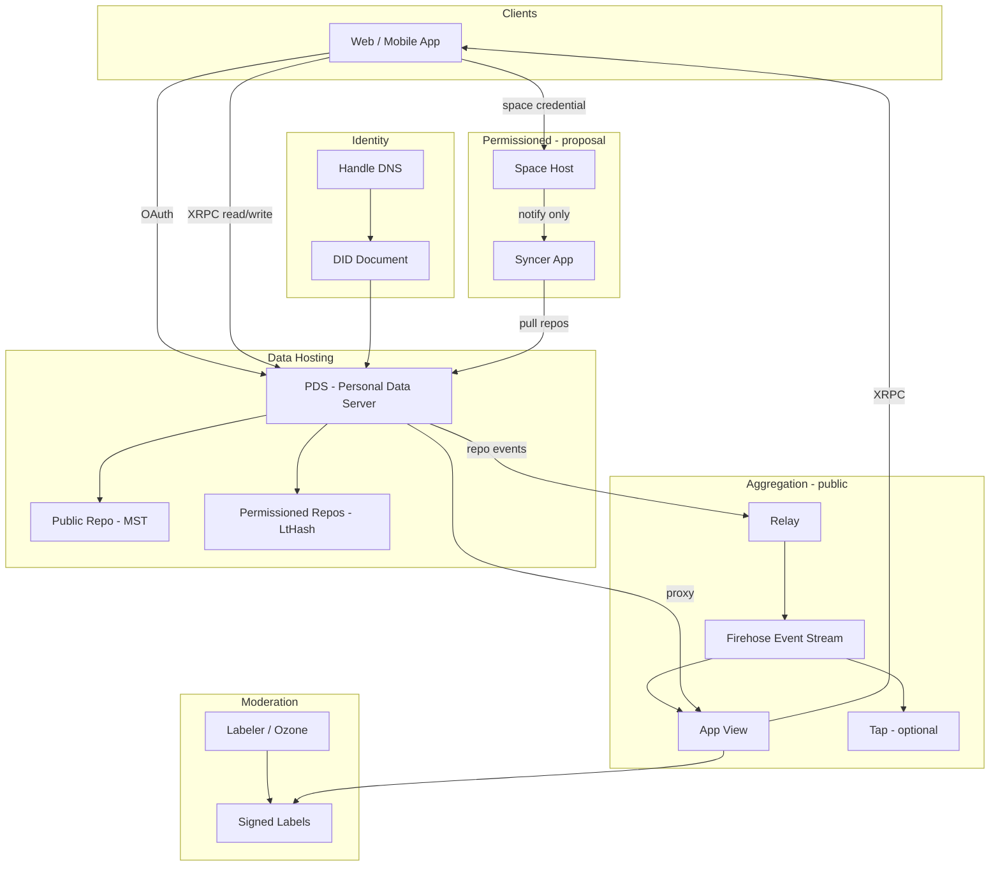
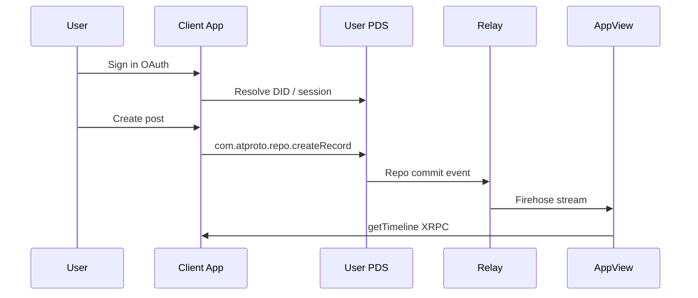
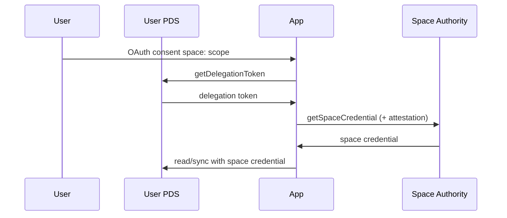

## TL;DR

**AT Protocol** ("atproto") is an open standard for social apps. Users publish **signed records** into personal **repositories**. Changes **sync across the network** so many apps can read the same data and prove authenticity — without each app owning a walled garden.

| Layer | What it is |
|-------|------------|
| **Public broadcast** (shipping) | One public repo per user; MST commits; open `at://` addressing; relay **firehose**; self-authenticating / rebroadcastable |
| **Permissioned data** (proposal 0016) | Per-**(user, space)** repos; **LtHash** commits; deniable signatures; space credentials; **no relay**; access control **not** E2EE |

The ecosystem is the **Atmosphere**. Bluesky is an app; atproto is the protocol underneath.

---

## Novice Mental Model

| Everyday idea | AT Protocol equivalent |
|---------------|------------------------|
| Username (`@alice.bsky.social`) | **Handle** — friendly DNS name |
| Permanent account ID | **DID** — never changes when you move hosts |
| Public profile + posts + follows | **Repository (repo)** — signed key/value store of JSON records |
| A single post or follow | **Record** — one JSON document in a **collection** |
| Rules for what a "post" looks like | **Lexicon** — schema language (OpenAPI/JSON Schema–like) |
| HTTP API | **XRPC** — `/xrpc/<nsid>` |
| Where your data lives | **PDS** (Personal Data Server) |
| Search / feeds / hydration | **App View** |
| News wire of everything public | **Relay firehose** |
| "Continue with…" login | **OAuth** |
| Private forum / bookmarks / gated content | **Space** + **permissioned repo** (proposal) |
| Token to read a private space | **Space credential** |

**Key insights:**

1. Public data is **yours and verifiable**. Apps are **views** over shared data. You can **migrate** between PDS hosts (DID persists).
2. Permissioned data is a **gate**, not a vault: PDSes and authorized apps can read plaintext. E2EE is app-layer, out of scope for the proposal.

---

## Design Principles

- **Self-authenticating data:** Signed records; copies verifiable without trusting the host.
- **Big-world scale:** Relays + app-level aggregation (not small ActivityPub-style instances only).
- **Formats over apps:** Interoperability via shared **Lexicon** NSIDs, not one company's API.
- **Delegated authority:** Anyone publishes Lexicons under their DNS-controlled NSID namespace.
- **Speech vs reach:** Publishing stays open; discovery/ranking is separate (feeds, algorithms, **labels**).
- **Access perimeter (proposal):** Permissioned protocol keeps DID authority, per-user repos, Lexicon records, and crawl-to-build-views — but replaces repo format, sync, addressing, and resolution path for non-public data.

---

## Architecture: The AT Stack



### Component responsibilities

| Component | Role | Required? |
|-----------|------|-----------|
| **PDS** | Accounts, public + (often) permissioned repos, signing keys, OAuth, blobs, lifecycle | Yes (per user) |
| **Relay** | Aggregates **public** repo events → unified firehose | Optional (scale) |
| **Tap** | Simplified public sync: backfill + filtered firehose as JSON | Optional |
| **App View** | App logic: feeds, search, hydration | Per application |
| **Labeler** | Signed moderation labels (public, outside repos) | Optional |
| **Feed Generator** | Custom timelines; returns post URIs | Optional (Bluesky) |
| **Repo host** | Stores/serves permissioned repos (often the PDS) | Permissioned |
| **Space host** | Credentials, writer set, notification routing (often the PDS) | Permissioned |
| **Syncer** | App that pulls and maintains a copy of a space | Permissioned |

**Account portability:** Public repos export as **CAR** files. Migration keeps DID; handle may change. Permissioned migration must enumerate **all** permissioned repos + blobs; oplog resets on the new host.

---

## Identifiers & Addressing

### DID (Decentralized Identifier)

Permanent, non-human-readable account ID. Use DIDs for storage, citations, and durable references.

#### Blessed methods

| Method | Role | Constraints |
|--------|------|-------------|
| `did:plc` | Default for new accounts; key rotation via plc.directory | Novel Bluesky method |
| `did:web` | HTTPS/DNS alternative | Hostname-level only (no path DIDs); no migration if domain lost; same TLD rules as handles; `localhost` (+ port) only in dev/test |

**Rules:**

- Support only a small blessed subset — not all DID methods.
- Distinguish: invalid syntax vs unsupported method vs supported-but-resolution-failed.
- Case-sensitive; reject invalid casing. Normalize case only on user-controlled input.
- ASCII `A-Z a-z 0-9 . _ : % -`; starts with lowercase `did:`; method = lowercase letters; no query/fragment; length ≤ 2048 (prefer &lt; 64).

```
/^did:[a-z]+:[a-zA-Z0-9._:%-]*[a-zA-Z0-9._-]$/
```

Examples: `did:plc:z72i7hdynmk6r22z27h6tvur`, `did:web:blueskyweb.xyz`.

#### DID document extraction

| Extract | Where | Rules |
|---------|-------|-------|
| **Handle** | `alsoKnownAs` | URI scheme `at://` + handle, no path. Primary = first valid handle URI. |
| **Signing key** | `verificationMethod` | `id` ends `#atproto`, `controller` = DID, `type` = `Multikey`, `publicKeyMultibase`. First valid. No key → broken account. |
| **PDS** | `service` | `id` ends `#atproto_pds`, type `AtprotoPersonalDataServer`, endpoint = HTTPS scheme+host+optional port only. No PDS → broken (temporary unreachability ≠ invalid). |

**Critical:** DID document alone does **not** prove the handle. Always verify **bidirectionally** (handle → DID and DID → handle). No valid handle: show none or mark invalid. API sentinel `handle.invalid` = no bi-directionally valid handle.

Curves for keys: `k256` (default for new keys) and `p256`; low-S ECDSA required.

### Handle

Human-readable DNS hostname (e.g. `alice.bsky.social`). **Mutable** / reassignable — handle-based AT URIs are not durable. Multiple handles may map to one repo.

**Syntax:** ASCII; ≤253 chars; ≥2 segments; each segment 1–63 of `[a-zA-Z0-9-]`, no leading/trailing hyphen; TLD not digit-leading; case-insensitive → store/display lowercase.

**Reserved TLDs (must fail real-world registration/resolution):** `.alt`, `.arpa`, `.example`, `.internal`, `.invalid`, `.local`, `.localhost`, `.onion`. `.test` only in development.

**Resolution:**

1. **DNS TXT (preferred for individuals):** name `_atproto.<handle>`, value `did=<full-DID>`. Ignore non-`did=` values. Multiple conflicting DIDs → fail. DNSSEC not required. Practical length ≤244 (prefix can hit 253 DNS limit).
2. **HTTPS well-known:** `GET https://<handle>/.well-known/atproto-did` → 2xx, `text/plain`, body = DID. HTTPS:443 in production; redirects OK; strip whitespace.
3. Clients may use `com.atproto.identity.resolveHandle` via a network service.

**Conflict:** Prefer DNS TXT over HTTPS when concurrent results disagree; or mark ambiguous and retry. Cache beyond DNS TTLs; re-resolve periodically.

**UI:** `@` is display-only. Never truncate to local part (`@jay` is wrong for `@jay.bsky.social`).

### NSID (Namespaced Identifier)

Reverse-DNS schema ID for records, XRPC methods, space types, etc. Example: `app.bsky.feed.post`, `com.atproto.repo.getRecord`.

| Part | Case | Rules |
|------|------|-------|
| Domain authority | Insensitive; normalize lowercase | Reversed hostname; ≥2 segments; TLD not digit-leading |
| Name | **Sensitive; never normalize** | 1–63 letters/digits only; no hyphens; not digit-leading |

Overall: ASCII; ≥3 segments; ≤317 chars. Globs: single trailing `*` at segment boundary (`com.atproto.*`). Subdomain segment (e.g. `sync` in `com.atproto.sync.getHead`) requires control of that full domain.

### TID (Timestamp Identifier)

Compact time-derived id used as record keys and commit revisions.

**64-bit layout:** top bit 0; 53 bits microseconds since UNIX epoch; 10-bit clock identifier. Encoded as **13-char** base32-sortable (`234567abcdefghijklmnopqrstuvwxyz`). Zero = `2222222222222`. First char ∈ `234567abcdefghij`.

```
/^[234567abcdefghij][234567abcdefghijklmnopqrstuvwxyz]{12}$/
```

**Constraints:** Not globally unique (hostile reuse possible). Do not trust as true creation time. Generators: random clock id; monotonic; never repeat. Millisecond clocks: pad ×1000.

### Record keys (rkey)

Name a record within a collection. Lexicon `key` types: `tid` | `nsid` | `literal:<value>` (often `literal:self`) | `any`.

**Syntax:** ASCII alnum + `.-_:~`; 1–512 chars; not `.` or `..`; case-sensitive (lowercase recommended); prefer paths &lt;80 chars.

**Uniqueness:** `(did, collection, rkey)` is unique; `(did, rkey)` is **not**. Same rkey under multiple collections often means related "sidecar" records. Treat keys as opaque unless you own the generation rules.

### AT URI (`at://`) — public

```
AT-URI    = "at://" AUTHORITY [ "/" COLLECTION [ "/" RKEY ] ]
AUTHORITY = HANDLE | DID
COLLECTION = NSID
RKEY      = RECORD-KEY
```

Example:

```
at://did:plc:vmt7o7y6titkqzzxav247zrn/app.bsky.feed.post/3m72rq2hgss2a
```

- Authority is **identity**, not network location (handle host often ≠ PDS).
- Prefer **DID** authority for durable refs; handle for display (HTML may show handle, `href` to DID form).
- Not content-addressed alone; contents may change or vanish.
- **Strong reference** = DID-based AT URI **plus** CID. Neither alone is strong: URI has no content pin; bare CID has no location.

To fetch: resolve identity → PDS from DID document → query that host.

### AT URI — permissioned (proposal)

```
Space:  at://{spaceDid}/space/{spaceType}/{skey}
Record: at://{spaceDid}/space/{spaceType}/{skey}/{authorDid}/{collection}/{rkey}
```

| Segment | Type | Role |
|---------|------|------|
| `spaceDid` | DID | Space authority (URI authority) |
| `space` | literal | Marker — zero dots, never an NSID |
| `spaceType` | NSID | Modality |
| `skey` | string | Distinguishes spaces of same type under same authority (rkey-like, ≤512 bytes) |
| `authorDid` | DID | Record author (record authority) |
| `collection` | NSID | Collection |
| `rkey` | string | Record key |

**Disambiguation from public URIs:** first path segment under authority is literal `space` (no dots) vs collection NSID (≥2 dots). Hosts never appear in URIs.

### CID (Content Identifier)

Hash reference to a record version, MST node, commit, or blob.

**Blessed formats:** CIDv1; multibase binary in DAG-CBOR / base32 in strings; multicodec **`dag-cbor` (0x71)** for data objects, **`raw` (0x55)** for blobs; multihash sha-256 preferred. Structural MST/commit links enforce blessed formats strictly; leaf record links should retain exact CIDs when reading untrusted history.

---

## Data Model Essentials

Records and messages use a dual representation: **JSON** (API/human) and **DAG-CBOR** (authoritative for sign/hash). JSON is **not** byte-deterministic. Signing: DAG-CBOR encode → SHA-256 → sign hash with account key.

| Aspect | Rule |
|--------|------|
| Floats | **Forbidden** — use integers or encode as string/bytes |
| Integers | 64-bit signed; prefer ≤53-bit precision for JS |
| null / missing / false-y | Three distinct semantics |
| `$` fields | Reserved (`$type`, `$link`, `$bytes`); ignore unknown `$`; apps must not invent new ones |
| Link (JSON) | `{ "$link": "<cid-string>" }` |
| Bytes (JSON) | `{ "$bytes": "<base64>" }` (RFC-4648; not URL-safe; padding optional) |
| Blob | `$type: "blob"`, `ref` (raw CID link), `mimeType` (non-empty), `size` &gt; 0. Never **write** deprecated legacy blob format; tolerate reading it. |

**Nodes / blocks / links:** Distinct data pieces are nodes; binary DAG-CBOR encoding is a block. Links by CID are self-certifying (content verifiable from untrusted parties). Location is contextual, not in the hash.

---

## Lexicon

Schema language (JSON) for records, XRPC, and stream messages. Version `lexicon: 1`.

### File structure

- Required: `lexicon` (1), `id` (NSID), `defs` (non-empty map).
- Optional: `description`.
- At most one **primary** def, named `main`.

| Primary type | Maps to |
|--------------|---------|
| `record` | Repo collection schema (+ `key` + `record` object schema) |
| `query` | HTTP GET XRPC |
| `procedure` | HTTP POST XRPC |
| `subscription` | WebSocket event stream |
| `permission-set` | OAuth permission bundles |
| `space` | Space type declaration (permissioned proposal) |

Fragment refs: `com.example.defs#someView`. Main in data `$type` is bare NSID — never `…#main`.

### `$type` rules

Required on: record objects (always), union variants (except top-level subscription messages), blob objects. Unions open by default; closed if marked. All union variants are objects with `$type`.

### Evolution (compatibility)

- New fields **must** be optional.
- Required fields cannot be removed (deprecate instead).
- Types cannot change; fields cannot be renamed.
- Breaking changes → **new NSID**.
- Invalid data → wholly invalid (no partial repair). Unknown fields in otherwise-valid data → ignore (tolerate evolution). Avoid clobbering unknown fields on re-serialize.

Public third-party adoption implies release: do not break. Mark experiments in the name (e.g. `com.corp.experimental.newRecord`).

### Publication & resolution

- Publish as `com.atproto.lexicon.schema` records; rkey = schema NSID.
- Resolve NSID → DNS TXT on `_lexicon.<authority-domain>` with `did=…` → fetch schema from that DID's repo.
- Resolution is **non-hierarchical** — never walk up/down DNS.
- Authority group: NSIDs differing only in final name segment share one repository.

### Common namespaces

| Namespace | Owner | Examples |
|-----------|-------|----------|
| `com.atproto.*` | Protocol core | `com.atproto.repo.createRecord`, `com.atproto.space.*` |
| `app.bsky.*` | Bluesky app | `app.bsky.feed.post`, `app.bsky.graph.follow` |
| Custom | Your domain | under your NSID hierarchy |

```bash
npm install -g @atproto/lex
lex install app.bsky.feed.post app.bsky.actor.profile
lex build
```

---

## Public Repositories & MST

### Repo overview

Each account has one **public, self-certifying repository**:

- Key/value map: paths `<collection>/<rkey>` (exactly two segments, no leading slash).
- Stored as **Merkle Search Tree (MST)** — content-addressed, key-sorted, shape **deterministic** from current contents (independent of insert/delete history).
- Large binaries are **blobs** (CID refs only inside the repo).
- **Deletion leaves no tombstone** in the public history.
- Authoritative host: PDS in DID document. Export: **CAR v1** (`.car`, `application/vnd.ipld.car`).

### Commit object (v3)

| Field | Type | Notes |
|-------|------|-------|
| `did` | string | Account DID, normalized |
| `version` | integer | Fixed `3` |
| `data` | CID link | MST root |
| `rev` | TID string | Monotonic logical clock; future revs beyond fudge → ignore |
| `prev` | CID link nullable | Field present in CBOR; almost always null in v3 |
| `sig` | bytes | Signature |

**Sign:** populate UnsignedCommit (all but `sig`) → DAG-CBOR → SHA-256 → sign with current `#atproto` key. Commit CID = DAG-CBOR of signed commit. After key rotation, create a new commit so the latest verifies against the current DID document.

### MST structure

- Keys: UTF-8 path bytes; values: CID links to records.
- Depth from key: SHA-256(key); count leading binary zeros; divide by 2 (fanout 4).
- Nodes: `l` (left subtree CID), `e` entries with prefix compression (`p`, `k`, `v`, `t`).
- Empty repo: single empty leaf; prune empty top/bottom nodes; keep empty intermediates so depths never skip.
- When parsing untrusted MSTs: verify depth, sort order; bound entries per node (adversarial depth mining).

### CAR export (public)

Header roots: first root = relevant commit CID. Full export: all MST nodes + records for that commit. Block order undefined; duplicates possible; tolerate dangling blob CIDs; verify structural completeness.

### Blobs (public)

- Upload: `com.atproto.repo.uploadBlob`.
- Fetch via `com.atproto.sync.*` (and related) endpoints.
- Not stored in MST; referenced from records.

### Labels (public moderation metadata)

- Signed metadata **outside** the repository, on DIDs or records.
- Speech layer permissive; reach layer filters via labels.
- **Ozone** (labeling UI/service), **Osprey** (rules engine at scale).
- Apps subscribe to labelers; users may choose labelers.

---

## XRPC (HTTP API)

- Path: `GET|POST /xrpc/<nsid>` (no prefix path).
- **Query** = GET (cacheable, no mutation). **Procedure** = POST (may mutate).
- Params → query string; body/response per Lexicon.
- Errors: `{ "error": "ErrorName", "message": "..." }`.
- Pagination: `cursor` pattern. CORS encouraged.

### Authentication (priority for new apps)

1. **OAuth** — preferred; scoped permissions (including `repo:` and `space:` grants).
2. **App Passwords** — restricted third-party password (`xxxx-xxxx-xxxx-xxxx`).
3. **Legacy JWT session** — `com.atproto.server.createSession` + `refreshSession`.
4. **Inter-service JWT** — service-to-service, signed by account key.

Unauthenticated public reads and firehose streaming are possible.

### Common public endpoints

| Endpoint | Purpose |
|----------|---------|
| `com.atproto.identity.resolveHandle` | Handle → DID |
| `com.atproto.repo.getRecord` | Fetch one record |
| `com.atproto.repo.listRecords` | List collection |
| `com.atproto.repo.createRecord` | Write record |
| `com.atproto.repo.uploadBlob` | Upload media |
| `com.atproto.server.createSession` | Legacy login |
| `app.bsky.feed.getTimeline` | Bluesky timeline (App View) |

---

## Typical Public App Developer Flow

1. **Auth:** OAuth → learn user's PDS URL.
2. **Read/Write:** PDS XRPC (or proxy via App View).
3. **Network awareness:** Relay firehose or Tap for global public activity.
4. **Validation:** Lexicons on ingest.
5. **Presentation:** App View aggregates/hydrates.
6. **Moderation:** Subscribe to labelers; apply at reach layer.



---

## Sync & Firehose (public)

- PDSes emit WebSocket event streams per public repo.
- **Relays** merge many PDS streams → network **firehose**.
- Consumers: App Views, bots, analytics, labelers, Tap.
- Data is signed — verify without trusting the relay.
- **Backfill:** full repo history from PDS for a new DID.
- **Tap:** verification, backfill, filter by DID/collection, WebSocket/webhook delivery.

---

## Permissioned Data (Proposal 0016)

> **Status:** Proposal, not final specification. Details may change.

### Promise and non-promise

| Provides | Does **not** provide |
|----------|----------------------|
| **Access control** (who may obtain data) | **Confidentiality** / E2EE |
| Space credentials gate reads | Records are **plaintext** on PDSes & authorized apps |
| Server-side search, index, notify, moderate | Hide content from authorized infrastructure |

E2EE may be layered by applications; out of scope.

**Modalities (one protocol):** personal data; gated content; socially shared; groups. **Not** world-readable public posts — those stay on public broadcast.

### Public vs permissioned comparison

| Aspect | Public broadcast | Permissioned data |
|--------|------------------|-------------------|
| Unit | Record in a repo | Record in a permissioned repo |
| Repo scope | One repo per user | One permissioned repo per **(user, space)** |
| Record authority | User DID | User DID |
| URI authority | User DID | **Space authority DID** |
| Commit | MST root | **LtHash** set-hash digest |
| Signature | Rebroadcastable, archival | **Deniable on rebroadcast** |
| Addressing | Traditional `at://` | `at://` with `space` segment |
| Access | Public | Gated by **space credential** |
| Sync collator | Relay / firehose | **None** — apps pull each repo host |

### Vocabulary

| Term | Meaning |
|------|---------|
| **Space** | Authorization + sync boundary; `(authority, type, skey)` |
| **Permissioned repo** | One user's records in one space; hosted on user's repo host (usually PDS) |
| **Repo host** | Stores/serves permissioned repos |
| **Space host** | Credentials, writer enumeration, notification routing |
| **Space authority** | DID root of space → host endpoint + credential keys |
| **Space credential** | Authority-issued token granting space read access |
| **Delegation token** | PDS-minted token exchanged for space credential |
| **Client attestation** | App-signed JWT proving app identity (when required) |
| **Syncer** | App that pulls and maintains a local copy of a space |

A space is **not** a colocated database. It is the aggregation of per-user permissioned repos. PDS usually fills both host roles; any service implementing the APIs may host either.

### Space identity

1. **Authority** — DID (user's own DID for personal spaces; dedicated DID for transferable shared spaces)
2. **Type** — NSID (modality; **OAuth consent boundary**)
3. **skey** — string (rkey-like syntax, ≤512 bytes; unique only among same type under same authority)

**Authority DID document:**

| Entry | Kind | Fallback if absent |
|-------|------|--------------------|
| `#atproto_space` | Verification method (credential verify key) | `#atproto` |
| `#atproto_space_host` | Service endpoint | `#atproto_pds` |

Reading/syncing always requires a space credential signed by the authority's declared key.

### Space type Lexicon (`"type": "space"`)

Main definition fields:

| Field | Required | Role |
|-------|----------|------|
| `type` | yes | Fixed `"space"` |
| `key` | yes | Recommended skey type |
| `name` | yes | 1–64 chars; **consent screen** |
| `collections` | yes | Expected collections + default OAuth collection set |
| `description` | no | Developers only — not shown to users |
| `name:lang` | no | Localized names |

`collections` is **not** a protocol write constraint — any collection may be written to any space.

### Access control — three JWTs

**Issuance axes:** (1) which user → **delegation token** (always); (2) which app → **client attestation** (only if space gates on app identity). Membership policy is **not** in the core protocol (simplespace defines it).

#### Delegation token

| Property | Value |
|----------|-------|
| Minted by | User's PDS — `com.atproto.space.getDelegationToken` |
| typ | `atproto-space-delegation+jwt` |
| Signed by | Account `#atproto` (`kid` MUST be `#atproto`) |
| iss | User DID |
| sub | Space URI |
| aud | Space host fragment (`…#atproto_space_host`) |
| Lifetime | Default 60s, **single-use**, `jti` |
| Asserts | User→app delegation only |
| Does **not** assert | Membership, app identity |

Prerequisite: OAuth `space:` scope with **`read`** (not mere `read_self`). Differs from service auth: distinct `typ`, no `lxm`, space-bound `sub`.

#### Client attestation

| Property | Value |
|----------|-------|
| typ | `atproto-client-attestation+jwt` |
| Signed by | App client key (`kid` from JWKS) |
| iss/sub | `client_id` URL (client-metadata.json) |
| aud | Space host fragment |
| Verify | metadata → JWKS → key by `kid` |
| When | e.g. simplespace `appAccess: #allowList` |

#### Space credential

| Property | Value |
|----------|-------|
| Minted by | Space authority — `com.atproto.space.getSpaceCredential` |
| typ | `atproto-space-credential+jwt` |
| Signed by | `#atproto_space` or fallback `#atproto` |
| iss | Space authority DID |
| sub | Space URI |
| aud | **None** (multi-host reuse) |
| Lifetime | Default 2 hours, **multi-use** |
| Used for | All repo read/sync methods on every member host |

Repo hosts verify offline against authority's published key — no phone-home.

#### Credential flow



1. User OAuth consent (`space:` with read grant)  
2. App → PDS: `getDelegationToken`  
3. App → space host: `getSpaceCredential` (+ attestation if needed)  
4. App → each repo host: read/sync with space credential  

One app serving many users of a space may hold **one** credential from any live user session. Lose all OAuth sessions for that space → cannot renew → access expires with credential.

### Permissioned repos, LtHash, deniable commits

**Placement:** Writes land in the **author's** permissioned repo on the **author's** repo host. Space host/authority never store record data.

#### LtHash commit digest

- State: fixed **2048-byte** buffer = **1024 little-endian uint16** lanes (empty = all zero).
- Element: UTF-8 `{collection}/{rkey}/{record_cid}` (update = remove old + add new).
- Add: BLAKE3-XOF expand to 2048 bytes → add lanes mod 65536. Remove: subtract.
- Wire field `hash` = **sha256(state)** (32 bytes). Order-independent; quantum-secure lattice construction. No MST overhead.

#### Deniable commit signatures

A signature over the content digest would prove private writing if leaked. Instead:

```
ctx = "atproto-space-v1"
    || uint16be(len(space)) || space URI
    || uint16be(len(author)) || author DID
    || uint16be(len(rev)) || rev TID
    || uint16be(len(ikm)) || ikm   // big-endian length prefixes (TLS)

sig = sign(ctx)                     // does NOT sign repository hash
mac = HMAC-SHA256(HKDF-SHA256(ikm, ctx), hash)
```

- Fresh **32-byte `ikm` per reader** served.
- **sig** = authenticity of (space, author, rev, ikm); **mac** = integrity for legitimate readers.
- Leaked commit: anyone can recompute mac for arbitrary hash (ikm public) → **content-deniable**; only context is attributable.
- Byte-order trap: ctx prefixes **big-endian**; LtHash lanes **little-endian**.
- Deniability ≠ encryption; leaked records remain readable.

**signedCommit** (`com.atproto.space.defs#signedCommit`): `ver` (1), `hash`, `ikm`, `sig`, `mac`, `rev`.

#### CAR serialization (permissioned)

Roots in order: (1) signed commit, (2) DRISL index map `"{collection}/{rkey}" → CID` (lex order), then record blocks same order. No MST nodes; blobs excluded (`getBlob` separate).

**Stream validation:**

1. Verify sig + mac → trust `hash`  
2. Fold index into running LtHash; match `sha256(state)` to `hash` (authenticates index without record bytes)  
3. Verify each record block against its CID  

### Permissioned sync

**No relay / no firehose of permissioned commits.** Syncer pulls each member's repo host. Correctness = **local running set hash equals host commit hash**, not "received every event."

#### Incremental — `listRepoOps`

Oplog entry: `{ rev, collection, rkey, cid, prev }`

- `cid` null = delete; `prev` null = create; both set = update.
- Shared `rev` = atomic batch (`applyWrites`).
- Default: inline **current** values (stale intermediates omitted); `excludeValues` for metadata-only.
- Response including last available op **must** include current signed commit; digest mismatch → syncer's copy wrong → recovery.
- Oplog is a **transport optimization**: may compact/drop; reset on migration; no durability. Missing `since` → full-state recovery.

#### Recovery paths

| Path | Method |
|------|--------|
| Full | `getRepo` CAR + stream validation; optional diff to keep only missing records |
| Light heal | `getLatestCommit` + `listRecords` (`excludeValues`) + local diff + targeted `getRecord` |

#### Blobs

On authoring repo host only; `getBlob` + space credential. Never in oplog or CAR.

#### Write notifications

Doorbell only (repo advanced to rev) — **no data**. `registerNotify` on space host (whole space) or repo host (one repo). On first write to a **shared** space (authority ≠ account DID), repo host auto-registers space authority as subscriber; authority fans out to registered syncers without carrying records. Best-effort; periodic `listRepos` sweep for eventual consistency.

#### Writer set — `listRepos`

Accounts that have **written ≥1 record** (not allowed-writers, not readers). Authority **claim** — confirm each repo against its host.

### OAuth `space:` scopes

```
space:<spaceType>[?authority=<did>][&skey=<skey>][&collection=<nsid>...][&action=<action>...][&manage=<verb>...]
```

| Param | Default | Notes |
|-------|---------|-------|
| spaceType | required (or `*`) | Consent boundary |
| authority | **`self`** | Own DID; use DID or `*` for shared spaces |
| skey | `*` | |
| collection | declaration's `collections` | Empty when `spaceType=*`; **dynamic** (tracks declaration over time) |
| action | `read,create,update,delete` | Explicit list replaces default |
| manage | **empty** | Admin of spaces themselves |

**Read verbs:**

| Grant | Own repo read/sync | `getDelegationToken` | Other members |
|-------|--------------------|----------------------|---------------|
| `read` | Yes | **Yes** | Yes (via space credential) |
| `read_self` | Yes (collection-constrained) | **No** | No |

`read` implies `read_self`. `read` ignores `collection` (all-or-nothing at space). Writes and `read_self` are collection-constrained.

**Auth asymmetry:**

- Read/sync: OAuth **or** space credential  
- Writes: **OAuth only** (attributed to authoring user)  
- `getDelegationToken`: OAuth only  

**manage:** create/update/delete spaces (not records); ignores collection; mapping implementation-defined. `manage=create` typically with `skey=*`.

**Consent:** space type → declaration `name`; concrete authority → bidirectional handle else DID; double-wildcard → **prominent warning**.

**Permission sets:** `resource: "space"`; `spaceType` must **not** be wildcard inside a set; collections may wildcard or cross namespace.

**Examples:**

- Personal: `space:com.example.bookmarks`  
- Forum client: `space:com.atmoboards.forum?authority=*`  
- Backup: `…&action=read_self&collection=*`  

### Permissioned API surface (`com.atproto.space`)

Method groups are **kinds**, not separate services.

| Auth class | Methods (representative) |
|------------|--------------------------|
| OAuth only | `createRecord`, `putRecord`, `deleteRecord`, `applyWrites`, `getDelegationToken`, `listSpaces` |
| OAuth **or** space credential | `getRecord`, `listRecords`, `getBlob`, `getLatestCommit`, `getRepo`, `listRepoOps` |
| Space credential | `getSpace`, `listRepos`, `registerNotify` |
| Delegation token (+ optional attestation) | `getSpaceCredential` |
| Service auth | `notifyWrite`, `notifySpaceDeleted` |

### simplespace (required on every PDS)

Baseline space management: spaces anchored on **user's own DID**. Not exclusive/privileged — other management implementations may run on bespoke hosts. Admin methods use OAuth **manage** scopes.

| Method | Role |
|--------|------|
| `createSpace` / `updateSpace` / `deleteSpace` | Lifecycle |
| `addMember` / `removeMember` / `listMembers` | Membership |

**Config (credential mint = policy AND appAccess):**

| Field | Values | Notes |
|-------|--------|-------|
| policy | `member-list` (default), `public`, `managing-app` | Per-user |
| appAccess | `#open` (default), `#allowList` | Per-app; allowlist checks **attested client_id** |
| managingApp | DID + fragment | Routes app requests; `checkUserAccess` when policy=`managing-app` |

`checkUserAccess` is served by **managingApp** (not PDS); authority calls with `iss`=authority, `aud`=managingApp. In simplespace, `manage=update` authorizes `updateSpace`, `addMember`, `removeMember`.

### Permissioned moderation, scaling, lifecycle

**Moderation:** Labelers are ordinary credentialed readers. **Do not** publish public labels for permissioned records (metadata leak) — publish labels as records **inside** the space. Levers: user delete own records; repo host takedown; app filter; authority **refuse credentials**.

**Scaling:** No relay; lighter than MST sync; load scales with **apps** not end-users; credential-gated rate limits.

**Space deletion:** Authority stops credentials, deletes own repo, `notifySpaceDeleted`. **Syncer** must delete all copies + derived state. **Repo host** **flags** member repo (user data for export/grace before GC).

**Account lifecycle:** Migration enumerates all permissioned repos + blobs; oplog resets. Deactivation/deletion same expectations as public. **Permissioned-only apps still need the public firehose** for `#account` / `#identity` events (key rotation, handle, status) — firehose does **not** carry permissioned commits.

---

## SDKs & Tooling

| Language | Package / Repo | Notes |
|----------|----------------|-------|
| TypeScript | `@atproto/lex`, [atproto monorepo](https://github.com/bluesky-social/atproto) | PDS reference, OAuth, lex tooling |
| Go | [indigo](https://github.com/bluesky-social/indigo) | Relay, Go SDK |
| CLI | [goat](https://github.com/bluesky-social/goat) | Account/repo management |
| Python | [atproto](https://atproto.blue/) | Community |
| Rust | rsky, jacquard, atproto-crates | Community |
| TypeScript alt | [atcute](https://github.com/mary-ext/atcute) | Community |

---

## What AT Protocol Does NOT Specify

- Concrete social features (follows, avatars) — left to app Lexicons (`app.bsky.*` is one app, not the protocol).
- **End-to-end encryption** for private data — permissioned proposal provides **access control only**; E2EE is application-layer if needed.
- Final frozen permissioned data APIs — treat proposal 0016 as provisional.
- Formal IETF standard status yet — intended future step.

---

## Agent Quick Reference

### When building a feature, ask:

1. **Public or access-perimeter?** World-readable → public repo/MST/firehose. Private/gated/group → space model (proposal).
2. **Which Lexicon/NSID** defines the record, endpoint, or space type?
3. **Read or write?** Public: PDS or App View. Permissioned writes: OAuth only on author's repo host. Permissioned reads of others: credential flow.
4. **Identity reference?** Prefer DID over handle in stored data; strong refs = AT-URI(DID) + CID.
5. **Media?** Upload blob first; never put blob bytes in the repo tree; permissioned blobs via `getBlob` + space credential.
6. **Network data?** Public → firehose/Tap. Permissioned → pull + notifications + `listRepos` (no relay).
7. **OAuth scopes?** Shared spaces need `authority=*` or a specific DID — default `authority=self` only covers the user's own spaces. Use `read_self` when other members must stay invisible.
8. **Moderation?** Public labels for public data; **in-space** labels for permissioned data.
9. **Never treat permissioned data as E2EE.** Plan for PDS/app plaintext + optional app-layer crypto.
10. **Baseline space management:** `com.atproto.simplespace` on every PDS.

### Load full reference when you need:

- Exact Lexicon field constraints or error types → `docs/references/atproto.comdocs.md`
- Tutorial lessons (identity, spaces, credentials, LtHash, OAuth) → `docs/references/blacksky_tutorial/*.pdf`
- OAuth PAR/PKCE/DPoP flow specifics
- Event stream wire protocol framing
- Source KB parts: [at-protocol.md](./at-protocol.md), [at-protocol-blacksky-tutorial.md](./at-protocol-blacksky-tutorial.md)

### External reading

- [Open Social](https://overreacted.io/open-social/)
- [Where it's at://](https://overreacted.io/where-its-at/)
- [A Social Filesystem](https://overreacted.io/a-social-filesystem/)
- [Atproto for distributed systems engineers](https://atproto.com/articles/atproto-for-distsys-engineers)
- [The Atproto Ethos](https://atproto.com/articles/atproto-ethos)

---

## Glossary

| Term | Definition |
|------|------------|
| **Atmosphere** | The atproto ecosystem |
| **atproto** | Authenticated Transfer Protocol |
| **PDS** | Personal Data Server; hosts user repos |
| **Repo (public)** | Signed MST of public user data |
| **Permissioned repo** | One user's records in one space (LtHash commits) |
| **Space** | Authorization + sync boundary `(authority, type, skey)` |
| **Space authority** | DID at the root of a space |
| **Space host / repo host** | Service roles for whole-space ops vs per-user repos |
| **Space credential** | Token granting read/sync access to a space |
| **Delegation token** | Short-lived PDS-minted user→app proof for credential exchange |
| **Client attestation** | App-identity JWT for spaces that gate on client |
| **Syncer** | App maintaining a local copy of a space by pull |
| **simplespace** | Required baseline space-management implementation on every PDS |
| **Collection** | NSID-keyed bucket of records |
| **Record** | JSON document in a collection (`$type` = Lexicon NSID) |
| **Blob** | Binary media referenced by CID |
| **Lexicon** | Schema for records, APIs, space types |
| **NSID** | Namespaced Identifier (reverse DNS) |
| **XRPC** | Lexicon-defined HTTP API |
| **DID** | Permanent decentralized account ID |
| **Handle** | Mutable human-readable username (DNS) |
| **AT URI** | `at://` pointer to repo, collection, record, or space |
| **CID** | Content hash identifier |
| **TID** | Timestamp identifier (13-char base32-sortable) |
| **Relay** | Network event aggregator (public) |
| **Firehose** | Real-time stream of **public** repo commits |
| **App View** | App-specific aggregation service |
| **Label** | Signed moderation metadata |
| **CAR** | Content-addressed archive export format |
| **MST** | Merkle Search Tree (public repo internals) |
| **LtHash** | Lattice set-hash for permissioned commit digests |
| **DAG-CBOR** | Authoritative binary encoding for sign/hash |
| **PLC** | `did:plc` identity method & directory |
