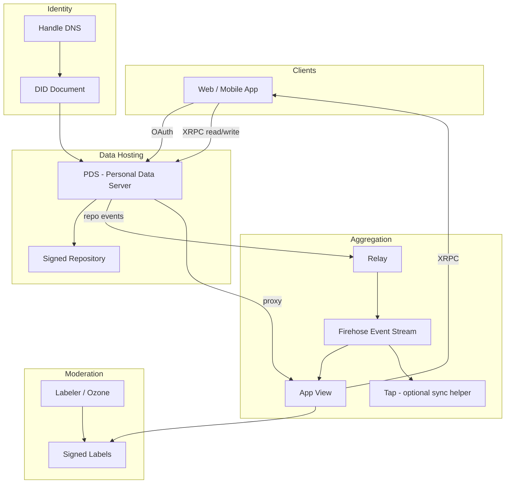
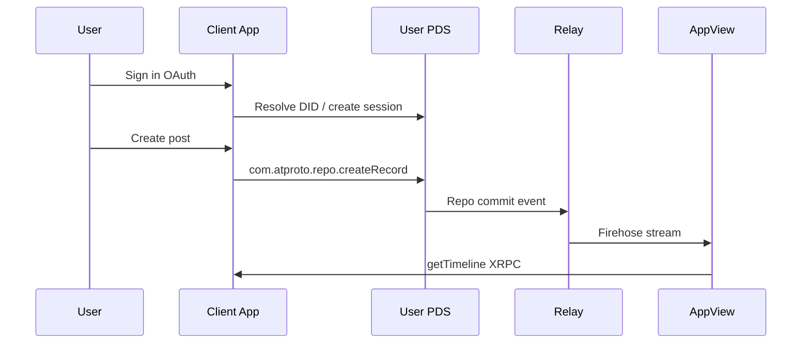

# AT Protocol (atproto)

**Purpose:** Synthesized reference for AI agents building on the Authenticated Transfer Protocol. Covers architecture, data model, identifiers, APIs, auth, sync, and moderation. Use this file for conceptual grounding and implementation decisions. For verbatim spec details, field-by-field Lexicon definitions, or tutorial walkthroughs, load `docs/references/atproto.comdocs.md` via Progressive Disclosure.

**Source:** Distilled from [atproto.com/docs](https://atproto.com/docs) (snapshot in `docs/references/atproto.comdocs.md`).

---

## TL;DR

**AT Protocol** (Authenticated Transfer Protocol, "atproto") is an open standard for social apps. Users publish **signed JSON records** into personal **repositories**. Those changes **sync across the network** so many apps can read the same data and prove it is authentic — without each app owning a walled garden.

The ecosystem is called the **Atmosphere**. Bluesky is the best-known app; atproto is the protocol underneath.

---

## Novice Mental Model

Think of atproto like **GitHub for your social life**, but designed for real-time apps:

| Everyday idea | AT Protocol equivalent |
|---------------|------------------------|
| Your username (`@alice.bsky.social`) | **Handle** — a friendly DNS name |
| Your permanent account ID | **DID** — never changes, even if you move hosts |
| Your public profile + posts + follows | **Repository (repo)** — a signed database of JSON records |
| A single post or follow | **Record** — one JSON document in a **collection** |
| The rules for what a "post" looks like | **Lexicon** — a schema (like OpenAPI/JSON Schema) |
| Talking to a server over HTTP | **XRPC** — normal HTTPS with paths like `/xrpc/app.bsky.feed.getTimeline` |
| Where your data lives in the cloud | **PDS** (Personal Data Server) — your account's home server |
| A search engine / feed builder | **App View** — aggregates data from across the network |
| A news wire of everything happening | **Relay firehose** — streams repo changes network-wide |
| Signing in with "Continue with…" | **OAuth** — grant limited access without sharing your password |

**Key insight:** Your data is **yours and verifiable**. Apps are **views** over shared data, not silos. You can **move your account** between PDS hosts (account portability).

---

## Design Principles

- **Self-authenticating data:** Records are cryptographically signed; copies can be verified without trusting the source server.
- **Big-world scale:** Designed for billions of accounts via relays and app-level aggregation (not "small federation instances" like classic ActivityPub).
- **Formats over apps:** Interoperability comes from shared **Lexicon** schemas, not from one company's API.
- **Delegated authority:** Anyone can publish Lexicons under their own **NSID** namespace (reverse-DNS).
- **Speech vs reach:** Publishing (speech) stays open; discovery/ranking (reach) is a separate layer — often via feeds, algorithms, and **labels**.

---

## Architecture: The AT Stack



### Component Responsibilities

| Component | Role | Required? |
|-----------|------|-----------|
| **PDS** | Hosts accounts, repos, signing keys, OAuth, identity ops, blob storage, account lifecycle | Yes (per user) |
| **Relay** | Aggregates repo events from many PDSes; outputs unified **firehose** | Optional (scaling optimization) |
| **Tap** | Simplified sync: backfill + filtered firehose as JSON; verifies signatures/MST | Optional convenience |
| **App View** | Application logic: feeds, search, metrics, hydration; responds to XRPC | Per application |
| **Labeler** | Publishes moderation **labels** (outside repos) | Optional |
| **Feed Generator** | Custom timeline algorithms; returns post URIs | Optional (Bluesky feeds) |

**Account portability:** Repos export as **CAR files**. Users migrate between PDS hosts without losing identity (DID persists; handle may update).

**DID methods (blessed):** `did:plc` (default for new accounts; key rotation via [plc.directory](https://web.plc.directory/)) and `did:web`.

---

## Core Data Concepts

### Repository (Repo)

Each account has one **public, self-certifying repository**:

- Stored as a **Merkle Search Tree (MST)** — content-addressed, key-sorted.
- Every mutation produces a new signed **commit** (version `3`); root hash changes.
- Paths: `<collection>/<record-key>` (e.g. `app.bsky.feed.post/3k5nobkf2w72g`).
- **Deletion leaves no tombstone** — removed records vanish from the public history.
- Export/import format: **CAR v1** (`.car` files).
- Authoritative location declared in the account's **DID document** → PDS URL.

### Record

- JSON document with required `$type` field matching its Lexicon NSID.
- Lives in a **collection** (also identified by NSID).
- Record key (**rkey**) formats: `tid` (timestamp ID, common), `nsid`, `literal:<value>`, or `any` per Lexicon.

### Blob

- Binary media (images, video) referenced from records, not embedded in the MST.
- Uploaded via `com.atproto.repo.uploadBlob`; referenced in records as `$type: blob` with CID `ref`, `mimeType`, `size`.
- Stored separately on PDS; fetched via `com.atproto.sync.*` endpoints.

### Label

- Signed metadata **outside** the repository, attached to DIDs or records.
- Used for moderation, badging, content warnings (e.g. `nudity`, `graphic-media`).
- Apps subscribe to labelers; speech layer stays permissive, reach layer filters.

---

## Identifiers

### DID (Decentralized Identifier)

- Permanent, non-human-readable account ID (e.g. `did:plc:ewvi7nxzyoun6zhxrhs64oiz`).
- Resolves to a **DID document**: PDS endpoint, handles, public signing keys.
- Use DIDs when durability matters (storage, citations).

### Handle

- Human-readable DNS hostname (e.g. `alice.bsky.social`).
- Resolved via DNS TXT or HTTPS `/.well-known/atproto-did`.
- **Can change** or be reassigned — AT URIs using handles are not durable.
- Multiple handles may map to one repo.

### NSID (Namespaced Identifier)

- Reverse-DNS schema ID (e.g. `app.bsky.feed.post`, `com.atproto.repo.getRecord`).
- Domain authority = reversed hostname; final segment = camelCase name.
- Governance via domain ownership; case-sensitive name segment.

### AT URI (`at://`)

```
at://AUTHORITY/COLLECTION/RKEY
```

- **Authority:** DID (durable) or handle (not durable).
- **Collection:** normalized NSID.
- **Rkey:** record key.
- Does **not** encode network location — authority is identity, not PDS hostname.
- Not content-addressed; record contents may change.

Example:
```
at://did:plc:vmt7o7y6titkqzzxav247zrn/app.bsky.feed.post/3m72rq2hgss2a
```

### CID (Content Identifier)

- SHA-256 hash reference to a specific record version or blob.
- Blessed format: CIDv1, DRISL codec (`0x71`) for objects, `raw` (`0x55`) for blobs, base32 string encoding elsewhere.
- Self-certifying: verify returned bytes against the CID.

### TID (Timestamp ID)

- Common rkey format; time-derived, lexicographically sortable, collision-resistant.

---

## Data Model Essentials

| Aspect | Rule |
|--------|------|
| Wire formats | **JSON** (human/API) and **DRISL-CBOR** (signing/hashing) |
| Floats | **Disallowed** — use integers or encode floats as strings |
| `$` fields | Reserved (`$type`, `$link`, `$bytes`); ignore unknown `$` fields |
| Links in JSON | `{ "$link": "bafy..." }` |
| Bytes in JSON | `{ "$bytes": "<base64>" }` |
| Signing pipeline | DRISL-CBOR encode → SHA-256 → sign hash with account key |
| Curves | `k256` (default for new keys) and `p256`; low-S ECDSA required |

---

## Lexicon

Schema language (JSON, JSON-Schema-like) defining:

| Lexicon `type` | Maps to |
|----------------|---------|
| `record` | Repo collection schema |
| `query` | HTTP GET XRPC endpoint |
| `procedure` | HTTP POST XRPC endpoint |
| `subscription` | WebSocket event stream |
| `permission-set` | OAuth permission bundles |

**Versioning rule:** Published Lexicons are immutable. Loosening or tightening constraints breaks compatibility. Add optional fields only; breaking changes require a **new NSID**.

### Common Lexicon Namespaces

| Namespace | Owner | Examples |
|-----------|-------|----------|
| `com.atproto.*` | Protocol core | `com.atproto.repo.createRecord`, `com.atproto.server.createSession` |
| `app.bsky.*` | Bluesky app | `app.bsky.feed.post`, `app.bsky.graph.follow`, `app.bsky.actor.profile` |
| Custom | Your domain | `com.yourco.yourapp.post` under your NSID hierarchy |

Install Lexicons for TypeScript:
```bash
npm install -g @atproto/lex
lex install app.bsky.feed.post app.bsky.actor.profile
lex build
```

---

## XRPC (HTTP API)

- Path pattern: `GET|POST /xrpc/<nsid>` (top-level, no prefix).
- **Query** = GET (cacheable, no state mutation).
- **Procedure** = POST (may mutate state).
- Params → URL query string; body/response per Lexicon JSON schema.
- Errors: `{ "error": "ErrorName", "message": "..." }`.
- Pagination: `cursor` param pattern.
- CORS encouraged, not required.

### Authentication (priority order for new apps)

1. **OAuth** — preferred for user-facing apps; scoped permissions.
2. **App Passwords** — restricted password for third-party clients (`xxxx-xxxx-xxxx-xxxx`).
3. **Legacy JWT session** — `com.atproto.server.createSession` + `refreshSession`; tokens opaque to clients.
4. **Inter-service JWT** — service-to-service, signed by account key.

Unauthenticated reads and firehose streaming are possible without auth.

---

## Typical App Developer Flow

1. **Auth:** User signs in via OAuth → app learns their PDS URL.
2. **Read/Write:** App calls PDS XRPC to read/write records in user's repo (or proxies via App View).
3. **Network awareness:** App syncs from **Relay firehose** (or Tap) for global activity — signatures verify relay data.
4. **Validation:** Validate records against **Lexicons** on ingest.
5. **Presentation:** App View aggregates/hydrates records into UI-ready views.
6. **Moderation:** Subscribe to labelers; apply labels in reach/discovery layer.



---

## Sync & Firehose

- PDSes emit **event streams** (WebSocket) per repo.
- **Relays** merge many PDS streams → network **firehose**.
- Consumers: App Views, bots, analytics, labelers, Tap.
- Data is signed — consumers can verify without trusting relay.
- **Backfill:** Fetch full repo history from PDS when subscribing to a new DID.
- **Tap** abstracts: verification, backfill, filtering by DID/collection, WebSocket/webhook delivery.

---

## Moderation Model

- **Speech layer:** Repos stay permissive; users can publish.
- **Reach layer:** Apps/feeds apply **labels** and policies.
- **Ozone:** Labeling service + moderation UI.
- **Osprey:** Rules engine for automated moderation at scale.
- Apps **subscribe** to labelers; users may choose labelers (composable trust & safety).

---

## SDKs & Tooling

| Language | Package / Repo | Notes |
|----------|----------------|-------|
| TypeScript | `@atproto/lex`, [atproto monorepo](https://github.com/bluesky-social/atproto) | PDS reference impl, OAuth, lex tooling |
| Go | [indigo](https://github.com/bluesky-social/indigo) | Relay, Go SDK |
| CLI | [goat](https://github.com/bluesky-social/goat) | Account/repo management |
| Python | [atproto](https://atproto.blue/) | Community |
| Rust | rsky, jacquard, atproto-crates | Community |
| TypeScript alt | [atcute](https://github.com/mary-ext/atcute) | Community |

---

## What AT Protocol Does NOT Specify

- Concrete social features (follows, avatars) — left to app Lexicons (`app.bsky.*` is one app, not the protocol).
- Private/encrypted group data — planned; do not bolt encryption onto current primitives.
- Formal IETF standard status yet — intended future step.

---

## Agent Quick Reference

### When building a feature, ask:

1. **Which Lexicon/NSID** defines the record or endpoint?
2. **Read or write?** → PDS directly (authenticated) or App View (aggregated)?
3. **Need real-time network data?** → Relay firehose or Tap.
4. **Identity reference?** → Prefer DID over handle in stored data.
5. **Media?** → Upload blob first, then embed blob ref in record.
6. **Moderation?** → Labels, not repo deletion (unless user/takedown action).

### Common XRPC endpoints (starting points)

| Endpoint | Purpose |
|----------|---------|
| `com.atproto.identity.resolveHandle` | Handle → DID |
| `com.atproto.repo.getRecord` | Fetch one record |
| `com.atproto.repo.listRecords` | List collection |
| `com.atproto.repo.createRecord` | Write record |
| `com.atproto.repo.uploadBlob` | Upload media |
| `com.atproto.server.createSession` | Legacy login |
| `app.bsky.feed.getTimeline` | Bluesky timeline (via App View) |

### Load full reference when you need:

- Exact Lexicon field constraints or error types
- MST/CAR binary format byte-level details
- OAuth PAR/PKCE/DPoP flow specifics
- Handle/DID resolution edge cases
- Event stream wire protocol v0 framing
- Tutorial code for bots, custom feeds, OAuth in Next.js

**Full spec snapshot:** `docs/references/atproto.comdocs.md`

### External reading (recommended by atproto.com)

- [Open Social](https://overreacted.io/open-social/) — protocol as API
- [Where it's at://](https://overreacted.io/where-its-at/) — handles & hosting
- [A Social Filesystem](https://overreacted.io/a-social-filesystem/) — formats over apps
- [Atproto for distributed systems engineers](https://atproto.com/articles/atproto-for-distsys-engineers)
- [The Atproto Ethos](https://atproto.com/articles/atproto-ethos)

---

## Glossary (compact)

| Term | Definition |
|------|------------|
| **Atmosphere** | The atproto ecosystem |
| **atproto** | Authenticated Transfer Protocol |
| **PDS** | Personal Data Server; hosts user repo |
| **Repo** | Signed Merkle tree of public user data |
| **Collection** | NSID-keyed bucket of records in a repo |
| **Record** | JSON document in a collection |
| **Blob** | Binary media referenced by CID |
| **Lexicon** | Schema for records and APIs |
| **NSID** | Namespaced Identifier (reverse DNS) |
| **XRPC** | Lexicon-defined HTTP API |
| **DID** | Permanent decentralized account ID |
| **Handle** | Mutable human-readable username (DNS) |
| **AT URI** | `at://` pointer to a repo record |
| **CID** | Content hash identifier |
| **Relay** | Network event aggregator |
| **Firehose** | Real-time stream of repo commits |
| **App View** | App-specific aggregation service |
| **Label** | Signed moderation metadata |
| **CAR** | Content-addressed archive file format |
| **MST** | Merkle Search Tree (repo internals) |
| **PLC** | `did:plc` identity method & directory |