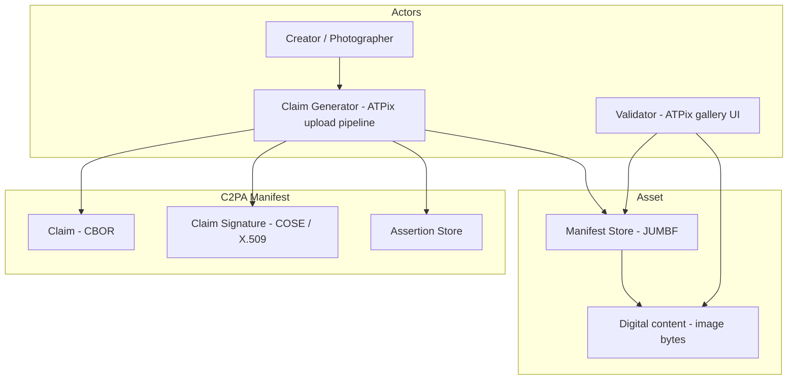

# C2PA (Coalition for Content Provenance and Authenticity)

**Purpose:** Synthesized reference for AI agents implementing Content Credentials in ATPix. Covers manifest lifecycle, required assertions, validation states, trust model, and UX obligations. For verbatim CDDL schemas, exclusion-range byte rules, or embedding byte layouts, load `docs/references/C2PA_Specification.pdf` via Progressive Disclosure.

**TL;DR:** C2PA attaches cryptographically signed **manifests** (Content Credentials) to media **assets**. Each manifest contains a signed **claim** referencing **assertions** (actions, hashes, thumbnails, metadata) and **hard bindings** that tie the manifest to exact file bytes. Validators report **Well-Formed → Valid → Trusted** states; UIs MUST present validation status without judging content "good" or "bad."

---

## Novice Mental Model

| Everyday idea | C2PA equivalent |
|---------------|-----------------|
| Photo file (JPEG/PNG) | **Asset** — digital content + optional manifest store |
| "Who made this and what happened to it?" | **Provenance** — chain of signed assertions |
| Tamper-evident sticker on the file | **C2PA Manifest** — claim + signature + assertions in JUMBF |
| "I took this photo" / "I cropped it" | **Actions** (`c2pa.created`, `c2pa.edited`, …) in `c2pa.actions` |
| Hash locking manifest to pixels | **Hard binding** (`c2pa.hash.data` for raster images) |
| Viewer checking the sticker | **Validator** — runs §15 validation algorithm |
| Green check / warning icon | **Validation state** (Well-Formed, Valid, Trusted) — not a moral rating |

**Key insight:** C2PA is **opt-in provenance**, not DRM. Signers are identified by X.509 credentials; trust is **configurable** via trust lists. ATPix complements atproto signed **records** (who published what) with C2PA signed **pixels** (how the image file was created/edited).

---

## Architecture Stack

### Core components (Source: §1.3, §2.3)

| Component | Role |
|-----------|------|
| **Claim generator** | Software that builds claim + signature (ATPix on upload/edit) |
| **Signer** | X.509 credential holder whose key signs the claim |
| **Assertion** | Structured statement (action, hash, thumbnail, metadata, …) |
| **Claim** | Signed CBOR structure listing assertions + binding info |
| **Manifest** | JUMBF package: claim + signature + assertion store |
| **Manifest store** | Collection of manifests embedded in or linked from asset |
| **Validator** | Consumes asset, runs validation (§15), returns status codes |
| **Content Credentials** | Plural term for provenance technology; one manifest = one credential |

### Manifest types (Source: §11.2)

| Type | When used |
|------|-----------|
| **Standard manifest** | Initial capture or creation; includes hard binding + `c2pa.created` or `c2pa.opened` |
| **Update manifest** | Subsequent edits; chains via `parentOf` ingredient to prior manifest |
| **Timestamp manifest** | TSA-signed; optional for long-term validity evidence |

---

## Binding to Content (Source: §9, §18.5)

| Binding | Mechanism | ATPix use |
|---------|-----------|-----------|
| **Hard binding** | Cryptographic hash over asset bytes (`c2pa.hash.data` for non-BMFF raster) | **Required** on upload — binds manifest to uploaded blob |
| **Soft binding** | Fingerprint from digital content (not raw bits) | Optional for renditions/thumbnails served at different resolutions |

**Rules:**
- Standard manifest MUST include ≥1 hard-binding assertion (§10.3).
- `c2pa.hash.data` uses SHA-256 by default; exclusion ranges MAY skip manifest store and classic metadata boxes (EXIF/IPTC) (§18.5.1).
- `c2pa.hash.data` MUST NOT appear in cloud-data assertions or compressed manifests (§18.5.1).

---

## Required Assertions — Photo Upload Workflow

### Standard manifest minimum (Source: §10.3, §18.14, v2.2 changelog)

| Assertion label | Required? | Purpose |
|-----------------|-----------|---------|
| `c2pa.actions` / `c2pa.actions.v2` | **MUST** | Exactly one actions assertion; first action MUST be `c2pa.created` (new capture) or `c2pa.opened` (import) |
| `c2pa.hash.data` | **MUST** (standard) | Hard binding for JPEG/PNG/WebP raster assets |
| `c2pa.thumbnail.claim` | **SHOULD** | Embedded preview at claim time (§18.13) |
| `c2pa.metadata` | **MAY** | JSON-LD capture/device/creator metadata (§18.16) |
| `c2pa.ingredient` / `.v3` | **MUST** when derived | Prior asset reference for edits/imports (§18.15) |
| `c2pa.time-stamp` | **RECOMMENDED** | RFC 3161 timestamp for signature longevity (§18.17) |
| `c2pa.certificate-status` | **RECOMMENDED** | OCSP stapling for revocation checks (§18.18) |

### Standard action types (Source: §18.14)

| Action | ATPix trigger |
|--------|---------------|
| `c2pa.created` | User uploads new photo (no prior C2PA ingredient) |
| `c2pa.opened` | User imports existing image (with or without prior manifest) |
| `c2pa.edited` | Pixel/editorial change (crop, rotate, filter) |
| `c2pa.edited.metadata` | Caption/title/keywords change only (non-pixel) |
| `c2pa.published` | Photo published to public gallery or shared album link |
| `c2pa.placed` / `c2pa.removed` | Adding/removing ingredient in composed asset |
| `c2pa.transcoded` / `c2pa.repackaged` | Format conversion without editorial change |

**Critical:** Claim generators MUST NOT redact `c2pa.actions` or `c2pa.actions.v2` (§6.8). Actions history is essential.

### Ingredient rules (Source: §18.15, §15.11)

- When editing an existing C2PA asset, update manifest MUST reference `parentOf` ingredient.
- Validator MUST validate ingredient manifest chain back to standard manifest.
- `ingredient.unknownProvenance` is informational when source lacks C2PA — UI MUST disclose unknown provenance.

---

## Cryptography & Signatures (Source: §13, §14.5)

| Topic | Requirement |
|-------|-------------|
| **Claim signature** | COSE Sign1; algorithm from C2PA hash/signature identifier lists |
| **Signing credential** | X.509 chain in `x5chain` protected header; include full intermediate chain (§14.5) |
| **EKU** | `c2pa-kp-claimSigning` (OID 1.3.6.1.4.1.62558.2.1) on end-entity cert |
| **Compatibility** | Also include `id-kp-emailProtection` or `id-kp-documentSigning` for older validators (§14.4.1) |
| **Timestamps** | Trusted TSA list separate from signer trust list (§14.4.2) |

---

## Trust Model & Validation States (Source: §14.3)

Validators classify manifests and assets:

| State | Meaning | Key gates |
|-------|---------|-----------|
| **Well-Formed** | Spec-compliant structure; allowed assertions for manifest type | §15.10, §15.11 |
| **Valid** | Well-Formed + signature verifies + not revoked + inside cert validity | §15.7–§15.9 |
| **Trusted** | Valid + signer credential on validator trust list | §14.4, `signingCredential.trusted` |

**Asset states (derived):**
- **Valid asset** — active manifest Valid/Trusted AND hard binding matches bytes (§14.3.3).
- **Invalid asset** — binding mismatch, signature failure, or manifest missing when expected.

**Guiding principle (Source: §1.2):** Implementations MUST NOT label provenance "good" or "bad" — only whether assertions are **associated**, **well-formed**, and **tamper-free**.

---

## Validation Process (Source: §15)

Phases (order flexible per spec text):

1. Locate active manifest (§15.5)
2. Validate claim CBOR + signature (§15.6–§15.7)
3. Validate timestamp + revocation (§15.8–§15.9)
4. Validate assertions schema + actions rules (§15.10) — including mandatory `c2pa.created`/`c2pa.opened`
5. Validate ingredients chain (§15.11)
6. Validate asset content against hard binding (§15.12)

**Results format:** `validation-results-map` with `success`, `informational`, `failure` code arrays (§15.2.1). Store in ingredient assertions when composing derived assets.

**Representative failure codes:** `assertion.dataHash.mismatch`, `claimSignature.mismatch`, `signingCredential.untrusted`, `signingCredential.ocsp.revoked`, `assertion.action.malformed`.

---

## Embedding & Storage (Source: §11.3, Appendix A)

| Strategy | ATPix implication |
|----------|-----------------|
| **Embedded manifest** | Preferred for JPEG/PNG/WebP uploads — manifest travels with blob to PDS |
| **External manifest** | Manifest at URI; asset holds reference (§11.4) — optional for large manifests |
| **Cloud data** | Remote assertion storage — only with `c2pa.cloud-data`; special rules (no hard binding in cloud assertion) |

**Supported raster formats (Appendix A):** JPEG, PNG, WebP, GIF, TIFF, HEIF/HEIC (verify per-format rules before claiming support). ATPix v1 MUST support **JPEG and PNG** at minimum.

**atproto integration pattern:**
1. Claim generator embeds manifest in image bytes client-side or in upload service.
2. `uploadBlob` sends asset-with-credentials to PDS.
3. Photo record stores `c2pa.activeManifestId`, `c2pa.validationSummary`, optional external manifest URI.
4. Gallery validator re-validates on display (or trusts cached result with refresh policy).

---

## User Experience Requirements (Source: §16)

### Principles (§16.2)

- Support **creators** capturing history and **consumers** understanding origin.
- Designs are context-dependent (Consumers, Creators, Publishers, Verifiers) — recommendations not mandates.

### Disclosure levels (§16.3) — implement progressively

| Level | UI obligation |
|-------|---------------|
| **L1** | Indicator that C2PA data exists + cryptographic validation status |
| **L2** | Summary sufficient to understand how asset reached current state |
| **L3** | Detailed provenance (actions, signers, timestamps) |
| **L4** | Forensic view — full signatures, trust signals (power users) |

### Privacy (Source: §1.2, Table 1 Design Goals)

- Users MUST control which provenance assertions are included (GPS, device ID, etc.).
- ATPix MUST offer opt-in/opt-out per assertion class before signing.
- Consumption/validation MUST work **offline** from embedded manifests (Flexible Locality goal).

---

## Security & Harms (Source: §17)

- Treat validator trust stores as sensitive; private credential store entries require **explicit user consent** (§14.4.3).
- Mitigate misuse documented in §17.2 (false sense of security, coerced signing, surveillance via device metadata).
- ATPix MUST NOT embed location/device assertions without explicit user consent.

---

## Versioning & Compatibility (Source: §5, §6.3)

- Target **C2PA 2.2** for new ATPix work.
- Use `c2pa.actions.v2` for new manifests when possible; support reading v1.
- Deprecated constructs MUST NOT be written by claim generators (Appendix C).
- Custom assertions/namespaces: reverse-DNS prefix (e.g. `com.atpix.gallery.creatorDid`) per §6.2.1 namespacing.

---

## ATPix Agent Quick Reference

### When implementing upload

1. Is this **created** or **opened**? → first action in `c2pa.actions`
2. Compute `c2pa.hash.data` over image bytes with exclusions for manifest store region
3. Add `c2pa.thumbnail.claim` (optional but recommended)
4. Sign with C2PA-compliant cert (`c2pa-kp-claimSigning` EKU)
5. Embed manifest in asset before `com.atproto.repo.uploadBlob`

### When implementing edit

1. Validate existing manifest chain
2. Create **update manifest** with `parentOf` ingredient
3. Record `c2pa.edited` or `c2pa.edited.metadata` action
4. Recompute hard binding on new bytes

### When displaying gallery

1. Run validator (or use cached §15.2 results)
2. Show L1 + L2 disclosure minimum
3. Map `signingCredential.trusted` → "Trusted signer" vs "Unknown signer" — never "Authentic photo"

### Linking C2PA ↔ atproto

| C2PA field | ATPix bridge |
|------------|--------------|
| `claim_generator_info.name` | "ATPix" + version |
| Custom assertion `com.atpix.gallery.creatorDid` | Author's atproto DID |
| Custom assertion `com.atpix.gallery.photoUri` | `at://` record URI after publish |
| `c2pa.published` action | Triggered when visibility → public |

---

## Glossary (compact)

| Term | Definition |
|------|------------|
| **Asset** | File/stream with digital content + optional manifest store |
| **Assertion** | Provenance statement in manifest |
| **Claim** | Signed root structure referencing assertions |
| **Claim generator** | Software creating manifests (ATPix) |
| **Content Credentials** | C2PA provenance for an asset |
| **Hard binding** | Cryptographic hash binding manifest to bytes |
| **Ingredient** | Prior asset incorporated into derived work |
| **JUMBF** | ISO 19566-5 container format for manifests |
| **Manifest store** | All manifests attached to an asset |
| **Signer** | Entity behind signing certificate |
| **Soft binding** | Content-derived fingerprint for matching renditions |
| **Validator** | Component executing §15 validation |
| **Well-Formed / Valid / Trusted** | Progressive validation states (§14.3) |

---

## Traceability Index (key constraints)

| Rule | Source |
|------|--------|
| Standard manifest requires `c2pa.created` OR `c2pa.opened` in actions | §18.14, §15.10 |
| Do not redact `c2pa.actions` | §6.8 |
| Hard binding required in standard manifest | §10.3 |
| `c2pa.hash.data` for non-BMFF raster hard bind | §18.5 |
| Validation states: Well-Formed → Valid → Trusted | §14.3 |
| No good/bad value judgments | §1.2 Guiding Principles |
| Disclosure levels L1–L4 | §16.3 |
| User privacy control over assertions | §1.2, Design Goals |
| Return validation status tripartite codes | §15.2 |
| Signer EKU `c2pa-kp-claimSigning` | §14.4.1 |
| Full PDF snapshot | [docs/references/C2PA_Specification.pdf](../../docs/references/C2PA_Specification.pdf) |

**Full spec:** https://spec.c2pa.org/specifications/specifications/2.2/specs/C2PA_Specification.html