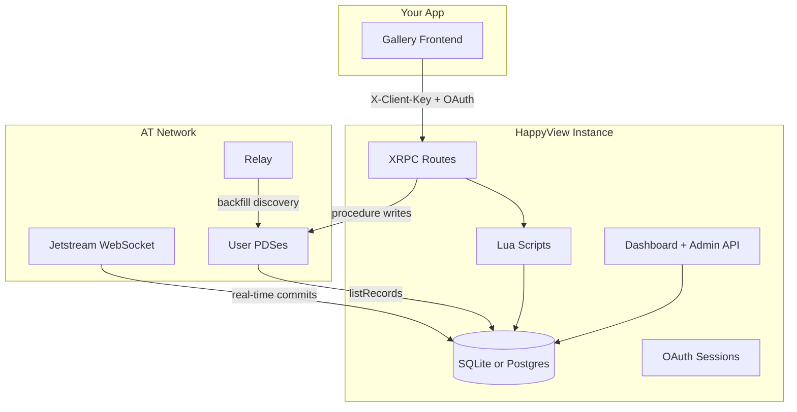

# HappyView

**Purpose:** Synthesized reference for AI agents building AT Protocol App Views with [HappyView](https://happyview.dev). Covers schema-driven endpoints, indexing, auth, Lua customization, deployment, and client SDKs. Use this file for HappyView-specific implementation decisions. For verbatim API field lists, admin endpoint schemas, or full Lua API signatures, load `docs/references/happyview.dev.docs.md` via Progressive Disclosure. For underlying atproto concepts, see `.agents/kb/at-protocol.md`.

**Source:** Distilled from [happyview.dev/docs](https://happyview.dev) (snapshot in `docs/references/happyview.dev.docs.md`).

---

## TL;DR

**HappyView** is a schema-driven **App View framework** for AT Protocol. Upload **Lexicons** → HappyView auto-generates **XRPC endpoints**, **database indexing**, **Jetstream sync**, **historical backfill**, and **OAuth/PDS write proxying**. Add **Lua scripts** for custom gallery logic. You describe *what* your data looks like; HappyView handles App View plumbing.

---

## Novice Mental Model

Building an App View from scratch means wiring: firehose consumption, repo storage, XRPC routing, OAuth, PDS proxies, and backfill — before you write app logic.

HappyView inverts that:

| You provide | HappyView provides |
|-------------|-------------------|
| Lexicon JSON (record/query/procedure schemas) | Database tables + indexing |
| Optional Lua `handle()` functions | Custom query/write behavior |
| API client registration | Rate limits + client identification |
| (Optional) frontend app | Dashboard, admin API, OAuth flows |

**The Statusphere pattern** (record + query + procedure) is the canonical template. A photo gallery App View follows the same shape with different fields.

---

## Architecture



### Request flows

| Operation | Path |
|-----------|------|
| **Read (query)** | `GET /xrpc/{nsid}` → Lua script or default list/get → local DB |
| **Write (procedure)** | `POST /xrpc/{nsid}` → Lua → `Record:save()` → user's PDS → re-indexed locally |
| **Blob upload** | `POST /xrpc/com.atproto.repo.uploadBlob` → proxied to user's PDS (max 50MB) |
| **Admin** | `/admin/*` → API key (`hv_*`) or service JWT + permissions |

### Data stores (core tables)

| Table | Holds |
|-------|-------|
| `records` | Indexed atproto records (`uri`, `did`, `collection`, `rkey`, `record` JSON, `cid`) |
| `lexicons` | Uploaded schemas + `target_collection`, `backfill` flag |
| `users` / `api_keys` | Dashboard operators + automation keys |
| `oauth_sessions` | Per-DID OAuth tokens for PDS proxying |

---

## The Three-Lexicon Pattern

Every HappyView app typically needs **three lexicons**:

| Type | HTTP | Purpose |
|------|------|---------|
| `record` | — | Defines data shape; triggers Jetstream subscription + DB indexing |
| `query` | `GET /xrpc/{nsid}` | Read indexed data (list, filter, paginate) |
| `procedure` | `POST /xrpc/{nsid}` | Create/update records on user's PDS |

### HappyView-specific fields (on upload)

| Field | Applies to | Meaning |
|-------|------------|---------|
| `target_collection` | query, procedure | Which record NSID to read/write |
| `backfill` | record (default `true`) | Fetch historical network records on upload |

**Critical:** Query/procedure lexicons without `target_collection` won't know which records to operate on.

### Lexicon upload methods

1. **Local** — paste/upload JSON via dashboard or `POST /admin/lexicons`
2. **Network** — enter NSID; HappyView resolves via DNS `_lexicon.{domain}` TXT → DID → PDS → `com.atproto.repo.getRecord`

Network lexicons auto-update via Jetstream `com.atproto.lexicon.schema` events. Tracking a network lexicon indexes records but does **not** serve that NSID's query endpoints locally — upload a local query lexicon to serve reads from your DB.

### Default query behavior (no Lua)

`GET /xrpc/{method}?limit=20&cursor=...&did=...` or `?uri=at://...`

- Lists records from `target_collection`
- Blob fields auto-enriched with `url` pointing to PDS

### Default procedure behavior (no Lua)

Proxies simple creates/updates to caller's PDS when a Lua script uses `Record:save()`.

---

## Photo Gallery App View (First-App Walkthrough)

Use namespace `com.yourdomain.gallery` (replace with your reversed domain).

### Step 0: Deploy + bootstrap

1. Deploy HappyView (Railway one-click, Docker Compose, or `cargo run`)
2. Set `DATABASE_URL`, `PUBLIC_URL` (use `http://127.0.0.1:3000` locally — not `localhost`)
3. Log into dashboard with your atproto handle → first login becomes **super user**
4. Configure **Service Identity** (`did:web` simplest; `did:plc` for production durability)

### Step 1: Define the photo record lexicon

```json
{
  "lexicon": 1,
  "id": "com.yourdomain.gallery.photo",
  "defs": {
    "main": {
      "type": "record",
      "key": "tid",
      "record": {
        "type": "object",
        "required": ["image", "createdAt"],
        "properties": {
          "image": { "type": "blob", "accept": ["image/*"] },
          "caption": { "type": "string", "maxLength": 2000 },
          "albumId": { "type": "string", "maxLength": 100 },
          "createdAt": { "type": "string", "format": "datetime" }
        }
      }
    }
  }
}
```

Upload with `backfill: true`. HappyView subscribes via Jetstream and backfills existing photos network-wide.

### Step 2: Create API client

**Settings > API Clients > New client** → copy `hvc_...` key (and `hvs_...` secret for server apps). Required on **every** XRPC request via `X-Client-Key` header.

### Step 3: Query lexicon — list gallery

```json
{
  "lexicon": 1,
  "id": "com.yourdomain.gallery.listPhotos",
  "defs": { "main": { "type": "query" } }
}
```

Set `target_collection` = `com.yourdomain.gallery.photo`. Attach Lua:

```lua
collection = "com.yourdomain.gallery.photo"

function handle()
  if params.uri then
    local record = db.get(params.uri)
    if not record then error("record not found") end
    return { record = record }
  end

  return db.query({
    collection = collection,
    did = params.did,
    limit = tonumber(params.limit) or 20,
    cursor = params.cursor,
  })
end
```

Call: `GET /xrpc/com.yourdomain.gallery.listPhotos?limit=20`

Filter by user: `?did=did:plc:...`
Filter by album (custom): extend Lua with `params.albumId` + `db.search` or JSON field filters.

### Step 4: Procedure lexicon — upload photo

Client flow:
1. `POST /xrpc/com.atproto.repo.uploadBlob` with image bytes (DPoP auth) → get `blob` ref
2. `POST /xrpc/com.yourdomain.gallery.createPhoto` with `{ image, caption, albumId }`

Procedure lexicon + Lua:

```lua
collection = "com.yourdomain.gallery.photo"

function handle()
  local r = Record(collection, {
    image = input.image,
    caption = input.caption,
    albumId = input.albumId,
    createdAt = now(),
  })
  r:save()
  return { uri = r._uri, cid = r._cid }
end
```

`Record:save()` writes to the authenticated user's PDS and indexes locally.

### Step 5: Build the frontend

Use `@happyview/lex-agent` + `@happyview/oauth-client-browser` + `@atproto/lex`:

```javascript
import { Client } from "@atproto/lex";
import { HappyViewBrowserClient } from "@happyview/oauth-client-browser";
import { createAgent } from "@happyview/lex-agent";

const oauthClient = new HappyViewBrowserClient({
  instanceUrl: "https://your-happyview.example.com",
  clientKey: "hvc_...",
});

await oauthClient.signIn("alice.bsky.social");
const { session } = await oauthClient.init();
const lex = new Client(createAgent(session));

// Upload blob, then create photo record via your procedure lexicon
```

### What you end up with

- Network-wide indexing of `com.yourdomain.gallery.photo` records
- Paginated gallery API
- Authenticated photo uploads to any user's PDS
- No custom Rust/Go server code for App View infrastructure

---

## Real-Time Sync & Backfill

### Jetstream

- Filtered WebSocket firehose (`JETSTREAM_URL`, default Bluesky Jetstream)
- Collection filter built from all `record`-type lexicons + `com.atproto.lexicon.schema`
- Cursor persisted for reconnect resume

### Backfill

Triggered automatically on record lexicon upload (`backfill: true`) or manually via dashboard/`POST /admin/backfill`.

Pipeline:
1. `com.atproto.sync.listReposByCollection` on relay → discover DIDs
2. Resolve DIDs via PLC → PDS endpoints (concurrent)
3. `com.atproto.repo.listRecords` per PDS → upsert into local DB

Jobs survive restarts; safe to re-run (upsert by URI). Deleting local records does not delete network data — re-backfill restores.

---

## Authentication Surfaces

### XRPC (`/xrpc/*`)

| Requirement | Details |
|-------------|---------|
| **Always** | `X-Client-Key: hvc_...` (or `client_key` query param) |
| **Queries** | Client key only (user identity optional) |
| **Procedures** | Client key + user auth (DPoP preferred) |
| **uploadBlob** | Client key + user auth |

User auth resolution order:
1. DPoP (`Authorization: DPoP` + `DPoP` header) — third-party apps
2. Bearer space credential (spaces only)
3. Bearer service auth JWT
4. Cookie session (dashboard)
5. Anonymous (script decides)

**Admin API keys (`hv_*`) are NOT valid on XRPC.**

### Admin API (`/admin/*`)

- `Authorization: Bearer hv_...` (scoped permissions)
- Or service auth JWT
- 44 granular permissions; templates: Viewer, Operator, Manager, Full Access
- First dashboard login → super user (unrestricted)

### API client types

| Type | Where | Auth |
|------|-------|------|
| **Confidential** | Server, CLI, bots | `X-Client-Key` + `X-Client-Secret` |
| **Public** | Browser, mobile | `X-Client-Key` + `Origin` match + PKCE |

---

## Lua Scripting

### Triggers

| Trigger | When |
|---------|------|
| `xrpc.query:<nsid>` | Query endpoint hit |
| `xrpc.procedure:<nsid>` | Procedure endpoint hit |
| Record/label scripts | On index or label event (see label-scripts) |

### Structure

```lua
function handle()
  return { ... }  -- JSON response
end
```

### Key globals

| Global | Queries | Procedures |
|--------|---------|------------|
| `params` | query string (strings) | query string |
| `input` | — | JSON body |
| `caller_did` | optional | required for writes |
| `collection` | target NSID | target NSID |
| `env` | script variables from dashboard | same |

### Key APIs

| API | Use |
|-----|-----|
| `Record(collection, data)` + `r:save()` | Create on PDS (procedures) |
| `db.query({ collection, did, limit, cursor })` | Paginated list |
| `db.get(uri)` | Single record |
| `db.search(...)` | Full-text / field search |
| `now()`, `TID()`, `log(msg)`, `toarray(tbl)` | Utilities |

Sandbox: no `io`, `require`, `os.execute`; 1M instruction limit.

Full references: `api-reference/lua/record-api`, `database-api`, `json-api`, `xrpc-lua-api`.

---

## Configuration (Essential Env Vars)

| Variable | Required | Default | Notes |
|----------|----------|---------|-------|
| `DATABASE_URL` | yes | — | `sqlite://...` or `postgres://...` |
| `PUBLIC_URL` | yes | — | OAuth callbacks; no trailing path |
| `SESSION_SECRET` | prod | dev default | 64+ chars in production |
| `JETSTREAM_URL` | no | Bluesky Jetstream | Real-time sync |
| `RELAY_URL` | no | `https://bsky.network` | Backfill discovery |
| `PLC_URL` | no | `https://plc.directory` | DID resolution |
| `TOKEN_ENCRYPTION_KEY` | prod rec. | — | Encrypts OAuth tokens |
| `BASE_PATH` | no | — | Reverse-proxy subpath (e.g. `/hv`) |
| `PORT` | no | `3000` | Bind port |

---

## Service Identity

App Views should expose a DID so PDSes can route requests:

| Mode | DID method | Best for |
|------|------------|----------|
| Domain | `did:web` | Simple; tied to domain; auto `/.well-known/did.json` |
| Network | `did:plc` | Production; survives domain changes; **backup rotation key** |
| Linked account | existing DID | Operators with existing atproto account |

Skippable for local dev; required for full network service routing.

---

## JavaScript SDKs

| Package | Use |
|---------|-----|
| `@happyview/lex-agent` | **Recommended** — type-safe XRPC via `@atproto/lex` |
| `@happyview/oauth-client-browser` | Browser OAuth + DPoP provisioning |
| `@happyview/oauth-client-node` | Server-side OAuth |
| `@happyview/oauth-client` | Low-level; custom adapters |

DPoP flow: SDK gets keypair from HappyView → OAuth with user's PDS → registers tokens → all XRPC uses DPoP proofs.

---

## Extensions

| Feature | Purpose |
|---------|---------|
| **Labelers** | Subscribe to moderation labels; filter gallery content |
| **Plugins (WASM)** | External integrations (CDN, search, etc.) |
| **Permissioned Spaces** | Experimental gated containers (ATP-0016) |
| **Attestation signing** | Sign responses with App View key |
| **Event logs** | Audit admin actions, script errors |

---

## XRPC Fixed Endpoints

Always available (in addition to dynamic lexicon routes):

| Endpoint | Method | Auth |
|----------|--------|------|
| `/health` | GET | none |
| `app.bsky.actor.getProfile` | GET | required |
| `com.atproto.repo.uploadBlob` | POST | required |

---

## Troubleshooting Quick Reference

| Symptom | Likely cause |
|---------|--------------|
| XRPC 404 | Lexicon not uploaded; wrong NSID; query vs procedure mismatch |
| Empty query results | Missing `target_collection`; backfill incomplete; collection just added (need backfill) |
| Procedure 401 | Missing `X-Client-Key` or DPoP auth |
| Records not real-time | Jetstream disconnect; no record lexicon for collection |
| Admin 403 | Missing permission; not bootstrapped as user |
| Lua script failed | Check server logs; use `log()`; instruction limit exceeded |

---

## Agent Quick Reference

### Building a new App View feature

1. Design **record lexicon** (data model + `key` type, usually `tid`)
2. Upload record lexicon with `backfill: true`
3. Create **API client** (`hvc_...`)
4. Upload **query** lexicon + Lua for reads
5. Upload **procedure** lexicon + Lua for writes
6. Register lexicons on network (DNS `_lexicon` TXT) if you want others to resolve schemas
7. Build frontend with `@happyview/lex-agent`

### NSID authority for network lexicons

`com.yourdomain.gallery.photo` → authority `com.yourdomain.gallery` → domain `gallery.yourdomain.com` → DNS `_lexicon.gallery.yourdomain.com` TXT `did=...`

### Proxy behavior

Unknown XRPC methods without local lexicon → proxied to authority's PDS. To serve locally, upload a local query/procedure lexicon.

### Load full reference when you need:

- Complete admin API endpoint schemas
- All 44 permission strings
- Lua API full signatures
- Plugin WASM manifest format
- Spaces experimental API
- Production deployment hardening checklist
- Changelog / version-specific behavior

**Full doc snapshot:** `docs/references/happyview.dev.docs.md`

### External links

- [HappyView source](https://tangled.org/gamesgamesgamesgames.games/happyview)
- [Statusphere tutorial](https://happyview.dev/tutorials/statusphere)
- [Statusphere example app](https://github.com/bluesky-social/statusphere-example-app)
- [Jetstream](https://github.com/bluesky-social/jetstream)
- [AT Protocol KB](.agents/kb/at-protocol.md)

---

## Glossary (HappyView-specific)

| Term | Definition |
|------|------------|
| **API client** | App identity (`hvc_` key); not a user account |
| **Backfill** | Bulk import of existing network records |
| **Network lexicon** | Schema fetched from atproto network via DNS authority |
| **Target collection** | Record NSID a query/procedure operates on |
| **Super user** | First-login bootstrap; unrestricted admin access |
| **Jetstream** | Filtered WebSocket record event stream |
| **DPoP** | Proof-of-possession OAuth token binding for XRPC |
| **Record script** | Lua triggered on record index events |
| **Service identity** | App View DID for network routing |