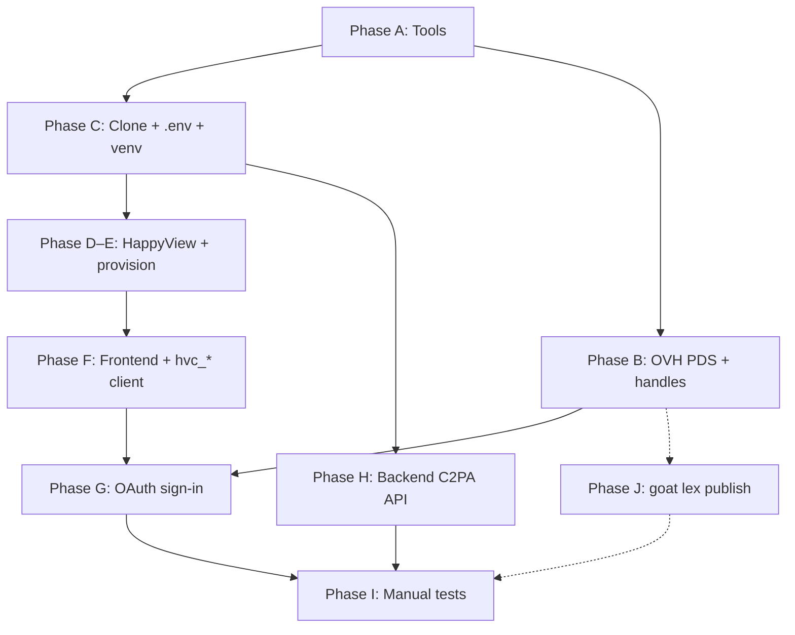

# About this project

**ATPix** is a decentralized photo collection and sharing application on the [AT Protocol](https://atproto.com). 

Users own their libraries: photos live as cryptographically signed records and blobs in Personal Data Server (PDS) repositories, indexed and served by a [HappyView](https://happyview.dev) App View. 

This product is a proof-of-concept to evaluate HappyView's permissioned spaces implementation.

## What it does

Users sign in with **atproto OAuth** (DPoP-bound sessions, no app passwords) — including new visitors who register a **`*.pds.atpix.net`** handle on the operator-hosted PDS ([F-017](docs/overview/002-prd.md#f-017-hosted-pds-account-onboarding)) — upload images with **C2PA 2.2 Content Credentials**, organize **albums**, and browse **My Gallery** or a **Following / Hashtags** discovery feed. 

Galleries populate two ways: 
**(a)** direct PDS upload and 
**(b)** photos already indexed on the network via follow-graph and hashtag rules—Path B uses only HappyView Jetstream sync, not a custom firehose. 

Sharing supports **public**, **unlisted**, and **permissioned** albums; permissioned collections use [HappyView Permissioned Spaces](https://happyview.dev/experimental/spaces) (ATP-0016) so only invited members can view curated private albums.

Product language (gallery, album) maps to atproto primitives (queries, `net.atpix.gallery.*` records, space repos) in the [PRD](docs/overview/002-prd.md#product-terms--at-protocol-primitives) and [Lexicon README](docs/lexicon/net.atpix.gallery.md).

## Metadata
 Photo metadata maps to [Dublin Core](https://www.dublincore.org/specifications/dublin-core/dcmi-terms/) and [Schema.org](https://schema.org/docs/schemas.html) terms in `net.atpix.gallery.*` Lexicons; image files embed [C2PA 2.2](https://spec.c2pa.org/specifications/specifications/2.2/specs/C2PA_Specification.html) Content Credentials for tamper-evident provenance. 
 
 Photos and metadata remain user-owned and portable across the Atmosphere—not locked in a proprietary CDN or siloed account system.

## Repository layout

| Component | Role | ADR |
|-----------|------|-----|
| `apps/frontend/` | Vite vanilla JS; OAuth, gallery UI, HappyView XRPC | [005](docs/architecture/005-application-architecture.md), [006](docs/architecture/006-oauth-dpop-authentication.md) |
| `apps/backend/` | FastAPI; C2PA claim generation/validation, health | [008](docs/architecture/008-c2pa-sdk-and-signing.md) |
| HappyView (external) | Indexing, OAuth proxy, XRPC, spaces | [007](docs/architecture/007-happyview-app-view-integration.md) |
| `docs/lexicon/` | `net.atpix.gallery.*` schema artifacts | [009](docs/architecture/009-lexicon-namespace-authority.md) |
| `docs/` | Project documentation portal (`docs.atpix.net` via GitHub Pages) | — |
| [atpix-homepage](https://github.com/peterVG/atpix-homepage) | Marketing site (`atpix.net` via GitHub Pages; separate repo) | — |

Observability (Promtail → Redpanda → Loki, Prometheus, Grafana) runs via root `docker-compose.yml` per [003](docs/architecture/003-observability-stack.md). Tests use pytest/behave, vitest/playwright, and **Allure** reporting per [001](docs/architecture/001-test-runners-and-reporting.md).

## Where user data lives (PDS vs App View)

ATPix follows the standard [AT Protocol](https://atproto.com) split: a **Personal Data Server (PDS)** hosts each user's signed repository; an **App View** indexes and serves that data for apps. **The ATPix monorepo does not run a PDS** — neither the local Docker stack nor HappyView replaces account storage. Production deployments MAY point visitors to an **operator-hosted PDS** (e.g. `pds.atpix.net` on OVH) for `*.pds.atpix.net` account creation; see [Phase B](#phase-b--dedicated-pds-at-ovh).

| Layer | Role in ATPix | Canonical user photos & records? |
|-------|---------------|----------------------------------|
| **User PDS** (remote) | Hosts blobs + public/unlisted `net.atpix.gallery.*` records; `net.atpix.gallery.album` metadata (with `spaceUri` when permissioned) | **Yes** — source of truth for public/unlisted content and album containers |
| **HappyView** (external, port 3001) | App View: index, OAuth write proxy, XRPC, permissioned spaces | **Public/unlisted:** index/cache + proxy only. **Permissioned:** `net.atpix.gallery.photo` and `net.atpix.gallery.albumItem` in the album's space repo are canonical there |
| **`apps/backend/`** | C2PA claim generation/validation, health | No |
| **`apps/frontend/`** | Gallery UI, OAuth client | No — browser session state only |

**Users need a PDS-backed atproto account** (TC-003). Sign-in uses OAuth against an existing identity (Bluesky, another hoster, or `*.pds.atpix.net` on the hosted PDS). ATPix does not create accounts in-app in v1 — it links to PDS registration when `VITE_PDS_SIGNUP_URL` is set ([F-017](docs/overview/002-prd.md#f-017-hosted-pds-account-onboarding)). HappyView proxies `uploadBlob` and record writes to the user's PDS. See [ADR-006](docs/architecture/006-oauth-dpop-authentication.md) and [ADR-007](docs/architecture/007-happyview-app-view-integration.md).

Typical write path once the gallery UI is implemented:

```
Browser (ATPix) → HappyView (OAuth + XRPC proxy) → user's PDS
```

**Permissioned albums** ([ADR-010](docs/architecture/010-permissioned-spaces-storage.md)): the `net.atpix.gallery.album` container record stays in the owner's **PDS** and links `spaceUri`. The HappyView **space repo** holds permissioned `net.atpix.gallery.photo` and `net.atpix.gallery.albumItem` records. **Image blobs remain on the author's PDS** and are served via `com.atproto.space.getBlob` with membership checks.

**Local Docker persistence:** HappyView stores its own SQLite index, OAuth sessions, and provisioned lexicons under `./data/happyview_data/` (bind-mounted in `docker-compose.happyview.yml`). Stopping the container does **not** delete user PDS data. Wiping `./data/happyview_data/` loses local index and sessions only — records on users' PDSes remain; re-run [Step 4 provisioning](#step-4--provision-lexicons-and-enable-permissioned-spaces) and backfill to rebuild the index.

**New test accounts:** use Bluesky accounts for quick smoke tests, or the [dedicated OVH PDS path](#phase-b--dedicated-pds-at-ovh) below for multi-account permissioned-album testing.

## Requirements and verification

- **[Product vision](docs/overview/001-product-vision.md)** — problem, users, value proposition
- **[PRD v1.6](docs/overview/002-prd.md)** — F-001–F-021 functional requirements (F-018–F-021 post-v1 identity platform), NFRs, technical constraints
- **[SRS v1.1](docs/overview/003-srs.md)** — technical specs with 100% PRD traceability
- **[Implementation plan](docs/overview/005-plan.md)** — global roadmap; module checklists in [apps/frontend/docs/plan.md](apps/frontend/docs/plan.md) and [apps/backend/docs/plan.md](apps/backend/docs/plan.md)
- **[UI requirements v1.1](docs/overview/004-ui-requirements.md)** — screens, components, and mockups ([UX guide](docs/references/000-UX-guide.md))
- **BDD features** — Gherkin scenarios under `apps/frontend/tests/features/` (UI/auth/gallery) and `apps/backend/tests/features/` (C2PA, lexicon, spaces, performance)
- **Architecture** — [ADRs 001–011](docs/architecture/) including OAuth ([006](docs/architecture/006-oauth-dpop-authentication.md)), HappyView integration ([007](docs/architecture/007-happyview-app-view-integration.md)), C2PA ([008](docs/architecture/008-c2pa-sdk-and-signing.md)), lexicon authority ([009](docs/architecture/009-lexicon-namespace-authority.md)), permissioned spaces ([010](docs/architecture/010-permissioned-spaces-storage.md)), SQLite index ([011](docs/architecture/011-sqlite-index-database.md))
- **Agent knowledge bases** — [AT Protocol combined (v2)](.agents/kb/at-protocol-v2.md) (public + permissioned proposal concepts); [HappyView](.agents/kb/happyview.md) (ATPix wire dialect). Permissioned albums use HappyView’s `ats://` Spaces API, not the raw proposal URI grammar alone — see [ADR-010](docs/architecture/010-permissioned-spaces-storage.md).

v1 is a **product-validation** and **reference implementation** release—not a mass-market consumer launch. Encrypted private albums and client-side encryption are explicitly out of scope. Permissioned albums are **membership-gated** (access control), not end-to-end encrypted.

## Prerequisites

Install runtimes using a version manager ([mise](https://mise.jdx.dev/), [asdf](https://asdf-vm.com/), [nvm](https://github.com/nvm-sh/nvm), or [pyenv](https://github.com/pyenv/pyenv)) — do not rely on OS-shipped Python/Node alone.

| Tool | Version | Docs |
|------|---------|------|
| Python | 3.11+ | [python.org/downloads](https://www.python.org/downloads/) |
| Node.js | 22+ | [nodejs.org](https://nodejs.org/) |
| Docker | latest | [docs.docker.com](https://docs.docker.com/get-docker/) |
| [`goat`](https://github.com/bluesky-social/goat#install) | latest | Handle/DID checks and network lexicon publish (OVH PDS path) |
| Git | 2.x | Clone this repository |

## First-time install and test

Use this order after merging Task 5.1. Each phase depends on the ones above it.

| Phase | What you set up | Depends on | Go to |
|-------|-----------------|------------|-------|
| **A** | Developer tools (Docker, Python, Node, Git) | — | [Prerequisites](#prerequisites) |
| **B** | Domain DNS + OVH PDS + test handles (`alice.pds.atpix.net`, `bob.pds.atpix.net`) | Registrar + VPS | [Phase B — Dedicated PDS at OVH](#phase-b--dedicated-pds-at-ovh) |
| **C** | Clone repo, `.env`, backend Python venv | A | [Phase C — Step 1](#step-1--clone-repository-and-environment) |
| **D** | HappyView App View (Docker, port 3001) | A, C | [Phase D — Step 2](#step-2--start-happyview-and-verify-health) |
| **E** | HappyView admin login, `hv_*` key, lexicon provisioning | D | [Phase E — Steps 3–4](#step-3--happyview-admin-login-and-admin-api-key) |
| **F** | Frontend dev server, OAuth metadata, `hvc_*` API client | C, E | [Phase F — Steps 5–6](#step-5--start-frontend-and-verify-oauth-client-metadata) |
| **G** | Sign in to ATPix (OAuth against your PDS) | B (OVH handles) or any PDS (Bluesky shortcut), F | [Phase G — Step 7](#step-7--sign-in-and-verify-application-shell-task-21) |
| **H** | Backend API for C2PA signing (port 8000) | C (venv), G for upload tests | [Phase H — Step 8](#step-8--c2pa-pre-upload-signing-task-31) |
| **I** | Manual feature walkthrough (gallery, albums, permissioned spaces) | G, H | [Phase I — Steps 9–11](#step-9--photo-upload-and-my-gallery-task-32) |
| **J** | Network lexicon authority (`goat lex publish`) — optional for local dev | B (PDS + `lexicon.atpix.net`); [Phase E](#step-4--provision-lexicons-and-enable-permissioned-spaces) for App View | [Phase J — Lexicon authority](#phase-j--network-lexicon-authority-optional-before-production) |
| **K** | Automated tests (optional) | D–I as applicable | [Step 12](#step-12--run-automated-tests-optional) |
| — | **Manual feature tests** (after C–H) | B–H | [What you can test right now](#what-you-can-test-right-now) |



While DNS propagates during Phase B, you may run Phases C–D in parallel. For the OVH path, finish Phase B before [Step 3](#step-3--happyview-admin-login-and-admin-api-key) (HappyView admin login as `alice.pds.atpix.net`) and before [Phase G](#step-7--sign-in-and-verify-application-shell-task-21).

**Two sign-in paths**

| Path | When to use | Sign-in handle | Phase B required? |
|------|-------------|----------------|-------------------|
| **Dedicated OVH PDS (recommended)** | First real install; permissioned-album multi-account tests; end-user `*.pds.atpix.net` signup | `alice.pds.atpix.net` / `bob.pds.atpix.net` on `https://pds.atpix.net` | **Yes** — complete Phase B before Phase G |
| **Bluesky shortcut** | Fast UI smoke test only | `you.bsky.social` (or any hosted PDS) | No — skip Phase B |

ATPix does **not** host user accounts. HappyView proxies writes to whichever PDS your handle resolves to ([Where user data lives](#where-user-data-lives-pds-vs-app-view)). For permissioned-space BDD and two-account album tests, you need Phase B.

**Ports (local dev):** HappyView **3001**, Grafana **3000**, frontend **5173**, backend **8000**. HappyView must reach your PDS over HTTPS (e.g. `curl https://pds.atpix.net/xrpc/_health` from the host running Docker).

## What you can test right now

After [Task 5.1](docs/overview/005-plan.md) and [Task 5.2](docs/overview/005-plan.md) (F-017), the following features are implemented end-to-end. Complete [First-time install](#first-time-install-and-test) Phases **C–H** before manual UI tests (Phase **B** as well for the OVH / `*.pds.atpix.net` path). Walkthrough with raw test output: [Task-5.2-Walkthrough.md](apps/frontend/docs/tasks/Task-5.2-Walkthrough.md). Install steps: [Manual walkthrough (Phases C–I)](#manual-walkthrough-phases-ci).

### Before you start

| Requirement | How to verify |
|-------------|---------------|
| HappyView running | `curl -sS http://127.0.0.1:3001/health` → JSON |
| Lexicons provisioned | `python3 scripts/provision_happyview.py --verify-only` → 23 lexicons + `spaces_enabled=true` |
| Frontend dev server | `npm run dev` in `apps/frontend/` → [http://127.0.0.1:5173](http://127.0.0.1:5173) |
| `hvc_*` client key | Set in root `.env`; restart `npm run dev` after adding |
| Backend C2PA API | `uvicorn app.main:app --reload --port 8000` in `apps/backend/` (venv active) |
| Signed in | OAuth shell visible (header tabs, sidebar handle) |
| PDS signup link (optional) | `VITE_PDS_SIGNUP_URL=https://pds.atpix.net/account` in `.env` → link on sign-in panel |

**OVH path only:** `alice.pds.atpix.net` / `bob.pds.atpix.net` resolve (`goat resolve …`) and `https://pds.atpix.net/xrpc/_health` returns JSON.

### Test 1 — Sign-in and hosted PDS signup link (F-001, F-017)

1. Sign out if already signed in.
2. Open **http://127.0.0.1:5173/** — confirm **Sign in to ATPix** panel.
3. If `VITE_PDS_SIGNUP_URL` is set, confirm **Create a `*.pds.atpix.net` handle** link points to your PDS `/account` URL.
4. Enter your handle (`alice.pds.atpix.net` on OVH path, or `you.bsky.social` for Bluesky shortcut) → **Sign in with atproto**.
5. Complete OAuth on your PDS; land on **My Gallery** with shell chrome (Gallery / Discovery / Albums tabs, sidebar handle, **Sign Out**).
6. Toggle color scheme (header ◐ and Settings → Appearance) — preference persists after reload.

### Test 2 — C2PA signing and public upload (F-002, F-012)

1. Ensure backend is running (`curl -sS http://127.0.0.1:8000/c2pa/status`).
2. Click **Upload Media** → select a JPEG or PNG (≤ 50 MB).
3. Confirm **C2PA** badge on the queue item after signing completes.
4. Set title/caption/tags, visibility **Public** → **Publish**.
5. Open **Gallery** → **My Gallery** — photo appears with C2PA badge (**Trusted** / **Valid** when applicable).
6. Use vault search to filter by title or tag.

### Test 3 — Albums and caption editing (F-004, F-005)

1. Open **Albums** → create album with name + visibility **Public** or **Unlisted** → confirm album detail view.
2. **Manage Photos** → add a photo from Test 2.
3. Return to **My Gallery** → open a photo card → edit caption/tags (≤ 2000 chars) → save.
4. Create a **Permissioned** album — confirm **Invite Members** and **Space URI** appear; share link hidden.

### Test 4 — Permissioned space admin (F-008, UI-SCR-006)

1. On a permissioned album, click **Invite Members** (or **Manage space** on Collaborators tab).
2. Verify space admin panel: Space DID, **Gated** badge, member directory, invite-by-handle form.
3. **OVH multi-account:** sign in as `alice.pds.atpix.net`, invite `bob.pds.atpix.net`; sign in as Bob in a separate browser profile and accept/open the album (when invite flow is configured on your PDS).

### Test 5 — Permissioned upload (F-002 permissioned path)

1. **Upload Media** → destination **Permissioned Space** → select the permissioned album from Test 3/4.
2. Publish a photo — records written via `space.createRecord`; thumbnails load through authenticated `space.getBlob`.
3. Confirm photo appears in the permissioned album grid (member session required).

### Test 6 — Automated tests (no live OAuth)

From repository root (frontend uses `.env.test` stubs — no real PDS tokens):

```bash
cd apps/frontend && npm run lint && npm run test:unit && npm run test:ui
cd ../backend && source .venv/bin/activate
ruff check . --fix && ruff format . && ./test
```

View Allure reports: `allure serve apps/frontend/tests/allure-results` (see [Run tests](#run-tests)).

### Test 7 — Live multi-account BDD (optional, BE-4.1)

Requires HappyView, `HAPPYVIEW_ADMIN_KEY`, `HAPPYVIEW_CLIENT_KEY`, and `TEST_OWNER_*` / `TEST_MEMBER_*` in root `.env` after signing in both accounts via ATPix:

```bash
cd apps/backend && source .venv/bin/activate
behave tests/features/permissioned_spaces_integration_SRS-F-008.feature
```

### Not available yet

| Feature | Planned task |
|---------|----------------|
| Discovery feed / Following–Hashtags (Path B) | Task 4.1 |
| Public profile gallery and shareable links | Task 4.2 |
| Unified photo detail and deletion (UI-SCR-003) | Task 4.3 |
| Embedded signup on atpix.net (F-018) | Task 9.1 |

# Setup Development Environment

Follow [First-time install and test](#first-time-install-and-test) for the full ordered walkthrough. The subsections below are the same steps with verification commands.

## Quick reference (after `.env` is configured)

```bash
# HappyView (ADR-007, port 3001)
docker compose -f docker-compose.happyview.yml up -d
# Provision (requires apps/backend venv — see Step 1b)
cd apps/backend && source .venv/bin/activate && cd ../..
python3 scripts/provision_happyview.py && python3 scripts/provision_happyview.py --verify-only

# Backend (from apps/backend/, venv activated)
uvicorn app.main:app --reload --port 8000

# Frontend (from apps/frontend/)
npm run dev
```

Open [http://127.0.0.1:5173](http://127.0.0.1:5173). API health: [http://127.0.0.1:8000/health](http://127.0.0.1:8000/health). See [docs/lexicon/net.atpix.gallery.md](docs/lexicon/net.atpix.gallery.md) for lexicon upload order.

### Manual walkthrough (Phases C–I)

#### Step 1 — Clone repository and environment

```bash
git clone https://github.com/peterVG/ATPix.git
cd ATPix
cp .env.example .env
```

Open `.env` in an editor. You will fill in keys in later steps; for now confirm these defaults exist:

| Variable | Example value | Purpose |
|----------|---------------|---------|
| `HAPPYVIEW_URL` | `http://127.0.0.1:3001` | App View base URL |
| `VITE_HAPPYVIEW_URL` | `http://127.0.0.1:3001` | Same, for frontend build |
| `VITE_DEPLOYMENT_ORIGIN` | `http://127.0.0.1:5173` | Public URL of the ATPix UI (OAuth `client_id` origin) |
| `HAPPYVIEW_ADMIN_KEY` | *(empty until Step 3)* | `hv_*` admin key for provisioning |
| `VITE_HAPPYVIEW_CLIENT_KEY` | *(empty until Step 6)* | `hvc_*` client key for XRPC |
| `VITE_BACKEND_URL` | `http://127.0.0.1:8000` | FastAPI C2PA + health API |
| `VITE_PDS_SIGNUP_URL` | `https://pds.atpix.net/account` | Optional — sign-in panel “Create account” link ([F-017](docs/overview/002-prd.md#f-017-hosted-pds-account-onboarding)) |
| `TEST_OWNER_PDS_URL` / `TEST_MEMBER_PDS_URL` | `https://pds.atpix.net` | BDD only — after Phase B |

#### Step 1b — Backend Python virtual environment (do this before provisioning)

The provision script needs `python-dotenv`; upload tests need the full backend. Create the venv once after Step 1:

```bash
cd apps/backend
python3 -m venv .venv
# macOS/Linux:
source .venv/bin/activate
# Windows:
# .venv\Scripts\activate
pip install -r requirements-dev.txt
cd ../..
```

You will start `uvicorn` in [Step 8](#step-8--c2pa-pre-upload-signing-task-31). Until then, the venv is only required for `scripts/provision_happyview.py` (via `pip install python-dotenv` in Step 4 if you skipped 1b).

#### Step 2 — Start HappyView and verify health

```bash
docker compose -f docker-compose.happyview.yml up -d
curl -sS http://127.0.0.1:3001/health
```

**Expected:** HTTP 200 and a JSON body (not an error page). If `curl` fails, wait 10–30 seconds for the container to start, then retry.

#### Step 3 — HappyView admin login and admin API key

1. Open **http://127.0.0.1:3001/** in a browser.
2. Sign in with an atproto handle on a PDS HappyView can reach:
   - **OVH path (recommended):** `alice.pds.atpix.net` after [Phase B](#phase-b--dedicated-pds-at-ovh) — confirms your PDS works end-to-end.
   - **Shortcut:** any Bluesky or other hosted handle.
   The **first** HappyView login becomes super-user.
3. Go to **Settings → API Keys → Create**.
4. Name it e.g. `atpix-provision`; enable permissions: `lexicons:create`, `lexicons:read`, `settings:manage`.
5. Copy the key (starts with `hv_`). Paste into `.env`:

```bash
HAPPYVIEW_ADMIN_KEY=hv_paste_your_key_here
```

#### Step 4 — Provision lexicons and enable permissioned spaces

From the **repository root** (with `apps/backend` venv activated, or after `pip install python-dotenv`):

```bash
python3 scripts/provision_happyview.py
python3 scripts/provision_happyview.py --verify-only
```

**Expected from `--verify-only`:** confirmation that all 23 `net.atpix.gallery.*` lexicons are registered and `feature.spaces_enabled` is `true`. Errors about `HAPPYVIEW_ADMIN_KEY` mean Step 3 is incomplete.

Optional: in HappyView admin, open **Lexicons** and confirm `net.atpix.gallery.photo` (and siblings) appear in the list.

#### Step 5 — Start frontend and verify OAuth client metadata

```bash
cd apps/frontend
npm install
npm run dev
```

Leave this terminal running. In a **second** terminal:

```bash
# Landing page loads
curl -sS -o /dev/null -w "http_code=%{http_code}\n" http://127.0.0.1:5173/

# OAuth metadata document (Task 1.3)
curl -sS http://127.0.0.1:5173/oauth-client-metadata.json
```

**Expected metadata checks (local dev uses loopback client-id — not the metadata URL):**

| JSON field | Expected value (local dev on `127.0.0.1:5173`) |
|------------|--------------------------------------------------|
| `client_id` | Loopback URL (e.g. `http://localhost/oauth/callback?redirect_uri=…`) encoding `http://127.0.0.1:5173/oauth/callback` — copy the full value from `curl` |
| `client_name` | `ATPix` |
| `redirect_uris` | `["http://127.0.0.1:5173/oauth/callback"]` |
| `dpop_bound_access_tokens` | `true` |
| `token_endpoint_auth_method` | `"none"` |
| `scope` | contains `atproto`, `blob:*/*`, `repo:net.atpix.gallery.photo` |

Production builds (`VITE_DEPLOYMENT_ORIGIN=https://your-domain`) emit `client_id` as `https://your-domain/oauth-client-metadata.json` instead.

Open **http://127.0.0.1:5173/** in a browser — you should see the **Sign in to ATPix** panel with **HappyView endpoint: `http://127.0.0.1:3001`**.

**Production build check (optional):**

```bash
cd apps/frontend
VITE_DEPLOYMENT_ORIGIN=http://127.0.0.1:5173 npm run build
grep client_id dist/oauth-client-metadata.json
```

#### Step 6 — Register ATPix API client in HappyView (required for sign-in)

HappyView must know about your app **before** users can sign in via OAuth. You register it as an **API Client** (different from the admin `hv_*` key).

1. Keep `npm run dev` running so `http://127.0.0.1:5173/oauth-client-metadata.json` stays reachable.
2. Open **http://127.0.0.1:3001/** → **API Clients** (admin sidebar).
3. Click **Create** (or equivalent).
4. Fill in fields:

| Field | Value |
|-------|-------|
| **Type** | Public (browser app; no client secret) |
| **Client ID** | Copy the **`client_id`** field from Step 5 exactly (loopback URL locally; `https://…/oauth-client-metadata.json` in production) |
| **Allowed origins** | `http://127.0.0.1:5173` (and `http://localhost:5173` if you use that hostname) |
| **Scopes** | Include at minimum: `atproto`, `blob:*/*`, and the `repo:net.atpix.gallery.*` collections listed in the metadata `scope` field |

5. Save. Copy the generated **client key** (`hvc_…`) — shown once on create.
6. Add to the **repository root** `.env` (created in Step 1):

```bash
VITE_HAPPYVIEW_CLIENT_KEY=hvc_paste_your_key_here
```

Vite is configured with `envDir` pointing at the repo root, so `npm run dev` from `apps/frontend/` loads `VITE_*` variables from that file only. A separate `apps/frontend/.env` is **not** read unless you change `envDir` in `apps/frontend/vite.config.js`.

7. **Restart** `npm run dev` (Vite reads `.env` at startup).

**Important:** `hv_*` = admin automation (provisioning). `hvc_*` = browser app identity on every XRPC call. Never put `hv_*` on XRPC routes ([TC-006](docs/overview/002-prd.md#tc-006-api-client-identification)).

#### Step 7 — Sign in and verify application shell (Task 2.1)

Prerequisites: Steps 2–6 complete (`hvc_*` key in `.env`, `npm run dev` restarted). **OVH path:** [Phase B](#phase-b--dedicated-pds-at-ovh) complete so `alice.pds.atpix.net` resolves and `https://pds.atpix.net/xrpc/_health` returns JSON.

1. Open **http://127.0.0.1:5173/** — confirm the sign-in panel shows **Sign in with atproto**, optional **Create a `*.pds.atpix.net` handle** link when `VITE_PDS_SIGNUP_URL` is set, and **HappyView endpoint: `http://127.0.0.1:3001`**.
2. Enter your handle (`alice.pds.atpix.net` on the OVH path, or `you.bsky.social` for the Bluesky shortcut) and submit.
3. Complete OAuth on your PDS (`https://pds.atpix.net` for OVH accounts); you should return to ATPix at `/oauth/callback` then land on **My Gallery** inside the shell.
4. Verify shell chrome:
   - Header tabs: **Gallery**, **Discovery**, **Albums**
   - Sidebar: your **@handle** or **DID**, **Upload Media**, **Sign Out**
   - Header utilities: color-scheme toggle (◐), search, upload, notifications, avatar
5. Click **Discovery** — the Discovery tab should show as active.
6. Toggle the header color-scheme control — chrome switches between dark and light; photo area uses placeholder cards only.
7. Open **Settings** (sidebar) → **Appearance** → select **Light**, **Dark**, or **System** — preference persists in `localStorage` key `atpix-color-scheme`.
8. Click **Sign Out** — you should return to the sign-in panel.

**OAuth callback path:** `http://127.0.0.1:5173/oauth/callback` (Vite SPA fallback serves the app).

#### Step 8 — C2PA pre-upload signing (Task 3.1)

Prerequisites: [Step 1b](#step-1b--backend-python-virtual-environment-do-this-before-provisioning) venv ready; Steps 2–7 complete (signed in).

1. In a **new terminal**, start the backend API (leave `npm run dev` running):
   - macOS/Linux: `cd apps/backend && source .venv/bin/activate && uvicorn app.main:app --reload --port 8000`
   - Windows: `cd apps/backend && .venv\Scripts\python.exe -m uvicorn app.main:app --reload --port 8000`
2. Confirm C2PA status: `curl -sS http://127.0.0.1:8000/c2pa/status`
3. In the signed-in shell, click **Upload Media** (header ↑ or sidebar button).
4. Select a JPEG or PNG (≤ 50 MB). The upload workspace runs **C2PA signing before blob upload** and shows a **C2PA** badge on signed queue items.
5. Optional API check:

```bash
curl -sS -o /tmp/atpix-signed.jpg \
  -F "file=@apps/backend/tests/fixtures/c2pa/A.jpg;type=image/jpeg" \
  -F "creator_did=did:plc:manual-test" \
  http://127.0.0.1:8000/c2pa/manifest/embed
```

The backend loads environment variables from the repository-root `.env` automatically. For local development, set `C2PA_ALLOW_DEV_SIGNING=true` to use CAI test certificates from `apps/backend/tests/fixtures/c2pa/`. Production deployments must provide `C2PA_SIGNING_CERTS_PATH` and `C2PA_SIGNING_KEY_PATH` with org-issued claim-signing credentials and keep `C2PA_ALLOW_DEV_SIGNING=false`.

#### Step 9 — Photo upload and My Gallery (Task 3.2)

Prerequisites: Steps 2–8 complete; signed in with `hvc_*` key; backend running for C2PA signing.

1. Open **Upload Media** and select a JPEG or PNG (≤ 50 MB). Wait for C2PA signing, then **Publish** the photo (title, optional caption/tags, visibility).
2. After publish succeeds, open **Gallery** (header tab or sidebar **Home**).
3. Verify **My Gallery** (UI-SCR-001):
   - Section label **Personal archive** and toolbar with vault search + **Upload**
   - Photo grid with C2PA badges (**Trusted** / **Valid** when applicable)
   - Cursor pagination when you have more than 20 photos
   - Empty state with **Upload your first photo** when the gallery is empty
4. Use vault search to filter by title, caption, or keyword.

Path A upload flow: `uploadBlob` → `createPhoto` via the HappyView OAuth proxy (`net.atpix.gallery.createPhoto`).

#### Step 10 — Albums and caption editing (Task 3.3)

Prerequisites: Step 9 complete (at least one photo in My Gallery).

1. Open the **Albums** header tab (sidebar **Collections**).
2. Create an album: enter a name, optional description, and pick a visibility chip (**Public**, **Unlisted**, or **Permissioned**), then **Create album**. You should land on the album detail view.
3. On album detail (UI-SCR-004), verify:
   - Visibility badge, album AT URI (`metadata-code`), title, and description
   - Tabs: **All Media**, **Verified Only**, **Collaborators**
   - **Manage Photos** — add photos from your Path A uploads
   - **Destroy Album** — confirmation dialog; underlying photos remain in My Gallery
4. **Public / unlisted albums:** share link visible; **Invite Members** and **Space URI** hidden.
5. **Permissioned albums:** **Invite Members** opens space admin (`#/albums/:uri/space`); **Space URI** visible; share link hidden. Create a permissioned album first (Step 10) to obtain a linked `spaceUri`.
6. Return to **My Gallery**, click a photo card, and edit caption/tags in the editor (max 2000 characters). Save and confirm the editor closes without error.

Caption/tag edits persist via `net.atpix.gallery.updatePhoto`.

#### Step 11 — Permissioned albums and space admin (Task 5.1)

Prerequisites: Steps 2–10 complete; `feature.spaces_enabled=true` (Step 4). **Multi-account tests:** Phase B handles (`alice.pds.atpix.net` owner, `bob.pds.atpix.net` member).

1. Create a **Permissioned** album (Albums → visibility chip → Create album). Confirm the album detail shows **Invite Members** and a **Space URI** (`ats://…/net.atpix.gallery.albumSpace/…`).
2. Click **Invite Members** (or **Manage space** on the Collaborators tab) to open **Permissioned Space** admin (UI-SCR-006):
   - Space DID, record type `net.atpix.gallery.albumSpace`, **Gated** badge
   - Member directory (ADMIN / MEMBER / VIEWER roles)
   - Invite by handle or direct **Add member**
   - Export Logs / Share Access actions
3. **Permissioned upload:** Upload Media → select **Permissioned Space** destination → pick the permissioned album → publish. Photos are written to the linked space via `space.createRecord` (blobs remain on your PDS; thumbnails are fetched through authenticated `space.getBlob` calls and rendered as object URLs in the gallery UI).
4. **Multi-account BDD (optional):** export OAuth session env vars for two accounts (see `.env.example` `TEST_OWNER_*` / `TEST_MEMBER_*`) after signing in via ATPix. Behave loads the repository root `.env` automatically; ensure `HAPPYVIEW_CLIENT_KEY` and test-account variables are set there, then:

```bash
cd apps/backend
behave tests/features/permissioned_spaces_integration_SRS-F-008.feature
```

Requires live HappyView, `HAPPYVIEW_ADMIN_KEY`, `HAPPYVIEW_CLIENT_KEY`, and both test-account token sets.

#### Step 12 — Run automated tests (optional)

```bash
cd apps/frontend && npm run lint && npm run test:unit && npm run test:ui
cd ../backend
# macOS/Linux: source .venv/bin/activate
# Windows: .venv\Scripts\activate
ruff check . --fix && ruff format .
./test
behave tests/features/c2pa_manifest_generation_SRS-F-012.feature
behave tests/features/permissioned_spaces_integration_SRS-F-008.feature  # requires HappyView + TEST_* accounts
cd ../..
# With HappyView up and HAPPYVIEW_ADMIN_KEY set:
cd apps/backend && pytest tests/integration/test_happyview_provision.py -v
```

Behave writes Allure results to `apps/backend/tests/allure-results/` via `apps/backend/.behaverc`.

`npm run test:ui` builds production artifacts (`vite build --mode test`) and runs vitest DOM assertions against `dist/` per [ADR-001](docs/architecture/001-test-runners-and-reporting.md).

See [What you can test right now](#what-you-can-test-right-now) for the feature checklist and manual test scripts.

#### Permissioned albums and `appAccess`

Creating a permissioned album calls HappyView's `com.atproto.simplespace.createSpace` (via `net.atpix.gallery.createAlbum`) with an `appAccess` field built by `buildSpaceAppAccess(origin)` in `apps/frontend/src/config/oauthClientMetadata.js`. That object looks like:

```json
{
  "type": "allowList",
  "allowed": ["<same client_id URL you registered in Step 6>"]
}
```

See [ADR-010](docs/architecture/010-permissioned-spaces-storage.md) — only apps on the allow-list may obtain space credentials for that album. The URL is the same **Client ID** you registered in Step 6.

**Full stack via Docker:**

```bash
docker compose up backend frontend grafana loki promtail prometheus redpanda
```

## Run tests

Lint first (see [.agents/rules/lint-enforce.md](.agents/rules/lint-enforce.md)):

```bash
cd apps/backend && source .venv/bin/activate && ruff check . --fix && ruff format .
cd apps/frontend && npm run format && npm run lint
```

**Backend** (`apps/backend/`):

```bash
./test
```

Or with the venv activated: `source .venv/bin/activate && pytest`

**Frontend** (`apps/frontend/`):

```bash
npm install
npx playwright install    # required before e2e tests are added
npm run build             # production artifact for UI test mandate
npm run test:unit
```

**Allure reports** (install [Allure CLI](https://allurereport.org/docs/install/)):

```bash
allure serve apps/backend/tests/allure-results
allure serve apps/frontend/tests/allure-results
```

## View logs

Start the observability stack:

```bash
docker compose up -d loki promtail prometheus redpanda grafana
```

- **Grafana:** [http://localhost:3000](http://localhost:3000) (default `admin` / `admin`)
- **Prometheus:** [http://localhost:9090](http://localhost:9090)
- **Loki:** [http://localhost:3100](http://localhost:3100)

Application containers (`backend`, `frontend`) log to stdout; Promtail ships Docker logs to Loki per `config/promtail/docker-config.yaml`.

## Viewing Developer Documentation

See [docs/](docs/) for the PRD, SRS, architecture ADRs, and Lexicon artifacts.

## Phase B — Dedicated PDS at OVH

ATPix application code (frontend, backend, HappyView) runs on your laptop or any host. **User accounts** for `atpix.net` live on a **separate** self-hosted PDS on OVH. This repo does not provision DNS or VPS resources automatically.

Complete these steps **in order** before [Phase G](#step-7--sign-in-and-verify-application-shell-task-21) when using the OVH path. DNS can take up to 24 hours to propagate; use `dig` (or your registrar's DNS checker) after each change. While waiting on DNS, start [Phases C–D](#step-1--clone-repository-and-environment).

HappyView and ATPix still run locally (Docker + dev servers). Users sign in with `*.pds.atpix.net` handles (or any other atproto account); OAuth and writes proxy to `https://pds.atpix.net` per [ADR-007](docs/architecture/007-happyview-app-view-integration.md).

### B.0 — Domain roles (reference)

The PDS hostname, user handles, marketing site, and lexicon authority are **separate DNS roles**. **Default user handles** use the PDS subdomain pattern (`alice.pds.atpix.net`) — covered by the `*.pds` wildcard DNS record with **no per-user registrar TXT**. Optional **apex** handles (`alice.atpix.net`) require individual `_atproto` TXT records ([B.7](#b7--optional-apex-branded-handles)).

| Host / record | Role | Required for first ATPix test? | Section |
|---------------|------|-------------------------------|---------|
| `pds.atpix.net` | Self-hosted PDS (one instance, many accounts) | **Yes** | [B.1–B.4](#b1--order-ovh-vps-eu) |
| `*.pds.atpix.net` | User handles (self-service or admin-created) | **Yes** | [B.5–B.6](#b5--create-test-accounts), [B.8](#b8--end-user-self-service-registration) |
| `_lexicon.gallery.atpix.net` | Network lexicon authority for `net.atpix.gallery.*` | No — local dev uses HappyView provisioning | [Phase J](#phase-j--network-lexicon-authority-optional-before-production) |
| `atpix.net` | Marketing homepage | No | [Optional web presence](#optional--atpixnet-web-presence) |
| `docs.atpix.net` | Project documentation | No | [Optional web presence](#optional--atpixnet-web-presence) |

**Do not** add a registrar wildcard `*.atpix.net` — GitHub [discourages apex wildcards](https://docs.github.com/en/pages/configuring-a-custom-domain-for-your-github-pages-site/managing-a-custom-domain-for-your-github-pages-site) (takeover risk), and it would conflict with TXT-based handles. The PDS installer wildcard is **`*.pds.atpix.net` only**, not the apex zone.

**Execution order:** B.0 (reference) → B.1 (order VPS) → B.2 (PDS DNS) → B.3 (install PDS) → B.4 (verify health) → B.5 (create test accounts) → B.6 (verify handles) → B.8 (enable end-user signup). [B.7](#b7--optional-apex-branded-handles) is optional branding only.

### B.1 — Order OVH VPS (EU)

Run one [reference PDS](https://github.com/bluesky-social/pds) on an **EU-region** [OVHcloud VPS](https://www.ovhcloud.com/en-ie/vps/). Use hostname **`pds.atpix.net`** (not the apex `atpix.net`).

1. Sign in to the [OVHcloud Control Panel](https://www.ovh.com/manager/) and order a **VPS** ([getting started guide](https://help.ovhcloud.com/csm/en-ie-vps-getting-started?id=kb_article_view&sysparm_article=KB0047625)).
2. **Location:** choose an **EU datacenter** (for example Gravelines, Roubaix, Frankfurt, or Warsaw) so PDS data stays in the EU.
3. **Image:** Ubuntu 24.04 LTS. **Size:** at least 1 GB RAM / 1 vCPU / 20 GB SSD ([PDS recommendations](https://github.com/bluesky-social/pds#deploying-a-pds-onto-a-vps)).
4. **Authentication:** SSH key (recommended). Note the **public IPv4** address after provisioning ([find your VPS IP](https://help.ovhcloud.com/csm/en-ie-vps-getting-started?id=kb_article_view&sysparm_article=KB0047625)).
5. **Firewall:** enable the [OVH Network Firewall](https://help.ovhcloud.com/csm/en-ie-vps-network-firewall?id=kb_article_view&sysparm_article=KB0047548) (or equivalent host rules) allowing **inbound TCP 80 and 443** from anywhere. Restrict **SSH (22)** to your IP where possible.
6. SSH in: `ssh ubuntu@<vps-public-ipv4>` (or `root@…` if your image uses root). Continue to [B.2](#b2--pds-dns-before-install).

### B.2 — PDS DNS (before install)

At your registrar, add these records **before** running the PDS installer. Registrar UIs usually show only the **host label**; the full FQDN is shown for clarity.

| Registrar host label | Type | Value |
|----------------------|------|-------|
| `pds` | `A` | `<vps-public-ipv4>` from B.1 |
| `*.pds` | `A` | `<vps-public-ipv4>` — wildcard for `*.pds.atpix.net` handles |

Confirm propagation (retry until both return the VPS IP):

```bash
dig pds.atpix.net +short -t A
dig test123.pds.atpix.net +short -t A
```

### B.3 — Install PDS on the VPS

On the VPS ([PDS install guide](https://github.com/bluesky-social/pds#installing-on-ubuntu-200422042404-and-debian-111213)):

```bash
curl -O https://raw.githubusercontent.com/bluesky-social/pds/main/installer.sh
sudo bash installer.sh
```

When prompted:

| Prompt | Enter |
|--------|-------|
| Public DNS name | `pds.atpix.net` |
| Admin email | Your email (for Let's Encrypt; need not be `@atpix.net`) |
| First account | Skip or create a throwaway `admin.pds.atpix.net` for testing — you will create `alice` / `bob` handles in [B.5](#b5--create-test-accounts) |

On success, the installer prints service status commands and required DNS entries.

Useful admin commands on the VPS: `sudo systemctl status pds`, `sudo docker logs -f pds`, `sudo pdsadmin help`. Admin password: `/pds/pds.env` → `PDS_ADMIN_PASSWORD`.

References: [Self-hosting AT Protocol](https://atproto.com/guides/self-hosting), [PDS README](https://github.com/bluesky-social/pds).

### B.4 — Verify PDS is live

```bash
curl -sS https://pds.atpix.net/xrpc/_health
# Expect JSON with a "version" field, e.g. {"version":"0.2.2-beta.2"}

# From your laptop (optional WebSocket check):
# wsdump "wss://pds.atpix.net/xrpc/com.atproto.sync.subscribeRepos?cursor=0"
```

HappyView (running locally on port 3001) must be able to reach this URL over HTTPS when you sign in and upload.

### B.5 — Create test accounts (`alice.pds.atpix.net` / `bob.pds.atpix.net`)

Create two accounts on the **same** PDS using **subdomain handles** under `pds.atpix.net` ([handle specification](https://atproto.com/specs/handle)). No registrar TXT records are required — the [B.2](#b2--pds-dns-before-install) `*.pds` wildcard covers handle verification.

**Option A — PDS web UI:** open `https://pds.atpix.net/account` and register `alice.pds.atpix.net` and `bob.pds.atpix.net`. If invites are required, create codes on the VPS:

```bash
sudo docker exec pds goat pds admin create-invites
```

**Option B — `goat` on the VPS** (admin password from `/pds/pds.env`):

```bash
sudo docker exec pds goat pds admin account create \
  --handle alice.pds.atpix.net \
  --email alice@example.com \
  --password '<choose-a-password>'

sudo docker exec pds goat pds admin account create \
  --handle bob.pds.atpix.net \
  --email bob@example.com \
  --password '<choose-a-password>'
```

Save each account's **DID** and password from the command output. Set `TEST_OWNER_PDS_URL` and `TEST_MEMBER_PDS_URL` to `https://pds.atpix.net` in `.env` when running [Step 11 BDD](#step-11--permissioned-albums-and-space-admin-task-51).

### B.6 — Verify handles resolve

Install [`goat`](https://github.com/bluesky-social/goat#install) on your workstation if you have not already ([Prerequisites](#prerequisites)).

```bash
goat resolve alice.pds.atpix.net
goat resolve bob.pds.atpix.net
```

Use these handles when logging into HappyView ([Step 3](#step-3--happyview-admin-login-and-admin-api-key)) and ATPix ([Phase G](#step-7--sign-in-and-verify-application-shell-task-21)).

### B.7 — Optional: apex branded handles

Skip this section unless you specifically want apex handles like `alice.atpix.net` instead of `alice.pds.atpix.net`. Each apex handle requires a registrar `_atproto` TXT record and does **not** scale for self-service signup — see [F-020](docs/overview/002-prd.md#f-020-apex-handle-provisioning-at-scale) for a future operator workflow.

| Registrar host label | Type | Value |
|----------------------|------|-------|
| `_atproto.alice` | `TXT` | `did=<alice-did>` |

Verify with `dig _atproto.alice.atpix.net +short -t TXT` and `goat resolve alice.atpix.net`.

### B.8 — End-user self-service registration

New visitors without an atproto account can register **`*.pds.atpix.net`** handles on your PDS — ATPix does not create accounts ([F-001](docs/overview/002-prd.md#f-001-atproto-oauth-sign-in), [F-017](docs/overview/002-prd.md#f-017-hosted-pds-account-onboarding)).

1. **PDS policy:** configure open registration or invite codes on the VPS (`sudo docker exec pds goat pds admin create-invites` when invites are enabled).
2. **Signup URL:** users open `https://pds.atpix.net/account` and choose a handle such as `theirname.pds.atpix.net`.
3. **ATPix discovery:** set in repository root `.env`:

```bash
VITE_PDS_SIGNUP_URL=https://pds.atpix.net/account
```

Restart `npm run dev`. The sign-in panel shows a **Create a `*.pds.atpix.net` handle** link ([UI-SCR-009](docs/overview/004-ui-requirements.md#ui-scr-009-sign-in-and-pds-onboarding)).

**User journey:** create account on PDS → return to ATPix → sign in with the new handle → OAuth proceeds as for any existing account.

Post-v1 enhancements (embedded signup, ATPix-managed invites, apex handles at scale, Entryway/multi-PDS) are specified in [F-018](docs/overview/002-prd.md#f-018-embedded-signup-on-atpixnet) through [F-021](docs/overview/002-prd.md#f-021-entryway-and-multi-pds-federation).

## Optional — atpix.net web presence

GitHub Pages for the marketing site and documentation portal are **not** required to run or test ATPix locally. Configure them when you want public `atpix.net` / `docs.atpix.net` URLs.

### GitHub Pages (`atpix.net` homepage)

The marketing homepage lives in the separate **[atpix-homepage](https://github.com/peterVG/atpix-homepage)** repository (`index.html`, self-hosted CSS/fonts/images). It is **not** in this monorepo. The apex domain serves HTML only; it must not run the PDS.

1. Open **[peterVG/atpix-homepage](https://github.com/peterVG/atpix-homepage) → Settings → Pages**.
2. **Source:** deploy from branch `main`, folder `/ (root)`.
3. **Custom domain:** `atpix.net` (repo includes `CNAME`).
4. **Registrar DNS:** add four `A` records on `@` pointing to GitHub Pages (`185.199.108.153`, `185.199.109.153`, `185.199.110.153`, `185.199.111.153`). Optional `www` → `peterVG.github.io` CNAME.
5. **Verify DNS:**

```bash
dig atpix.net +noall +answer -t A
# Expect four A records → 185.199.108.153 … 185.199.111.153
```

6. Enable **Enforce HTTPS** after the custom domain verifies.

Local clone for homepage work: `git clone git@github.com:peterVG/atpix-homepage.git`. Design reference: `docs/000-UX-guide.md` in that repo (synced from [docs/references/000-UX-guide.md](docs/references/000-UX-guide.md)).

### GitHub Pages (`docs.atpix.net` documentation)

Project documentation is served from the **`docs/`** folder in **this** repository via GitHub Pages (`docs/index.md` portal with client-side markdown rendering). Requires the docs portal on `main` ([PR #12](https://github.com/peterVG/ATPix/pull/12)).

1. Open **[peterVG/ATPix](https://github.com/peterVG/ATPix) → Settings → Pages**.
2. **Source:** deploy from branch `main`, folder **`/docs`**.
3. **Custom domain:** `docs.atpix.net` (`docs/CNAME` in the docs portal).
4. **GoDaddy DNS:** add CNAME `docs` → `peterVG.github.io`.
5. **Verify DNS:**

```bash
dig docs.atpix.net +short -t CNAME
# peterVG.github.io.
```

6. Enable **Enforce HTTPS** after verification.

References: [Managing a custom domain for GitHub Pages](https://docs.github.com/en/pages/configuring-a-custom-domain-for-your-github-pages-site/managing-a-custom-domain-for-your-github-pages-site), [About custom domains and GitHub Pages](https://docs.github.com/en/pages/configuring-a-custom-domain-for-your-github-pages-site/about-custom-domains-and-github-pages).

## Phase J — Network lexicon authority (optional before production)

Network resolution for `net.atpix.gallery.*` links the authority domain **`gallery.atpix.net`** (reverse of `net.atpix.gallery`) to a DID that publishes `com.atproto.lexicon.schema` records ([Lexicons guide](https://atproto.com/guides/lexicons), [ADR-009](docs/architecture/009-lexicon-namespace-authority.md)).

**Skip Phase J for your first local test.** [Step 4](#step-4--provision-lexicons-and-enable-permissioned-spaces) (`scripts/provision_happyview.py`) registers lexicons in your HappyView App View, which is enough for ATPix UI and upload flows. Run Phase J when you want NSIDs resolvable network-wide (other App Views, federation tooling).

Prerequisites: [Phase B](#phase-b--dedicated-pds-at-ovh) complete (live PDS at `https://pds.atpix.net`).

### J.1 — Create the authority account

On the VPS, create a dedicated account (example handle `lexicon.atpix.net`):

```bash
sudo docker exec pds goat pds admin account create \
  --handle lexicon.atpix.net \
  --email lexicon@example.com \
  --password '<choose-a-password>'
```

Note the authority **DID** (`<authority-did>`). If this handle uses DNS verification, also add `_atproto.lexicon` TXT at your registrar — only the `_lexicon.gallery` record is required for NSID authority.

### J.2 — Publish authority DNS

| Registrar host label | Type | Value |
|----------------------|------|-------|
| `_lexicon.gallery` | `TXT` | `did=<authority-did>` |

Verify:

```bash
dig _lexicon.gallery.atpix.net +short -t TXT
# "did=did:plc:..."
```

### J.3 — Publish lexicons with `goat lex`

From your workstation ([`goat` installed](#prerequisites)) or the VPS via `docker exec pds goat`:

1. Prepare a project directory with `goat`'s expected layout (`lexicons/net/atpix/gallery/*.json`):

```bash
mkdir -p /tmp/atpix-lexicons/lexicons/net/atpix/gallery
for f in docs/lexicon/net.atpix.gallery.*.json; do
  base=$(basename "$f" .json)
  suffix=${base#net.atpix.gallery.}
  cp "$f" "/tmp/atpix-lexicons/lexicons/net/atpix/gallery/${suffix}.json"
done
cd /tmp/atpix-lexicons
```

2. Log in as the authority account:

```bash
goat account login -u lexicon.atpix.net -p '<password>' --pds-host https://pds.atpix.net
```

3. Lint, verify DNS, and publish:

```bash
goat lex lint
goat lex check-dns
goat lex publish
```

`goat lex check-dns` should report no missing `_lexicon` entries for `net.atpix.gallery.*`. After publish, network clients can resolve NSIDs like `net.atpix.gallery.photo` via DNS → DID → PDS repo.

Re-run [Step 4](#step-4--provision-lexicons-and-enable-permissioned-spaces) whenever lexicon JSON changes in this repo so your local HappyView index stays current. See [docs/lexicon/net.atpix.gallery.md](docs/lexicon/net.atpix.gallery.md) for upload order and [system architecture](docs/overview/000-architecture.md) for how PDS, HappyView, and DNS roles fit together.

## Deploy to Production

Deploy ATPix apps per the [first-time walkthrough](#first-time-install-and-test) and [quick reference](#quick-reference-after-env-is-configured): HappyView (`docker-compose.happyview.yml`), backend, and frontend. Point `VITE_HAPPYVIEW_URL` / `HAPPYVIEW_URL` at your production HappyView instance. Register an OAuth client in HappyView ([Step 6](#step-6--register-atpix-api-client-in-happyview-required-for-sign-in)) and set `VITE_HAPPYVIEW_CLIENT_KEY` in the frontend build environment. Complete [Phase B](#phase-b--dedicated-pds-at-ovh) and [Phase J](#phase-j--network-lexicon-authority-optional-before-production) for production `atpix.net` identity and lexicon authority.

## Monitor and Update

Use the observability stack in [View logs](#view-logs) for ATPix containers. Monitor the OVHcloud PDS VPS separately (disk, TLS expiry, PDS logs; [OVH monitoring and alerts](https://help.ovhcloud.com/csm/en-ie-vps-monitoring?id=kb_article_view&sysparm_article=KB0047626)). Re-run provisioning after lexicon changes and document HappyView `feature.spaces_enabled` status in test reports per [SRS NFR-013](docs/overview/003-srs.md).
