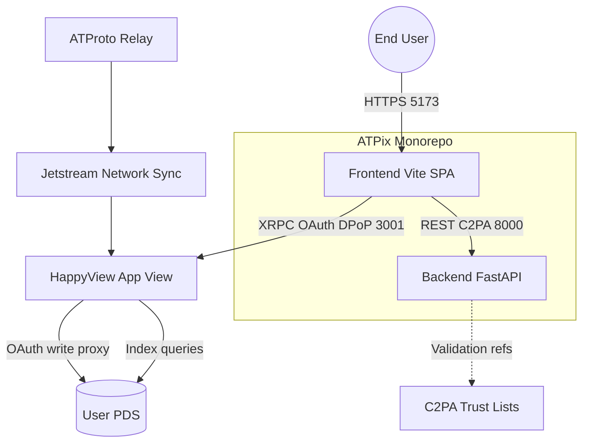
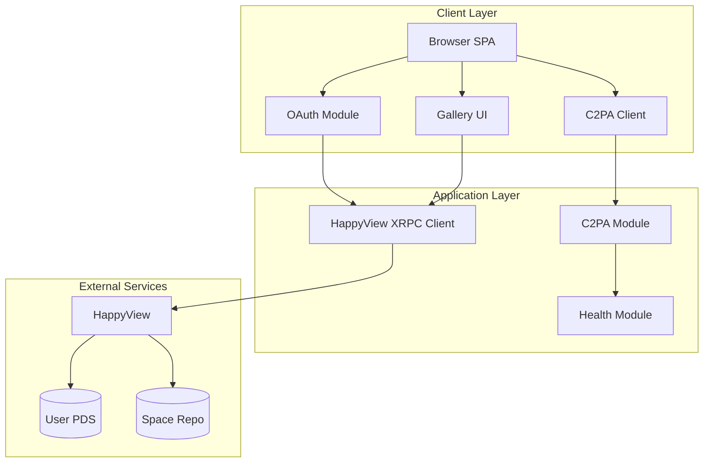
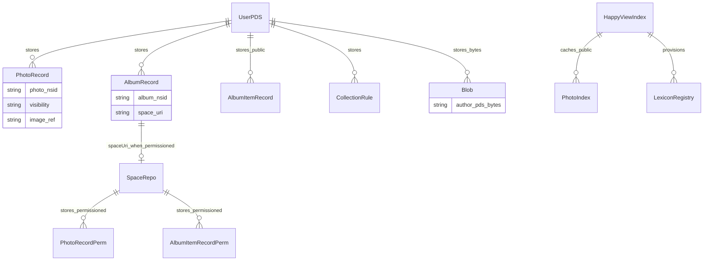
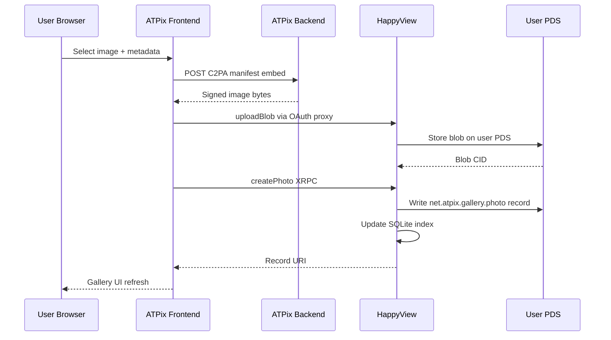
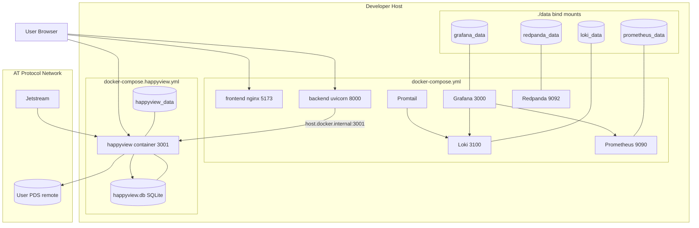
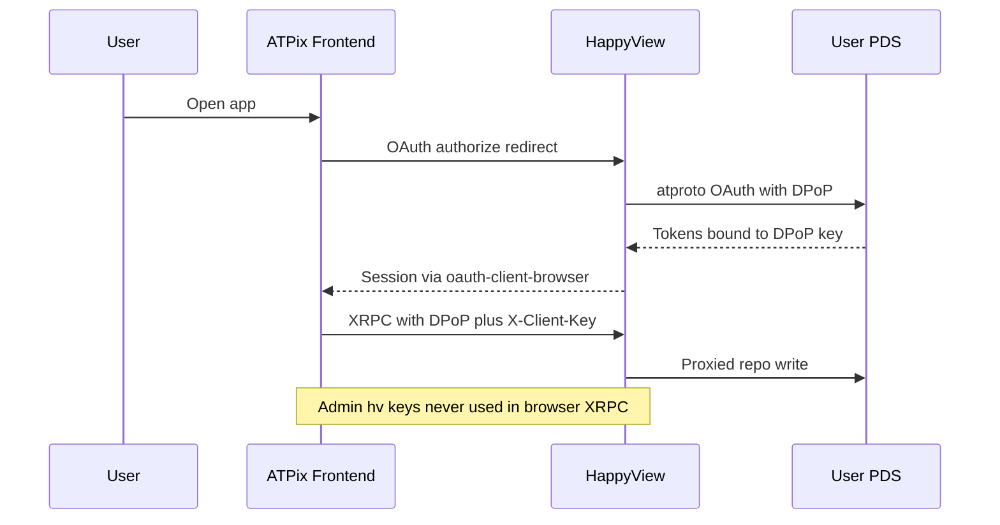
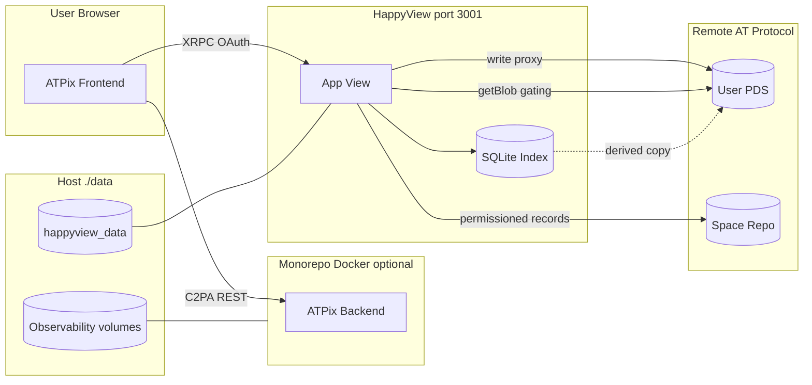

# System Architecture Document

**ATPix** — decentralized photo gallery on the AT Protocol  
**Version:** 1.1  
**Last Updated:** 2026-07-13  
**Status:** Reflects `main` after PR #6 (HappyView provisioning, `net.atpix.gallery.*`) and accepted ADRs 001–012

## 1. Introduction

### 1.1 Purpose

This document synthesizes the [PRD](./prd.md), [SRS](./srs.md), codebase layout, and Architecture Decision Records into a single ISO 42010–aligned system architecture. It is the high-level map for developers and stakeholders: what ATPix owns, what it delegates to HappyView and user PDSes, and how Docker, local storage, and network boundaries fit together.

### 1.2 Scope

This architecture covers:

- The ATPix monorepo (`apps/frontend/`, `apps/backend/`)
- External dependencies: HappyView App View, user PDSes, atproto network (Jetstream/relay)
- Local development and Docker deployment topology
- Data residency: PDS repos, HappyView index, permissioned space repos, and bind-mounted volumes

Out of scope: production hosting ADRs, client-side encryption, and custom App View or firehose consumers (explicitly forbidden per PRD TC-001 / TC-012).

### 1.3 References

- **PRD:** [prd.md](./prd.md)
- **SRS:** [srs.md](./srs.md)
- **Product vision:** [product-vision.md](./product-vision.md)
- **Implementation plan:** [plan.md](./plan.md)
- **Lexicon artifacts:** [lexicon/README.md](./lexicon/README.md)
- **ADRs:** [architecture/](./architecture/) (001–012)
- **Repository README:** [../README.md](../README.md)

### 1.4 Architectural Principles

Principles from [AGENTS.md](../AGENTS.md) and the PRD that shape this design:

- **KISS / minimum dependencies:** Gallery indexing and OAuth live in HappyView; ATPix adds C2PA and UI only.
- **Scale-to-zero orientation:** FastAPI backend is stateless; HappyView SQLite index supports dev scale-to-zero ([ADR-011](./architecture/011-sqlite-index-database.md)).
- **API-first:** Gallery operations use HappyView XRPC (`net.atpix.gallery.*`); C2PA uses FastAPI REST.
- **Security by design:** OAuth + DPoP via HappyView; no app passwords; blobs gated for permissioned albums.
- **Observability:** All services log unbuffered to `stdout`; Promtail ships container logs to Loki ([ADR-003](./architecture/003-observability-stack.md)).
- **Modularization:** Frontend (browser), auxiliary backend (C2PA), App View (HappyView), and user PDS are separate deployable boundaries.

---

## 2. Context & Stakeholder Viewpoint (ISO 42010)

*Who interacts with the system, external dependencies, and stakeholder concerns.*

### 2.1 Stakeholders & Concerns

| Stakeholder | Primary concerns | Architecture response |
|-------------|------------------|----------------------|
| **End users (creators)** | Photo ownership, sharing, permissioned albums | Records and blobs on user PDS; permissioned content in HappyView space repos |
| **atproto-native users** | OAuth sign-in, portable data | `@happyview/oauth-client-browser`; no ATPix-owned accounts |
| **Developers** | Clear module boundaries, local setup | Monorepo + documented ports; HappyView external on 3001 |
| **Operators** | Observability, provisioning | Root compose + `docker-compose.happyview.yml`; `scripts/provision_happyview.py` uploads lexicons and enables `feature.spaces_enabled` |
| **Security reviewers** | Auth boundaries, data leakage | DPoP sessions; permissioned index isolation; no PDS credentials in backend |

### 2.2 Context Diagram

**Boundary summary:** ATPix does **not** host user PDSes or operate a custom App View. HappyView is the sole indexing, OAuth proxy, and XRPC surface for gallery operations ([ADR-007](./architecture/007-happyview-app-view-integration.md)).

---

## 3. Functional / Logical Viewpoint (ISO 42010)

*Internal modules, responsibilities, and logical message flows.*

### 3.1 Logical Architecture

### 3.2 Frontend Architecture

| Aspect | Choice | ADR |
|--------|--------|-----|
| **Framework** | Vite 6 + vanilla JavaScript (ES modules) | [005](./architecture/005-application-architecture.md) |
| **atproto client** | `@happyview/lex-agent`, `@atproto/lex` | [005](./architecture/005-application-architecture.md) |
| **Authentication** | `@happyview/oauth-client-browser` (DPoP) | [006](./architecture/006-oauth-dpop-authentication.md) |
| **HappyView config** | `VITE_HAPPYVIEW_URL`, `VITE_HAPPYVIEW_CLIENT_KEY` | [006](./architecture/006-oauth-dpop-authentication.md) |

**Responsibilities:**

- OAuth sign-in, session, and sign-out (browser-owned DPoP keys)
- All gallery reads/writes via HappyView XRPC with `X-Client-Key` header
- C2PA embed/validate calls to FastAPI **before** `uploadBlob` / record creation
- Production build via `vite build`; Docker image serves static assets with nginx

**Directory overview (`apps/frontend/src/`):**

| Path | Role |
|------|------|
| `main.js` | Application bootstrap |
| `components/App.js` | Root UI shell |
| `api/happyview.js` | HappyView URL and client-key helpers |
| `styles.css` | Global styles |

### 3.3 Backend Architecture

| Aspect | Choice | ADR |
|--------|--------|-----|
| **Framework** | FastAPI + Uvicorn (port 8000) | [005](./architecture/005-application-architecture.md) |
| **API style** | REST (JSON) for C2PA and health | [008](./architecture/008-c2pa-sdk-and-signing.md) |
| **State** | Stateless — no gallery database | [011](./architecture/011-sqlite-index-database.md) |

**Responsibilities:**

- `/health` liveness for compose and monitoring
- C2PA 2.2 manifest generation, update signing, and validation (`app/modules/c2pa/`)
- Stdout logging for centralized observability

**Explicit non-responsibilities:** OAuth, PDS writes, gallery aggregation, Jetstream subscription, or lexicon indexing ([ADR-007](./architecture/007-happyview-app-view-integration.md)).

**Directory overview (`apps/backend/app/`):**

| Path | Role |
|------|------|
| `main.py` | FastAPI app, CORS, router registration |
| `core/config.py` | Environment settings (`HAPPYVIEW_URL`, `CORS_ORIGINS`) |
| `core/logging_config.py` | Stdout logging setup |
| `modules/health/` | Health check router |
| `modules/c2pa/` | C2PA API router (scaffold; full SDK per implementation plan) |

---

## 4. Information / Data Viewpoint (ISO 42010)

*Data structures, authority, caching, and flow across PDS, HappyView, and local volumes.*

### 4.1 Data Authority Model

ATPix follows the standard atproto split: **user PDS repos are the source of truth** for public/unlisted content and album containers; **HappyView holds a derived index** for queries and OAuth proxy state; **permissioned photos and `albumItem` records** live in HappyView space repos when `visibility: permissioned` ([ADR-010](./architecture/010-permissioned-spaces-storage.md)).

| Data | Canonical location | ATPix component access |
|------|-------------------|------------------------|
| Image blobs (bytes) | Author's **PDS** | Upload via HappyView `uploadBlob` proxy; permissioned reads via `com.atproto.space.getBlob` |
| `net.atpix.gallery.photo` (public/unlisted) | User **PDS** repo | Frontend → HappyView XRPC |
| `net.atpix.gallery.photo` (permissioned) | **Space repo** | Frontend → HappyView space APIs |
| `net.atpix.gallery.album` | User **PDS** repo (links `spaceUri` when permissioned) | Frontend → HappyView XRPC |
| `net.atpix.gallery.albumItem` | Same repo as parent photos (PDS or space) | Frontend → HappyView XRPC |
| `net.atpix.gallery.collectionRule` | Owner's **PDS** repo | Frontend → HappyView XRPC |
| Gallery index (denormalized) | HappyView **SQLite** (dev) / Postgres (prod option) | Queries only — not written by ATPix backend |
| C2PA manifests | Embedded in image files before upload | Backend generates; frontend attaches |
| OAuth / session state | HappyView local DB + browser DPoP material | Not stored in ATPix backend |

### 4.2 Data Architecture Diagram

### 4.3 Upload & Gallery Population Flows

**Path A — Own uploads:** Browser → Backend (C2PA embed) → HappyView (OAuth proxy) → User PDS (blob + record) → HappyView indexes record.

**Path B — Network discovery:** Jetstream → HappyView backfill/index → Frontend queries `listFeedPhotos` / `collectionRule` — ATPix MUST NOT run a separate firehose ([PRD Gallery Population Model](./prd.md#gallery-population-model)).

### 4.4 Database Decisions

| Store | Technology | Owner | ADR |
|-------|------------|-------|-----|
| Gallery index | SQLite (dev) / Postgres optional (prod) | **HappyView** | [011](./architecture/011-sqlite-index-database.md) |
| ATPix backend | None (stateless) | ATPix | [011](./architecture/011-sqlite-index-database.md) |
| Lexicon registry | HappyView admin DB | HappyView | [009](./architecture/009-lexicon-namespace-authority.md) |

---

## 5. Deployment / Physical Viewpoint (ISO 42010)

*How logical components map to containers, ports, bind-mounted storage, and external PDS infrastructure.*

### 5.1 Runtime Topology Overview

Local development typically runs **four classes** of processes:

1. **ATPix applications** — frontend (5173) and backend (8000), host-native or Docker
2. **HappyView App View** — `docker-compose.happyview.yml` on port **3001** (Grafana reserves **3000**)
3. **Observability stack** — Grafana, Loki, Promtail, Prometheus, Redpanda (Docker)
4. **User PDS** — remote (e.g. Bluesky, self-hosted); never containerized by ATPix

### 5.2 Infrastructure Architecture

### 5.3 Docker Containers

#### Root `docker-compose.yml` (monorepo + observability)

| Service | Image / build | Port | Role in ATPix |
|---------|---------------|------|---------------|
| `frontend` | `apps/frontend/Dockerfile` (nginx) | 5173→80 | Serves built SPA; talks to HappyView and backend from browser |
| `backend` | `apps/backend/Dockerfile` (Python 3.12) | 8000 | C2PA + health; `HAPPYVIEW_URL` points to host HappyView |
| `grafana` | grafana/grafana | 3000 | Dashboards for logs and metrics |
| `loki` | grafana/loki | 3100 | Log storage |
| `promtail` | grafana/promtail | — | Scrapes Docker `stdout` via socket |
| `prometheus` | prom/prometheus | 9090 | Metrics scrape |
| `redpanda` | redpanda | 9092 | Kafka-compatible log buffer |

HappyView is intentionally **absent** from the root compose file to avoid port conflicts with Grafana ([ADR-003](./architecture/003-observability-stack.md)). The backend container reaches a host-run HappyView via `host.docker.internal:3001` when ATPix apps run in Docker but HappyView runs on the host.

#### `docker-compose.happyview.yml` (App View)

| Service | Image | Port | Role |
|---------|-------|------|------|
| `happyview` | `ghcr.io/gamesgamesgamesgamesgames/happyview:latest` | 3001 | App View: SQLite index, OAuth proxy, XRPC, Jetstream sync, permissioned spaces |

Provisioned once per environment via `scripts/provision_happyview.py` (reads `config/happyview/provision-manifest.json`, uploads 23 `net.atpix.gallery.*` lexicons with backfill, enables `feature.spaces_enabled`). The script loads `.env` via `python-dotenv` ([ADR-007](./architecture/007-happyview-app-view-integration.md), [ADR-009](./architecture/009-lexicon-namespace-authority.md)).

### 5.4 Local Storage (bind mounts)

All persistent Docker volumes live under `./data/` at the repository root:

| Host path | Container | Contents |
|-----------|-----------|----------|
| `./data/grafana_data` | Grafana | Dashboards, users, plugins |
| `./data/loki_data` | Loki | Indexed log chunks |
| `./data/prometheus_data` | Prometheus | Time-series metrics |
| `./data/redpanda_data` | Redpanda | Kafka topic data |
| `./data/happyview_data` | HappyView (`docker-compose.happyview.yml`) | SQLite DB (`happyview.db`), OAuth sessions, provisioned lexicon registry |

Wiping `./data/happyview_data/` resets the **local HappyView index and sessions** only — user records on remote PDSes remain intact. Re-run `scripts/provision_happyview.py` and HappyView backfill to rebuild the index.

**What is not in `./data/`:** User photo libraries. Image bytes and signed records remain on each user's **remote PDS** (and permissioned **space repos**). ATPix never stores canonical user galleries on local disk.

### 5.5 PDS in the Architecture

ATPix **does not run or host a PDS**. Users bring an existing atproto identity (Bluesky account, hosting provider, or self-hosted PDS).

| Concern | Where it lives | How ATPix accesses it |
|---------|----------------|-------------------------|
| Account / DID | User's PDS operator | OAuth via HappyView |
| Public photo records | User PDS repo | HappyView OAuth write proxy + index |
| Image blobs | User PDS blob store | `uploadBlob` proxied through HappyView |
| Permissioned album container | User PDS (`album` + `spaceUri`) | HappyView XRPC |
| Permissioned photos/items | HappyView space repo | `com.atproto.space.*` APIs |
| Permissioned blob reads | User PDS bytes, gated | `com.atproto.space.getBlob` + membership |

**Frontend ↔ PDS:** The browser never talks to the PDS directly. All writes go **Frontend → HappyView → PDS** with DPoP-bound OAuth ([ADR-006](./architecture/006-oauth-dpop-authentication.md)).

**Backend ↔ PDS:** No connection. The FastAPI service MUST NOT accept PDS credentials or perform repo writes.

### 5.6 Port Map (local development)

| Port | Service | Owned by |
|------|---------|----------|
| 5173 | ATPix frontend (Vite dev or nginx) | Monorepo |
| 8000 | ATPix backend (Uvicorn) | Monorepo |
| 3000 | Grafana | Observability compose |
| 3001 | HappyView App View | External deployment |
| 3100 | Loki | Observability compose |
| 9090 | Prometheus | Observability compose |

### 5.7 CI/CD Pipeline

| Stage | Tooling | Status |
|-------|---------|--------|
| Lint | Ruff (backend), ESLint + Prettier (frontend) | [ADR-004](./architecture/004-coding-style-and-linting.md) |
| Unit / BDD / integration | pytest, behave, vitest | [ADR-001](./architecture/001-test-runners-and-reporting.md) |
| Reports | Allure CLI | [ADR-001](./architecture/001-test-runners-and-reporting.md) |
| Container build | `docker compose build` for frontend/backend | Documented in [README](../README.md) |
| Automated deploy | — | **Gap:** no `.github/workflows` yet |

---

## 6. Security Viewpoint (ISO 42010)

*Authentication boundaries, permissioned access, and secrets handling.*

### 6.1 Authentication Flow

### 6.2 Security Measures

| Control | Implementation | ADR |
|---------|----------------|-----|
| User authentication | atproto OAuth + DPoP; no app passwords | [006](./architecture/006-oauth-dpop-authentication.md) |
| XRPC client identity | `VITE_HAPPYVIEW_CLIENT_KEY` (non-admin) | [006](./architecture/006-oauth-dpop-authentication.md) |
| Admin operations | `HAPPYVIEW_ADMIN_KEY` (`hv_*`) for provisioning only; not in frontend | [009](./architecture/009-lexicon-namespace-authority.md) |
| Permissioned albums | Space membership + `feature.spaces_enabled` | [010](./architecture/010-permissioned-spaces-storage.md) |
| C2PA signing keys | Environment / secret store; never in repo | [008](./architecture/008-c2pa-sdk-and-signing.md) |
| CORS | Backend allows configured frontend origins only | [005](./architecture/005-application-architecture.md) |
| Secrets in `.env` | `HAPPYVIEW_URL`, `HAPPYVIEW_ADMIN_KEY`, client keys; provision script loads via `python-dotenv` | [.env.example](../.env.example) |

---

## 7. Performance & Concurrency Viewpoint (ISO 42010)

### 7.1 Scalability Constraints

| Constraint | Detail | Mitigation |
|------------|--------|------------|
| HappyView SQLite writes | Single-writer index in dev | Production Postgres option per HappyView docs ([ADR-011](./architecture/011-sqlite-index-database.md)) |
| C2PA CPU | Signing/validation in backend | Async FastAPI; locust performance tests per SRS |
| 50 MB blob limit | HappyView platform cap | Client-side validation before upload (PRD) |
| No custom firehose | ATPix cannot scale independent sync | Delegate to HappyView Jetstream ([ADR-007](./architecture/007-happyview-app-view-integration.md)) |

**NFR-011 baseline:** Gallery first-page queries ≤ 2s p95 with ≤ 10k records on single HappyView + SQLite ([ADR-011](./architecture/011-sqlite-index-database.md)).

### 7.2 Observability & Monitoring

| Signal | Path | ADR |
|--------|------|-----|
| Application logs | `stdout` → Promtail → Loki | [003](./architecture/003-observability-stack.md) |
| Metrics | Prometheus scrape → Grafana | [003](./architecture/003-observability-stack.md) |
| Log buffer | Redpanda (Kafka-compatible) | [003](./architecture/003-observability-stack.md) |
| Dashboards | Grafana on port 3000 | [003](./architecture/003-observability-stack.md) |

ATPix `backend` and `frontend` containers MUST NOT write log files on disk; Promtail reads container streams via the Docker socket.

---

## 8. Technology Decisions Summary

| Layer | Technology | Rationale (ADR) |
|-------|------------|-----------------|
| Architecture style | Modular monorepo + external App View | [005](./architecture/005-application-architecture.md) |
| Protocol | AT Protocol (repos, blobs, XRPC) | [PRD](./prd.md) |
| App View | HappyView (index, OAuth, Jetstream, spaces) | [007](./architecture/007-happyview-app-view-integration.md) |
| Frontend | Vite 6, vanilla JS, HappyView OAuth/lex libs | [005](./architecture/005-application-architecture.md), [006](./architecture/006-oauth-dpop-authentication.md) |
| Backend | FastAPI, Uvicorn, Pydantic Settings | [005](./architecture/005-application-architecture.md) |
| C2PA | FastAPI module (C2PA 2.2 target) | [008](./architecture/008-c2pa-sdk-and-signing.md) |
| Lexicons | `net.atpix.gallery.*` (23 JSON files) | [009](./architecture/009-lexicon-namespace-authority.md) |
| Permissioned storage | HappyView Spaces (ATP-0016) | [010](./architecture/010-permissioned-spaces-storage.md) |
| Gallery index DB | HappyView SQLite (dev) | [011](./architecture/011-sqlite-index-database.md) |
| User data store | Remote user PDS (+ space repos) | [010](./architecture/010-permissioned-spaces-storage.md), [PRD](./prd.md) |
| Observability | Promtail, Redpanda, Loki, Prometheus, Grafana | [003](./architecture/003-observability-stack.md) |
| Testing | pytest, behave, vitest, locust, Allure | [001](./architecture/001-test-runners-and-reporting.md) |
| Lint / format | Ruff, ESLint, Prettier | [004](./architecture/004-coding-style-and-linting.md) |
| API docs generation | pdoc, JSDoc | [002](./architecture/002-inline-documentation-generators.md) |
| UI specification | ui-requirements.md | [012](./architecture/012-ui-requirements-document.md) |

### 8.1 Documented Gaps

| Item | Notes |
|------|-------|
| CI/CD workflows | No GitHub Actions in repository |
| Production deployment ADR | Deferred; local/Docker dev documented in [README](../README.md) |
| Lexicon DNS publication | Publish `_lexicon.gallery.atpix.net` TXT before public network launch ([ADR-009](./architecture/009-lexicon-namespace-authority.md)) |

---

## 9. Component Quick Reference

How Docker, local storage, PDS, frontend, and backend relate in one view:

**Takeaway:** ATPix frontend and backend are thin application layers in the monorepo. HappyView plus the user's PDS (and optional space repo) carry all gallery truth. Docker bind mounts under `./data/` persist observability and HappyView-local state only — never the user's canonical photo library.