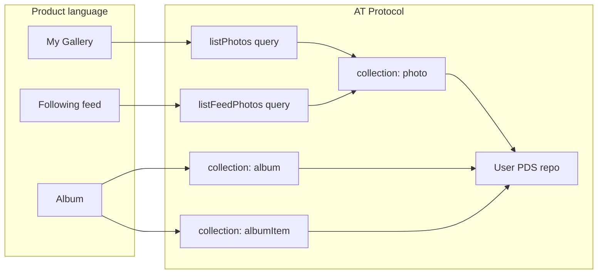

# Project Requirements Document: ATPix

**Version:** 1.6  
**Last Updated:** 2026-07-14T12:00:00Z
**Status:** Draft — stakeholder review  
**Sources:** [Product Vision](./001-product-vision.md) · [AGENTS.md](../../AGENTS.md) · [AT Protocol KB](../../.agents/kb/at-protocol.md) · [HappyView KB](../../.agents/kb/happyview.md) · [C2PA KB](../../.agents/kb/c2pa.md)

---

# Executive Summary

ATPix is a decentralized photo collection and sharing application built on the AT Protocol. Users upload, organize, and share photos through their own Personal Data Server (PDS) accounts while a HappyView App View indexes and serves gallery experiences. Photos remain user-owned, cryptographically signed at the protocol layer, and portable across the Atmosphere. ATPix additionally implements [C2PA 2.2](https://spec.c2pa.org/specifications/specifications/2.2/specs/C2PA_Specification.html) **Content Credentials** so image files carry tamper-evident provenance (capture, edit, publish) alongside atproto repository records.

This PRD translates the [product vision](./001-product-vision.md) into verifiable functional and non-functional requirements, integrates constraints from protocol, platform, and C2PA references, and aligns architectural expectations with [AGENTS.md](../../AGENTS.md). v1 targets product validation, a reference App View implementation, and a practical C2PA claim-generator/validator pairing for the atproto ecosystem—not a mass-market consumer launch.

**Gallery population:** Users populate galleries and albums by **(a)** uploading photos to their own PDS and/or **(b)** discovering photos already indexed on the network that match follow-graph and hashtag rules. Path (b) is served entirely by [HappyView](https://happyview.dev) network sync (Jetstream + backfill into the App View index)—ATPix does not operate a standalone relay firehose consumer.

**Permissioned sharing (mandatory v1):** Users MUST be able to restrict album access—and the photos within those albums—to a **select group of authenticated atproto users** via [HappyView Permissioned Spaces](https://happyview.dev/experimental/spaces/index) ([ATP-0016](https://github.com/bluesky-social/proposals)). This is not a stretch goal: **F-008** is a primary v1 deliverable alongside public/unlisted sharing (F-007) and serves as reference validation of protocol-native permissioned data in a real gallery application.

---

# Product Vision

ATPix solves vendor lock-in in mainstream photo apps by treating images as signed atproto records in user repositories—interoperable, verifiable, and movable between hosts—while still offering familiar gallery, album, and sharing workflows.

## Problem Statement

Mainstream photo applications trap image libraries in proprietary silos. Users lose access when services shut down, cannot port libraries between platforms, and lack transparency into where data is stored or who can read it. Developers building on atproto face months of App View infrastructure work before writing application logic.

## Target Users

| Persona | Description | Primary jobs |
|---------|-------------|--------------|
| **Creators & photographers** | Users who want ownership and portability of image libraries | Upload, organize, share, retain long-term access |
| **atproto-native users** | Bluesky and Atmosphere community members with existing PDS accounts | Sign in with OAuth, publish gallery records, browse others' galleries |
| **New ATPix visitors** | Users without an atproto account who register on the hosted `pds.atpix.net` PDS | Create a `*.pds.atpix.net` handle, then sign in to ATPix (F-017; post-v1 embedded signup F-018) |
| **Developers** | Builders exploring HappyView App View patterns | Study Lexicon design, indexing, OAuth proxying, and gallery UX |

**Pains:** Vendor lock-in, lost libraries on service shutdown, opaque sharing permissions, duplicate uploads across platforms.

**Gains:** One identity (DID/handle), portable signed data, open schemas any client can read, minimal backend boilerplate via HappyView.

---

# Product Terms ↔ AT Protocol Primitives

ATPix uses familiar **product language** in user stories and UI (gallery, album, share link). Underneath, data is stored and synced as standard atproto **repositories**, **collections**, **records**, and **blobs**. This section is the canonical mapping for architecture and developer documentation. See also [Lexicon README](../lexicon/net.atpix.gallery.md#product-terms--at-protocol-primitives).

> **Key distinction:** A **gallery** is a **query/view** over photo records—not a record type or repo container. An **album** is a **`net.atpix.gallery.album` record** plus optional **`albumItem` junction records**.

### Vocabulary mapping

| Product term | AT Protocol primitive | NSID / mechanism |
|--------------|----------------------|------------------|
| **My Gallery** | Query over author's photo records | `net.atpix.gallery.listPhotos?did=<author-did>` → collection `net.atpix.gallery.photo` in user's **PDS repo** |
| **Public profile gallery** | Same query, different DID filter | `listPhotos` over indexed `net.atpix.gallery.photo` records for target DID |
| **Following / Hashtags feed** | Multi-repo index query + rule records | `net.atpix.gallery.listFeedPhotos` + `net.atpix.gallery.collectionRule` records in curator's repo |
| **Photo** | Record + blob | Record in `net.atpix.gallery.photo`; bytes via `com.atproto.repo.uploadBlob` |
| **Album** | Container record | `net.atpix.gallery.album` record in owner's **PDS repo** (always); links `spaceUri` when `visibility: permissioned` |
| **Album membership** | Junction records + denormalized URIs | `net.atpix.gallery.albumItem` records in same repo as associated photos (PDS for public/unlisted; space repo when permissioned); optional `photo.albumUris[]` |
| **Private / permissioned album** | Permissioned **space repo** | `ats://<space-did>/…`; type `net.atpix.gallery.albumSpace`; photos/items in space, not public index |
| **Share link** | UI route + visibility field | `visibility` on `album` / `photo` records (`public` \| `unlisted` \| `permissioned`) |
| **App View index** | HappyView local DB | Copy of network `photo` records; not a user repo |

### Record collections (storage)

| Collection NSID | Record role | Typical repo |
|-----------------|-------------|--------------|
| `net.atpix.gallery.photo` | Image metadata + blob ref | User PDS repo, or permissioned space repo |
| `net.atpix.gallery.album` | Named curated container | User PDS repo (metadata); links `spaceUri` when permissioned |
| `net.atpix.gallery.albumItem` | Ordered album ↔ photo link | Same repo as associated photos (PDS for public/unlisted; space repo when permissioned) |
| `net.atpix.gallery.collectionRule` | Follow/hashtag source rules | Owner's public PDS repo |

**Terminology policy:** User-facing UI and user stories in this PRD keep gallery/album language. Each functional requirement below includes a **Protocol mapping** line for implementers. Architecture docs and [docs/lexicon/net.atpix.gallery.md](../lexicon/net.atpix.gallery.md) use repo/collection/record/blob/space vocabulary.

---

# Gallery Population Model

ATPix offers **two concurrent, first-class paths** for building gallery and album content. Both MAY be used together; neither replaces the other.

| Path | User action | Infrastructure | Primary requirements |
|------|-------------|------------------|----------------------|
| **A — Own uploads** | Upload image → blob + `net.atpix.gallery.photo` on user's PDS | HappyView OAuth proxy + local index | F-002, F-003, F-012 |
| **B — Network discovery** | Define follow/hashtag rules → browse matches → add to albums | HappyView Jetstream sync + backfill + SQLite/Postgres index | F-010, F-011, F-004 |

### Path A: Upload to PDS

The user's **My Gallery** view (F-003) shows photos they authored and uploaded to their own PDS. Uploads appear after HappyView indexes the new record.

### Path B: HappyView network monitoring (not a custom firehose)

Social discovery MUST rely on **HappyView's built-in network sync**—real-time record ingestion via [Jetstream](https://github.com/bluesky-social/jetstream) and historical [backfill](https://happyview.dev/guides/backfill) into the App View database (Source: [happyview.md](../../.agents/kb/happyview.md)). ATPix queries that index through Lexicon endpoints (e.g. `net.atpix.gallery.listFeedPhotos`); it MUST NOT subscribe to the relay firehose or operate a separate sync pipeline.

When followed accounts publish new `net.atpix.gallery.photo` records (or records matching configured hashtag keywords), HappyView indexes them; ATPix surfaces them in the **Following / Hashtags** feed and in album-creation previews per `collectionRule` (F-010).

### Album population

Albums MAY contain:

- Photos from **Path A** (user's own uploads), added directly or at upload time.
- Photos from **Path B** (network-indexed matches), added via album-creation preview or `addToAlbum` (F-004, F-010).

Album membership is curation (atproto `albumItem` records); Path B photos remain on the **author's PDS**—ATPix does not copy blobs to the curator's repo unless the user re-uploads.

---

# Sharing & Access Model

ATPix supports three visibility levels for albums (F-007) and photos stored in those albums:

| Visibility | Audience | v1 mechanism |
|------------|----------|--------------|
| **Public** | Anyone; listed in profile and discovery indexes | Public PDS repo + App View index |
| **Unlisted** | Anyone with the direct link; not listed publicly | Public PDS repo; excluded from public lists |
| **Permissioned** | Only invited, authenticated members | HappyView Permissioned Space ([ATP-0016](https://github.com/bluesky-social/proposals)); **F-008** |

### Permissioned data (mandatory)

Creators MUST be able to share curated photo collections with a **select group of users** without making them network-public. In v1 this is implemented as **permissioned albums**: album metadata links to a `spaceUri`; album photos and `albumItem` records live in the space repo; only members with valid space credentials can read or write.

- **F-008** is **Mandatory** priority—not optional, not post-v1.
- Permissioned content MUST NOT appear in public App View indexes or leak to unauthenticated viewers.
- v1 does NOT implement client-side encryption; membership gating via protocol-native spaces is the access-control model (TC-004).
- Public profile galleries (F-006) remain publicly readable; private sharing for select users is delivered through permissioned albums (curated private collections).

See [F-008](#f-008-permissioned-gallery--album-access-happyview-permissioned-spaces-validation), [RC-007](#rc-007-permissioned-spaces-end-to-end), and [NFR-013](#nfr-013-permissioned-spaces-reference-validation).

---

# Functional Requirements

> **Terminology:** Requirement keywords follow [RFC 2119](../../.agents/kb/rfc-2119-req-terms.md) (`MUST`, `SHOULD`, `MAY`). Product terms map to atproto primitives per [Product Terms ↔ AT Protocol Primitives](#product-terms--at-protocol-primitives).

### v1 mandatory capabilities (summary)

| ID | Capability | Priority |
|----|------------|----------|
| F-008 | **Permissioned albums** — restrict access to select authenticated users via HappyView Permissioned Spaces | **Mandatory** |
| F-002, F-003 | Upload and browse own gallery (Path A) | Mandatory |
| F-010 | Network discovery via HappyView index (Path B) | Mandatory |
| F-012–F-016 | C2PA Content Credentials on upload, edit, and validation | Mandatory |
| F-017 | Hosted PDS signup discovery link on sign-in panel | Recommended (v1.1) |
| F-018–F-021 | Embedded signup, ATPix-managed invites, apex handles, Entryway/multi-PDS | Post-v1 |

## F-001: atproto OAuth Sign-In

**Priority:** Mandatory  
**User Story:** As an atproto-native user, I want to sign in with my existing PDS account so that I can use ATPix without creating a separate password store.

**Protocol mapping:** OAuth + DPoP session bound to user DID; write procedures proxy to the user's PDS **repo**.

### Acceptance Criteria

- The application MUST authenticate users via atproto OAuth (not app-password or legacy JWT session storage in the browser).
- The application MUST NOT persist user PDS passwords or app passwords in client storage, server logs, or the App View database.
- The browser client MUST use `@happyview/oauth-client-browser` with DPoP key provisioning so HappyView can proxy writes to the user's PDS.
- Every XRPC request MUST include a valid `X-Client-Key` header registered for the ATPix API client.
- After successful sign-in, the UI MUST display the authenticated user's handle and/or DID.
- Sign-out MUST revoke the active DPoP session for the current device without affecting other devices.

**Source:** [001-product-vision.md](./001-product-vision.md) — Core Features, User Requirements  
**Reference:** Procedures require `X-Client-Key` plus DPoP auth (Source: [happyview.dev.docs.md](../references/happyview.dev.docs.md), Section: XRPC Authentication)

**Account creation:** ATPix MUST NOT provision atproto accounts or store PDS passwords. New users on the hosted ATPix PDS register at the PDS (`*.pds.atpix.net` handles) per [F-017](#f-017-hosted-pds-account-onboarding); embedded and operator-managed flows are post-v1 ([F-018](#f-018-embedded-signup-on-atpixnet)–[F-021](#f-021-entryway-and-multi-pds-federation)).

---

## F-002: Photo Upload

**Priority:** Mandatory  
**User Story:** As a creator, I want to upload photos to my gallery so that they are stored in my PDS repository and immediately visible in my personal gallery.

**Protocol mapping:** `com.atproto.repo.uploadBlob` → PDS **blob** (all paths); `net.atpix.gallery.createPhoto` → **record** in `net.atpix.gallery.photo` (public/unlisted PDS repo); permissioned album uploads additionally use `com.atproto.space.createRecord` / `putRecord` in the linked space and `com.atproto.space.getBlob` for gated thumbnail delivery.

### Acceptance Criteria

- Authenticated users MUST be able to select and upload image files accepted by the `net.atpix.gallery.photo` record Lexicon (`image/*` MIME types).
- **Public/unlisted upload flow** MUST: (1) generate and embed a C2PA standard manifest in the image asset per F-012, (2) call `com.atproto.repo.uploadBlob` via HappyView proxy with the manifest-bearing bytes, then (3) create a `net.atpix.gallery.photo` record in the user's public PDS repo referencing the blob ref and C2PA summary fields.
- **Permissioned album upload flow** MUST: (1) embed C2PA per F-012, (2) call `com.atproto.repo.uploadBlob` to the author's PDS (blob bytes remain on PDS per HappyView spaces model), then (3) write `net.atpix.gallery.photo` and `net.atpix.gallery.albumItem` records to the linked space via `com.atproto.space.createRecord` / `putRecord` — not to the owner's public repo. Thumbnails and full images for permissioned photos MUST be fetched via `com.atproto.space.getBlob` with valid membership (DPoP) or space credential (Bearer).
- Each public/unlisted uploaded photo MUST be indexed in the HappyView public App View. Permissioned space photos MUST NOT appear in public indexes (F-008).
- The UI MUST show upload progress and a completion or error state for each file.
- Uploads exceeding the 50MB per-blob limit MUST be rejected with a clear, user-visible error before transfer completes.
- Newly uploaded photos MUST appear in the user's personal gallery without requiring a manual page refresh beyond normal client refresh behavior.
- All `createdAt` timestamps on photo records MUST use RFC 3339 UTC format (e.g., `2026-07-12T14:30:00Z`).

**Source:** [001-product-vision.md](./001-product-vision.md) — Core Features, User Requirements, Key Constraints  
**Reference:** Blob upload proxied to PDS; maximum 50MB (Source: [happyview.dev.docs.md](../references/happyview.dev.docs.md), Section: `com.atproto.repo.uploadBlob`)  
**Reference:** Blobs MUST be uploaded before record creation (Source: [atproto.comdocs.md](../references/atproto.comdocs.md), Section: Blob Upload)

---

## F-003: Personal Gallery Grid (Path A — Own Uploads)

**Priority:** Mandatory  
**User Story:** As a signed-in user, I want to browse photos I uploaded to my PDS in a paginated gallery grid so that I can review and manage my own library.

**Protocol mapping:** UI **view** only — `net.atpix.gallery.listPhotos` **query** over indexed `net.atpix.gallery.photo` **records** for author DID; no gallery record or collection exists.

### Acceptance Criteria

- The application MUST provide a **My Gallery** view distinct from the network discovery feed (F-010, Path B).
- The application MUST render the authenticated user's own photos in a grid layout with thumbnail images resolved from PDS blob URLs.
- Gallery queries MUST use `net.atpix.gallery.listPhotos` filtered to the authenticated author's DID with cursor-based pagination.
- Default page size SHOULD be 20 items; callers MAY request a different `limit` within Lexicon bounds.
- Empty gallery state MUST display actionable guidance (e.g., upload your first photo).
- Gallery data MUST be served from the HappyView App View index (author's indexed records), not by scraping arbitrary third-party servers.

**Source:** [001-product-vision.md](./001-product-vision.md) — Core Features; [Gallery Population Model](#gallery-population-model) Path A

---

## F-004: Album Organization

**Priority:** Mandatory  
**User Story:** As a creator, I want to organize photos into named albums so that I can group related images and share curated collections.

**Protocol mapping:** **Records** in collections `net.atpix.gallery.album` and `net.atpix.gallery.albumItem` in the owner's **repo**; optional `albumUris` denormalization on photo **records**.

### Acceptance Criteria

- Authenticated users MUST be able to create albums with a display name via the `net.atpix.gallery.album` record Lexicon and corresponding create procedure.
- Users MUST be able to add and remove photos from albums via `net.atpix.gallery.albumItem` junction records (ordered membership) or by updating `photo.albumUris` per the [Lexicon specification](#atpix-lexicon-specification).
- Users MUST be able to rename albums and delete empty albums.
- Deleting an album MUST NOT delete underlying photo records unless the user explicitly deletes those photos.
- Album list and detail views MUST support pagination consistent with F-003.
- When creating an album, users MUST be able to seed initial membership from photos matching active `net.atpix.gallery.collectionRule` sources (Path B, F-010) **or** from their own uploads (Path A, F-002).
- The album UI MUST make both population paths visible: add own uploads and add from Following/Hashtag discovery.

**Source:** [001-product-vision.md](./001-product-vision.md) — Core Features; [Gallery Population Model](#gallery-population-model)

---

## F-005: Captions and Tags

**Priority:** Mandatory  
**User Story:** As a photographer, I want to add captions and tags to my photos so that I can describe and find images later.

**Protocol mapping:** Metadata updates via `net.atpix.gallery.updatePhoto` on `net.atpix.gallery.photo` **records** in the user's **repo**.

### Acceptance Criteria

- Users MUST be able to set and edit an optional caption (max 2000 characters per Lexicon) on upload and from the photo detail view.
- Users MUST be able to add and remove tags stored in the photo `keywords` field ([dc:subject](https://www.dublincore.org/specifications/dublin-core/dcmi-terms/#subject) / [schema:keywords](https://schema.org/keywords)).
- Caption and tag edits MUST persist as updated signed records on the user's PDS.
- Tag search via `net.atpix.gallery.listPhotos?tag=` MUST be supported in v1 and MUST power hashtag matching in F-010.

**Source:** [001-product-vision.md](./001-product-vision.md) — Core Features

---

## F-006: Public Profile Gallery

**Priority:** Mandatory  
**User Story:** As a visitor, I want to browse another user's public gallery by handle or DID so that I can view photos they have published with ATPix Lexicons.

**Protocol mapping:** `net.atpix.gallery.listPhotos?did=<target>` — read-only **query** over another account's indexed `net.atpix.gallery.photo` **collection**.

### Acceptance Criteria

- The application MUST expose a public profile gallery route resolvable by DID (durable) and handle (convenience).
- Handle resolution MUST use `com.atproto.identity.resolveHandle` or equivalent before querying indexed records.
- Only photos indexed under `net.atpix.gallery.photo` (and compatible collections) MUST appear in profile galleries.
- Public galleries MUST NOT require authentication to view unless the target content is permission-gated per F-008.
- Profile gallery pagination MUST match F-003 cursor semantics.

**Source:** [001-product-vision.md](./001-product-vision.md) — Core Features, User Requirements  
**Reference:** Prefer DID over handle for durable identity references (Source: [at-protocol.md](../../.agents/kb/at-protocol.md), Agent Quick Reference)

---

## F-007: Shareable Album and Gallery Links

**Priority:** Mandatory  
**User Story:** As a creator, I want to share a link to my public gallery or a specific album so that others can view my curated photos without an account.

**Protocol mapping:** UI routes + `visibility` field on `album` / `photo` **records** (`public` \| `unlisted` \| `permissioned`).

### Acceptance Criteria

- Users MUST be able to copy a stable URL for their public profile gallery.
- Users MUST be able to copy a stable URL for a specific album.
- Albums MAY be marked **public**, **unlisted** (accessible via direct link, not listed in public indexes), or **permissioned** (F-008).
- Unlisted albums MUST NOT appear in public profile album lists or network-wide discovery surfaces; they MUST remain reachable via direct link.
- Shared links MUST work for unauthenticated viewers when album visibility is public or unlisted.

**Source:** [001-product-vision.md](./001-product-vision.md) — Core Features, User Requirements

---

## F-008: Permissioned Gallery & Album Access (HappyView Permissioned Spaces Validation)

**Priority:** Mandatory  
**User Story:** As a creator, I want to restrict access to my albums—and the photos in them—to a select group of authenticated atproto users so that I can share private curated collections without making them network-public—and as a developer, I want ATPix to serve as a **reference validation** of HappyView Permissioned Spaces.

**Protocol mapping:** Permissioned **space repo** (`ats://`) for `photo` and `albumItem` **records**; album metadata **record** in public **repo** with `spaceUri`; space type `net.atpix.gallery.albumSpace`.

### Strategic Requirement

ATPix v1 MUST exercise [HappyView Permissioned Spaces](https://happyview.dev/experimental/spaces/index) ([ATP-0016](https://github.com/bluesky-social/proposals)) end-to-end. Permissioned album workflows are not optional stretch goals; they are a **primary v1 deliverable** used to prove membership gating, space credentials, invite flows, and space-scoped record storage in a real media application.

### Acceptance Criteria

- HappyView instances used for ATPix MUST enable `feature.spaces_enabled` before permissioned album features are tested or demonstrated.
- Album owners MUST be able to designate an album with `visibility: permissioned` and receive a linked `spaceUri` (`ats://<space-did>/net.atpix.gallery.albumSpace/<skey>`).
- Creating a permissioned album MUST call `com.atproto.simplespace.createSpace` with `type: net.atpix.gallery.albumSpace`, `mintPolicy: member-list`, `appAccess: {"type": "allowList", "allowed": ["<ATPix OAuth clientId URL>"]}` (the ATPix OAuth `clientId` metadata URL published at `{deployment-origin}/oauth-client-metadata.json`; `allowed` entries are client metadata URLs per HappyView credentials docs), and `config: {"membershipPublic": false, "recordsPublic": false}`.
- Photo and `albumItem` records for permissioned albums MUST be written to the space via `com.atproto.space.putRecord` / `com.atproto.space.createRecord`, not to the owner's public repo. Blob bytes remain on the author's PDS; gated reads use `com.atproto.space.getBlob`.
- Album owners MUST be able to invite members via `dev.happyview.space.createInvite`; invited users MUST join via `dev.happyview.space.acceptInvite`. Owners MUST manage membership via `com.atproto.simplespace.addMember` / `removeMember` with `access` values `read`, `write`, or `read_self` per HappyView members API.
- Authenticated space members with `read` or `write` access MUST view permissioned album contents using **direct member auth** (DPoP + `X-Client-Key` on `com.atproto.space.*` routes) or **cross-service reads** via space credential flows (`getDelegationToken` → `getSpaceCredential` → Bearer token without DPoP).
- Unauthenticated and non-authorized users MUST receive a clear access-denied state (404 or equivalent) without leaking photo thumbnails, blob CIDs, or metadata.
- Permissioned albums MUST NOT rely on client-side encryption; access control MUST use protocol-native space membership and credentials.
- Permissioned album content MUST NOT be aggregated into public App View indexes; queries for permissioned content MUST require valid space credentials.
- Integration tests MUST cover: create space → invite member → accept invite → upload photo to space → authorized read succeeds → unauthorized read fails.

**Source:** [001-product-vision.md](./001-product-vision.md) — Core Features, User Requirements, Key Constraints, Unfair Advantage  
**Reference:** Permissioned Spaces / ATP-0016 (Source: [happyview.dev.docs.md](../references/happyview.dev.docs.md), Section: Permissioned Spaces Overview)  
**Reference:** `feature.spaces_enabled` flag (Source: [happyview.dev.docs.md](../references/happyview.dev.docs.md), Section: Feature flag)

---

## F-009: Photo Deletion and Album Membership Management

**Priority:** Mandatory  
**User Story:** As a gallery owner, I want to delete photos and manage album membership so that I control what remains in my repository.

**Protocol mapping:** `deletePhoto` / `removeFromAlbum` procedures remove **records** from **repo** collections (`net.atpix.gallery.photo`, `net.atpix.gallery.albumItem`).

### Acceptance Criteria

- Authenticated users MUST be able to delete their own photo records via a procedure that removes the record from the user's PDS.
- Deletion MUST remove the photo from personal gallery, public profile gallery, and all album views after re-indexing.
- Users MUST be able to remove a photo from an album without deleting the photo record.
- Delete actions MUST require explicit user confirmation in the UI.
- The application MUST surface errors when PDS deletion fails and MUST NOT claim success until the procedure completes.

**Source:** [001-product-vision.md](./001-product-vision.md) — Core Features  
**Reference:** Record deletion leaves no tombstone in public repo history (Source: [at-protocol.md](../../.agents/kb/at-protocol.md), Repository)

---

## F-010: Network Discovery Feed and Album Sourcing (Path B — HappyView Index)

**Priority:** Mandatory  
**User Story:** As an atproto user, I want ATPix to show me photos from accounts I follow and hashtags I track as they appear on the network, so I can browse a discovery feed and add those photos to albums—using only HappyView's network sync, not a separate firehose client.

**Protocol mapping:** `collectionRule` **records** in the user's **repo**; `net.atpix.gallery.listFeedPhotos` **query** over HappyView's multi-repo index—not a repo container.

### Acceptance Criteria

- ATPix MUST NOT implement a standalone relay firehose consumer or custom atproto sync service; network photo discovery MUST use records indexed by HappyView via Jetstream and backfill (Source: [happyview.md](../../.agents/kb/happyview.md)).
- The application MUST resolve the authenticated user's follow graph via `app.bsky.graph.getFollows` (or equivalent) and extract followed actor DIDs for rule evaluation.
- Users MUST be able to create, edit, and delete `net.atpix.gallery.collectionRule` records that declare **followed-actor** sources, **hashtag** sources, or both.
- Collection rules MUST support `targetScope: gallery` (powers the **Following / Hashtags** discovery feed) and `targetScope: album` with an optional `targetAlbumUri` (preview when creating or editing an album).
- Hashtag matching MUST normalize tags (lowercase, strip leading `#`) and match against the photo `keywords` field (mapped from [Dublin Core `dc:subject`](https://www.dublincore.org/specifications/dublin-core/dcmi-terms/#subject) / [schema:keywords](https://schema.org/keywords)).
- Followed-actor matching MUST compare indexed `net.atpix.gallery.photo` author DIDs against the rule's `followedActors` list and/or the user's live follow graph when `useFollowGraph: true`.
- The discovery feed MUST use `net.atpix.gallery.listFeedPhotos` querying the HappyView index and MUST paginate with cursor semantics consistent with F-003.
- When new matching photos are indexed by HappyView (network publishes), they MUST become visible in the discovery feed on next query without requiring a user upload (concurrent with Path A).
- When creating or editing an album, the UI MUST let users select active collection rules to preview matching indexed photos and add selected matches as `albumItem` records (Path B album population).
- Collection rule evaluation MUST query only HappyView Lexicon endpoints over the local index; the feature MUST NOT scrape non-atproto services or query user PDSes directly for discovery.
- Empty follow graph or hashtag with no matches MUST show explicit empty states, not errors.

**Source:** [001-product-vision.md](./001-product-vision.md) — Core Features; [Gallery Population Model](#gallery-population-model) Path B  
**Reference:** HappyView Jetstream + backfill (Source: [happyview.dev.docs.md](../references/happyview.dev.docs.md), Network sync)  
**Reference:** Social graph via `app.bsky.graph.getFollows` (Source: [atproto.comdocs.md](../references/atproto.comdocs.md))

---

## F-012: C2PA Manifest Generation on Upload

**Priority:** Mandatory  
**User Story:** As a creator, I want ATPix to attach Content Credentials when I upload a photo so that viewers can cryptographically verify how the image file was created.

**Protocol mapping:** C2PA manifest embedded in **blob** bytes before upload; summary fields stored on `net.atpix.gallery.photo` **record**.

### Acceptance Criteria

- ATPix MUST act as a C2PA **claim generator** (Source: [c2pa.md](../../.agents/kb/c2pa.md), §2.1.2) for user-initiated uploads.
- For new captures (no C2PA ingredient), the standard manifest MUST include a `c2pa.actions` (or `c2pa.actions.v2`) assertion whose first action is `c2pa.created` (Source: [C2PA_Specification.pdf](../references/C2PA_Specification.pdf), §18.14).
- For imports of existing files, the first action MUST be `c2pa.opened` with appropriate `c2pa.ingredient` reference when source provenance exists (Source: §18.15).
- The standard manifest MUST include a hard-binding `c2pa.hash.data` assertion for JPEG and PNG assets (Source: §18.5, §10.3).
- The manifest MUST be embedded in the image asset (manifest store in-file) before blob upload unless the user explicitly chooses external manifest storage (Source: §11.3, Appendix A).
- The manifest MUST be digitally signed with an X.509 credential bearing the `c2pa-kp-claimSigning` EKU (OID 1.3.6.1.4.1.62558.2.1) (Source: §14.4.1).
- The claim MUST include `claim_generator_info` identifying ATPix name and version (Source: §10.2.3).
- A custom assertion `net.atpix.gallery.creatorDid` MUST record the uploader's atproto DID in the manifest assertion store (Source: §6.2.1 namespacing).
- Users MUST be able to opt out of optional assertions (GPS, device identifiers, capture metadata) before signing; required integrity assertions (actions, hash) MUST remain (Source: §1.2 privacy guidance).

**Source:** [c2pa.md](../../.agents/kb/c2pa.md) — Required Assertions, Privacy  
**Reference:** [C2PA_Specification.pdf](../references/C2PA_Specification.pdf), §1.3, §10.3, §18.14

---

## F-013: C2PA Provenance on Edit and Publish

**Priority:** Mandatory  
**User Story:** As a creator, I want edits and gallery publication reflected in the Content Credentials chain so that downstream viewers see an accurate history of changes.

**Protocol mapping:** Update manifest in **blob** bytes + `net.atpix.gallery.updatePhoto` on the photo **record** in the user's **repo**.

### Acceptance Criteria

- Any pixel-level change (crop, rotate, resize, filter) MUST produce a C2PA **update manifest** chained via `parentOf` ingredient to the prior active manifest (Source: §11.2, §18.15).
- Metadata-only changes (caption, title, keywords per F-005) MUST record a `c2pa.edited.metadata` action; pixel edits MUST record `c2pa.edited` (Source: §18.14).
- When a photo becomes publicly visible (public gallery or public album per F-006/F-007), ATPix MUST append a `c2pa.published` action in a new update manifest or include it in the same edit manifest when publish coincides with an edit (Source: §18.14).
- Claim generators MUST NOT redact `c2pa.actions` or `c2pa.actions.v2` assertions (Source: §6.8).
- Each update MUST recompute `c2pa.hash.data` for the modified asset bytes and re-embed the manifest store before replacing the PDS blob.
- The `net.atpix.gallery.photo` record MUST store `c2paActiveManifestId`, `c2paManifestStoreUri` (if external), and `c2paLastAction` reflecting the latest action type.

**Source:** [c2pa.md](../../.agents/kb/c2pa.md) — ATPix Agent Quick Reference (edit workflow)

---

## F-014: C2PA Validation and Content Credentials UI

**Priority:** Mandatory  
**User Story:** As a viewer, I want to see whether an image's Content Credentials are intact and who signed them so that I can make my own trust decision without ATPix judging the content.

**Protocol mapping:** Validator reads embedded **blob** manifests when rendering **query** results—no separate repo **collection** for credentials.

### Acceptance Criteria

- ATPix MUST implement a C2PA **validator** executing the §15 validation process for gallery and album views (Source: §15.1).
- The UI MUST implement C2PA disclosure **Level 1** (credentials present + validation status) and **Level 2** (action summary: created/opened/edited/published) minimum (Source: §16.3).
- The UI SHOULD support Level 3 detailed provenance for signed-in users who expand the credentials panel.
- Validation results MUST distinguish **Well-Formed**, **Valid**, and **Trusted** manifest states and surface top failure codes (e.g., `assertion.dataHash.mismatch`, `signingCredential.untrusted`) without labeling content "fake" or "authentic" (Source: §14.3, §1.2 guiding principles).
- When no C2PA manifest is present, the UI MUST show an explicit "No Content Credentials" state (not an error).
- When `ingredient.unknownProvenance` applies, the UI MUST disclose unknown upstream provenance (Source: §15.2.2.2).
- Validation MUST work offline when the manifest is embedded in the asset (Flexible Locality design goal, Source: Table 1 §1.3.3).
- Content Credentials UI MUST conform to WCAG 2.x accessibility requirements for indicators and expandable panels (Source: Table 1 §1.3.3).

**Source:** [c2pa.md](../../.agents/kb/c2pa.md) — Validation States, UX Requirements

---

## F-015: C2PA Ingredient and Derivative Handling

**Priority:** Mandatory  
**User Story:** As a creator composing albums or re-sharing images, I want derivative works to preserve and reference upstream Content Credentials per the C2PA ingredient model.

**Protocol mapping:** `addToAlbum` writes `albumItem` **record** only; album membership is atproto metadata, not a pixel derivative—no new C2PA manifest unless bytes change.

### Acceptance Criteria

- When adding an existing C2PA-bearing photo to a new composition (album cover merge, collage — if supported), ATPix MUST use `c2pa.opened` or `c2pa.placed` actions with `c2pa.ingredient.v3` referencing the source manifest (Source: §18.14, §18.15).
- When performing `addToAlbum` on a photo that already has credentials, ATPix MUST NOT strip manifests; album membership is atproto metadata, not a pixel derivative — no new C2PA manifest is required unless pixels change.
- When exporting or re-encoding a photo (transcode to WebP/JPEG quality change), ATPix MUST record `c2pa.transcoded` or `c2pa.repackaged` and validate ingredient chain (Source: §18.14).
- Validator MUST walk ingredient chains per §15.11 when displaying Level 3 provenance.

**Source:** [c2pa.md](../../.agents/kb/c2pa.md) — Ingredient rules

---

## F-016: C2PA Trust Configuration

**Priority:** Mandatory  
**User Story:** As a verifier, I want to configure which signers and timestamp authorities I trust so that "Trusted" status reflects my policy, not only ATPix defaults.

**Protocol mapping:** Client-side C2PA trust configuration—affects validator state only; no **repo** or **collection** impact.

### Acceptance Criteria

- The validator MUST ship with the C2PA Trust List for `c2pa-kp-claimSigning` and TSA anchors as a default (Source: §14.4.1, §14.4.2).
- Users MUST be able to add/remove signer trust anchors and MUST explicitly approve private credential store entries (Source: §14.4.3).
- The validator MUST NOT pre-populate a private credential store.
- Trust configuration changes MUST affect only the Trusted state; Valid and Well-Formed evaluation MUST remain independent of user trust lists.

**Source:** [c2pa.md](../../.agents/kb/c2pa.md) — Trust Model

---

## F-011: Lexicon Publication and Network Indexing

**Priority:** Mandatory  
**User Story:** As a developer, I want ATPix Lexicons published on the network so that any compatible client can read and write gallery records.

**Protocol mapping:** Lexicon NSIDs define **collections** and XRPC endpoints; HappyView indexes record **collections** network-wide via Jetstream and backfill.

### Acceptance Criteria

- ATPix MUST define record, query, and procedure Lexicons under the `net.atpix.gallery.*` NSID hierarchy per the [Lexicon specification](#atpix-lexicon-specification) and [docs/lexicon/](../lexicon/) JSON artifacts.
- Record Lexicons MUST be uploaded to HappyView with `backfill: true` so historical compatible records are indexed network-wide via Jetstream and relay backfill—this index is the sole source for Path B network discovery (F-010).
- ATPix MUST NOT duplicate HappyView's Jetstream subscription; all real-time network photo indexing MUST remain a HappyView responsibility.
- Query and procedure Lexicons MUST declare `target_collection` pointing at the corresponding record NSID.
- Production deployment SHOULD publish Lexicon authority via DNS `_lexicon` TXT records for the `net.atpix.gallery` namespace on **atpix.net**.
- Lexicon changes MUST follow atproto immutability rules: breaking changes require a new NSID, not in-place constraint tightening.

**Source:** [001-product-vision.md](./001-product-vision.md) — Unfair Advantage, Key Constraints, Technical Stack  
**Reference:** Published Lexicons are immutable; optional fields only (Source: [at-protocol.md](../../.agents/kb/at-protocol.md), Lexicon Versioning)

---

## F-017: Hosted PDS Account Onboarding

**Priority:** Recommended (v1.1 — Task 5.2)  
**User Story:** As a new visitor to ATPix without an atproto account, I want a clear path to create a `*.pds.atpix.net` handle on the hosted PDS so that I can return and sign in without operator DNS work per account.

**Protocol mapping:** Account creation remains on the reference PDS (`com.atproto.server.createAccount` / PDS web UI); ATPix surfaces discovery only. OAuth sign-in (F-001) applies unchanged after registration.

### Acceptance Criteria

- When `VITE_PDS_SIGNUP_URL` is configured, the unauthenticated sign-in panel MUST display a link to the hosted PDS registration URL (default production target: `https://pds.atpix.net/account`).
- The signup link MUST open the PDS registration page in the same browser context (standard anchor navigation); ATPix MUST NOT embed PDS password fields in v1.
- Copy MUST state that users create a `*.pds.atpix.net` handle on the ATPix PDS and return to sign in.
- When `VITE_PDS_SIGNUP_URL` is unset, the sign-in panel MUST NOT show a broken or placeholder signup link.
- ATPix MUST NOT persist PDS registration credentials or bypass PDS invite policy.

**Source:** [README](../../README.md) Phase B — end-user self-service registration; [atproto self-hosting](https://atproto.com/guides/self-hosting)

---

## F-018: Embedded Signup on atpix.net

**Priority:** Post-v1  
**User Story:** As a new visitor, I want to create a hosted PDS account inside the ATPix web app so that I never leave atpix.net during onboarding.

**Protocol mapping:** Browser calls PDS account-creation APIs (or a thin ATPix backend proxy) under operator policy; resulting handle MUST resolve on the hosted PDS; OAuth session follows F-001.

### Acceptance Criteria

- The application SHOULD provide an embedded registration flow (handle picker, email, password, invite code when required) that targets the operator's hosted PDS.
- The flow MUST NOT store passwords in ATPix client storage beyond the PDS session contract.
- Successful registration MUST transition the user into the F-001 OAuth shell without a manual return trip to the sign-in panel.
- UI MUST meet UI-SCR-009 embedded-mode requirements when implemented.

**Dependencies:** F-017 (signup URL discovery), hosted PDS with predictable `*.pds.atpix.net` namespace.

---

## F-019: ATPix-Managed PDS Invites

**Priority:** Post-v1  
**User Story:** As the ATPix operator, I want to issue and revoke PDS invite codes from ATPix admin tooling so that I control who can register on `pds.atpix.net` without SSH on the VPS.

**Protocol mapping:** Operator automation against PDS admin APIs (`goat pds admin create-invites` or successor); invite codes consumed by F-017/F-018 registration flows.

### Acceptance Criteria

- Operators MUST be able to generate single-use or limited-use invite codes from an authenticated admin surface (CLI acceptable in interim; UI required for production operator workflow).
- Invite revocation and audit logging MUST be supported before mass-market launch.
- Registration flows (F-017, F-018) MUST surface invite-code input when the PDS requires invites.
- ATPix MUST NOT bypass PDS invite policy.

**Dependencies:** Hosted PDS on OVH ([README](../../README.md) Phase B); operator credentials stored per security ADR (not in frontend env).

---

## F-020: Apex Handle Provisioning at Scale

**Priority:** Post-v1  
**User Story:** As a user, I want a branded apex handle such as `jane.atpix.net` (not `jane.pds.atpix.net`) so that my identity matches the ATPix domain.

**Protocol mapping:** DNS `_atproto.<label>` TXT records on `atpix.net` per [handle specification](https://atproto.com/specs/handle); account on hosted PDS; optional automation via operator DNS API.

### Acceptance Criteria

- The system SHOULD automate apex handle TXT publication when an operator approves a handle assignment (DNS provider API integration).
- Apex handles MUST NOT use a registrar wildcard on `*.atpix.net` (GitHub Pages and TXT-handle conflict risk).
- Self-service apex handles MUST include availability checks and rate limits to prevent DNS exhaustion.
- Default onboarding MUST remain `*.pds.atpix.net` (F-017) unless the user explicitly opts into apex branding.

**Dependencies:** F-019 (operator controls), DNS provider API credentials.

---

## F-021: Entryway and Multi-PDS Federation

**Priority:** Post-v1  
**User Story:** As the ATPix operator scaling beyond a single VPS PDS, I want Entryway-style routing and multi-PDS support so that accounts can be distributed while presenting a unified `atpix.net` identity plane.

**Protocol mapping:** [Entryway](https://docs.bsky.app/docs/advanced-guides/entryway) or equivalent atproto hosting topology; handle resolution and OAuth issuer consistency across PDS shards; HappyView MUST proxy writes to the correct user PDS per ADR-007.

### Acceptance Criteria

- Architecture MUST document single-PDS (v1) vs Entryway/multi-PDS (scale) deployment modes.
- Sign-in and OAuth MUST resolve the correct PDS host for each DID/handle when multiple PDSes are registered.
- Migration path from single `pds.atpix.net` to multi-PDS MUST preserve user repos and handles without data loss (runbook required).
- ATPix MUST NOT implement a custom identity layer that bypasses atproto handle/DID resolution.

**Dependencies:** F-017–F-020; HappyView compatibility with multi-PDS OAuth issuers.

---

# Non-Functional Requirements

## NFR-001: Data Ownership and Verifiability

**Requirement:** Blob bytes MUST reside in user PDS repositories (via `com.atproto.repo.uploadBlob`). Photo **records** for public/unlisted content MUST live in the user's public PDS repo as cryptographically signed atproto records. Photo and `albumItem` **records** for permissioned albums MUST live in the linked space repo (`ats://`); blobs remain on the author's PDS and are accessed via `com.atproto.space.getBlob` with membership gating. The App View MUST index and serve public copies but MUST NOT be the sole custodian of user media.  
**Rationale:** Core value proposition—portable, user-owned libraries ([001-product-vision.md](./001-product-vision.md)); HappyView spaces model (blob on PDS, gated record access in space).

## NFR-002: Public-by-Default Transparency

**Requirement:** The product MUST inform users that standard gallery and photo records in public repos are readable by anyone with the URI unless stored in a permissioned space (F-008). v1 MUST NOT implement encrypted private albums. Permissioned albums MUST clearly disclose that access is membership-gated via ATPix spaces, not encrypted.  
**Rationale:** [001-product-vision.md](./001-product-vision.md) — Standards, Laws, and Regulations; Key Constraints.

## NFR-013: Permissioned Spaces Reference Validation

**Requirement:** ATPix MUST document and test HappyView Permissioned Spaces as a first-class v1 capability. Test reports MUST include space lifecycle scenarios (create, invite, credential, read, write, deny) and MUST note the experimental `feature.spaces_enabled` flag status.  
**Rationale:** Stakeholder requirement; F-008 strategic validation goal; [happyview.dev.docs.md](../references/happyview.dev.docs.md) — Permissioned Spaces.

## NFR-014: C2PA 2.2 Conformance

**Requirement:** Content Credentials implementation MUST target C2PA Technical Specification **2.2** (2025-05-01). Claim generators MUST NOT emit deprecated constructs listed in Appendix C of the specification.  
**Rationale:** [c2pa.md](../../.agents/kb/c2pa.md); [C2PA_Specification.pdf](../references/C2PA_Specification.pdf), §5.

## NFR-015: C2PA Privacy and Selective Disclosure

**Requirement:** Users MUST control inclusion of sensitive assertions (location, device serial, capture software identifiers) before manifest signing. ATPix MUST NOT embed GPS or device identifiers in `c2pa.metadata` without explicit per-upload consent.  
**Rationale:** C2PA Guiding Principles (§1.2); Design Goal: Privacy (Table 1).

## NFR-016: C2PA Neutral Trust Presentation

**Requirement:** UI and API responses MUST NOT assert that credentials make content "authentic," "real," or "trustworthy" — only report validation states and signer identity.  
**Rationale:** §1.2 — specifications MUST NOT provide good/bad value judgments.

## NFR-017: C2PA Validation Performance

**Requirement:** Level 1–2 validation for a ≤10MB JPEG SHOULD complete within 3 seconds p95 on reference client hardware when manifest is embedded.  
**Rationale:** Gallery UX; verifiable NFR for SRS load testing.

## NFR-003: Authentication Security

**Requirement:** User-facing authentication MUST use OAuth with DPoP-bound tokens. The system MUST NOT store plaintext credentials. Production HappyView deployments SHOULD set `TOKEN_ENCRYPTION_KEY` for encrypting OAuth tokens and DPoP keys at rest.  
**Rationale:** [AGENTS.md](../../AGENTS.md) — Security by Design; [happyview.dev.docs.md](../references/happyview.dev.docs.md) — TOKEN_ENCRYPTION_KEY.

## NFR-004: Observability and Logging

**Requirement:** All application processes MUST emit structured logs unbuffered to `stdout`. Infrastructure MUST route logs through the project observability stack (Promtail → Redpanda → Loki; Prometheus metrics; Grafana dashboards) defined in `docker-compose.yml`. Applications MUST NOT write log files locally.  
**Rationale:** [AGENTS.md](../../AGENTS.md) — Centralized Logging & Observability.

## NFR-005: Timestamp Standards

**Requirement:** All timestamps in records, APIs, logs, and databases MUST use RFC 3339 with UTC as the default timezone (`Z` suffix or `+00:00`).  
**Rationale:** [AGENTS.md](../../AGENTS.md) — RFC 3339; [rfc-3339-date-and-time.md](../../.agents/kb/rfc-3339-date-and-time.md).

## NFR-006: Testability and Quality Gates

**Requirement:** Every `MUST` requirement in this PRD MUST be traceable to a verifiable test (unit, integration, UI, or BDD). Frontend features MUST include UI tests against production build artifacts with rigorous DOM assertions. Backend integrations with HappyView, PDS, and filesystem interfaces MUST include integration tests. Test runs MUST produce structured reports per project ADRs once initialized.  
**Rationale:** [AGENTS.md](../../AGENTS.md) — Test-driven development mandates; [iso-29148-srs.md](../../.agents/kb/iso-29148-srs.md).

## NFR-007: Zero-Friction Local Setup

**Requirement:** Local development MUST start with documented commands that auto-provision the SQLite index database, seed HappyView Lexicons, and prompt for missing API keys or OAuth client configuration rather than failing with opaque stack traces.  
**Rationale:** [AGENTS.md](../../AGENTS.md) — Zero-Friction Setup.

## NFR-008: Modularity and Interface-First Design

**Requirement:** Features MUST be exposed via documented XRPC Lexicons. Frontend and App View logic MUST communicate through those endpoints—not ad-hoc internal APIs. Modules (auth, upload, gallery read, album write) MUST be independently testable.  
**Rationale:** [AGENTS.md](../../AGENTS.md) — Modularity, Interface-First Design.

## NFR-009: Dependency Minimization

**Requirement:** The stack MUST prefer HappyView-managed App View infrastructure, user PDS blob storage, and SQLite indexing over additional proprietary databases or CDN lock-in. New npm dependencies MUST be justified against this constraint.  
**Rationale:** [AGENTS.md](../../AGENTS.md) — Minimize Dependencies; [001-product-vision.md](./001-product-vision.md) — Technical Stack.

## NFR-010: Scale-to-Zero Orientation

**Requirement:** Deployments SHOULD support scaling App View and static frontend assets to minimal idle cost (e.g., container scale-to-zero or static hosting for the gallery UI). Always-on databases beyond SQLite/Postgres for the App View index MUST be justified in an ADR.  
**Rationale:** [AGENTS.md](../../AGENTS.md) — Scale-to-Zero.

## NFR-011: Gallery Query Performance

**Requirement:** Paginated gallery queries (personal, profile, album) SHOULD return the first page within 2 seconds at p95 under nominal local development load (single App View instance, SQLite, ≤10,000 indexed photos).  
**Rationale:** Product validation UX; verifiable performance target for SRS derivation.

## NFR-012: Documentation Portability

**Requirement:** All project documentation cross-references MUST use relative Markdown links. Documentation MUST NOT contain absolute filesystem paths from developer machines.  
**Rationale:** [AGENTS.md](../../AGENTS.md) — Portable Documentation.

---

# Technology Stack

| Layer | Choice | Notes |
|-------|--------|-------|
| **Protocol** | AT Protocol | Identity, repos, blobs, XRPC |
| **App View** | [HappyView](https://happyview.dev) | Lexicon-driven indexing, Jetstream sync, OAuth proxy |
| **Index database** | SQLite (dev); Postgres MAY be used in production | Per [001-product-vision.md](./001-product-vision.md) |
| **Blob storage** | User PDS via `com.atproto.repo.uploadBlob` | 50MB per blob via HappyView proxy |
| **Frontend** | Vanilla HTML/CSS/JS with `@happyview/lex-agent` and `@happyview/oauth-client-browser` | React or other frameworks MAY be adopted via ADR |
| **Observability** | Promtail, Redpanda, Loki, Prometheus, Grafana | `docker-compose.yml` |
| **Lexicon namespace** | `net.atpix.gallery.*` | DNS authority **atpix.net** |
| **Content Credentials** | C2PA 2.2 | Manifest embed in JPEG/PNG; `c2pa` Rust/JS SDK TBD via ADR |
| **C2PA signing** | X.509 (`c2pa-kp-claimSigning` EKU) | Org-issued or CAI test certs in development |

---

# Technical Constraints

## TC-001: HappyView App View

**Constraint:** Backend aggregation, indexing, OAuth proxying, and XRPC routing MUST be implemented on HappyView. A custom Rust/Go App View server MUST NOT be introduced in v1.  
**Rationale:** [001-product-vision.md](./001-product-vision.md) — Technical Stack; [happyview.md](../../.agents/kb/happyview.md).

## TC-002: Blob Size Limit

**Constraint:** Individual image uploads MUST NOT exceed 50MB per file.  
**Rationale:** HappyView `uploadBlob` proxy limit (Source: [happyview.dev.docs.md](../references/happyview.dev.docs.md), Section: Blob Upload).

## TC-003: PDS Account Requirement

**Constraint:** Users MUST have (or create) a PDS-backed atproto account to upload photos.  
**Rationale:** [001-product-vision.md](./001-product-vision.md) — Key Constraints.

## TC-004: Repo vs. Space Storage Model

**Constraint:** Public and unlisted album photos MUST live in the user's public PDS repository. Permissioned album photos and their `albumItem` records MUST live in the associated Permissioned Space repo, addressed via `ats://` URIs. Client-side encryption MUST NOT be implemented.  
**Rationale:** [001-product-vision.md](./001-product-vision.md) — Key Constraints; F-008; ATP-0016 space storage model.

## TC-008: Permissioned Spaces Feature Flag

**Constraint:** HappyView deployments for ATPix MUST enable `feature.spaces_enabled` for permissioned album testing. Space endpoints return `FeatureDisabled` when the flag is off.  
**Rationale:** Source: [happyview.dev.docs.md](../references/happyview.dev.docs.md), Section: Feature flag.

## TC-009: C2PA Manifest Embedding

**Constraint:** v1 MUST embed C2PA manifests in **JPEG** and **PNG** assets per Appendix A. Other formats MAY follow in later versions. External-only manifests MUST NOT be the default upload path.  
**Rationale:** [c2pa.md](../../.agents/kb/c2pa.md) — Embedding; Flexible Locality.

## TC-010: C2PA Actions Integrity

**Constraint:** Manifests produced by ATPix MUST NOT redact `c2pa.actions` / `c2pa.actions.v2`. Every standard manifest MUST include `c2pa.created` or `c2pa.opened` as the first action.  
**Rationale:** [C2PA_Specification.pdf](../references/C2PA_Specification.pdf), §6.8, §18.14.

## TC-011: Dual Provenance Model

**Constraint:** atproto record signatures and C2PA asset credentials are complementary. ATPix MUST NOT claim C2PA replaces PDS repo signing or vice versa; both MUST be surfaced in UI where present.  
**Rationale:** ATPix architecture — protocol record vs. file-level provenance.

## TC-012: HappyView-Only Network Sync

**Constraint:** ATPix MUST NOT operate a standalone relay firehose client, Tap consumer, or custom PDS crawler for photo discovery. Path B discovery MUST use only HappyView's Jetstream ingestion, backfill, and local database index.  
**Rationale:** [Gallery Population Model](#gallery-population-model) Path B; [happyview.md](../../.agents/kb/happyview.md).

## TC-005: Record Size Discipline

**Constraint:** Photo metadata records MUST stay well under 1 MiB CBOR encoded size; large binary data MUST use blobs, not embedded record fields.  
**Rationale:** Source: [atproto.comdocs.md](../references/atproto.comdocs.md), Section: CBOR Record Size / `MAX_CBOR_RECORD_SIZE`.

## TC-006: API Client Identification

**Constraint:** All XRPC calls MUST include `X-Client-Key`. Admin API keys (`hv_*`) MUST NOT be used on XRPC routes.  
**Rationale:** Source: [happyview.dev.docs.md](../references/happyview.dev.docs.md), Section: XRPC Authentication.

## TC-007: Standalone Production Code

**Constraint:** Production application artifacts MUST remain deployable without permanent entanglement with AI development tooling (`.agents/`, task walkthroughs, etc.).  
**Rationale:** [AGENTS.md](../../AGENTS.md) — Standalone Production Code.

---

# Out of Scope (For Now)

- Embedded PDS signup inside ATPix UI (deferred to [F-018](#f-018-embedded-signup-on-atpixnet))
- ATPix-managed PDS invite administration UI (deferred to [F-019](#f-019-atpix-managed-pds-invites))
- Automated apex handle DNS at scale (deferred to [F-020](#f-020-apex-handle-provisioning-at-scale))
- Entryway / multi-PDS production topology (deferred to [F-021](#f-021-entryway-and-multi-pds-federation))
- Encrypted or zero-knowledge private photo albums
- Client-side encryption before data leaves the browser
- Mass-market consumer launch and growth KPIs
- Real-time collaborative album editing
- Version history / rollback for photo edits
- Non-image media (video, RAW) beyond generic blob support
- Jurisdiction-specific regulatory compliance modules (none identified for v1)
- Custom moderation labeler deployment (MAY integrate existing labelers later)
- C2PA Level 4 forensic investigator tooling (Level 1–3 required; Level 4 optional)
- Video/audio C2PA manifests (image formats only in v1)

---

# Success Criteria

- A user with an existing atproto account can sign in, upload a photo, and see it in their paginated gallery within one session.
- A new visitor can follow the sign-in panel link to create a `*.pds.atpix.net` account on the hosted PDS, return to ATPix, and complete OAuth sign-in (F-017).
- A creator can create a **permissioned album**, invite a second user, and demonstrate that only authorized members can view album photos—unauthenticated and non-member access is denied (F-008, HappyView Permissioned Spaces).
- A visitor can open a public profile gallery by handle or DID and browse photos without signing in.
- A creator can create a public or unlisted album, add photos, and share a direct link that renders the album.
- A user can populate galleries via upload (Path A) and via HappyView-indexed photos from followed accounts/hashtags (Path B), including adding Path B photos to albums.
- Uploaded public photos are retrievable via AT URI and verifiable as residing in the user's PDS repo.
- An uploaded JPEG carries a valid C2PA manifest with `c2pa.created` and matching `c2pa.hash.data`; gallery UI shows Level 1–2 Content Credentials status.
- Editing a caption records `c2pa.edited.metadata`; a crop records `c2pa.edited` with intact ingredient chain.
- All `MUST` requirements in this document have traceable acceptance tests defined in the downstream SRS.

---

# Release Criteria

## RC-001: End-to-End Upload and Gallery

**Criteria:** Authenticated user uploads a ≤10MB JPEG; photo appears on first page of personal gallery within 30 seconds of successful upload.  
**Verification:** BDD scenario + integration test against HappyView procedure and query endpoints; manual walkthrough recorded in task docs.

## RC-002: Public Profile Read

**Criteria:** Unauthenticated client loads a public profile gallery by DID with cursor pagination; first page returns within 2 seconds p95 on reference hardware.  
**Verification:** UI test against production build artifact + load sample of 1,000 indexed records.

## RC-003: Album Share Link

**Criteria:** Unlisted album link is accessible to anonymous users; album does not appear in public album list on owner profile.  
**Verification:** Gherkin feature with DOM assertions on visibility states.

## RC-004: OAuth Security

**Criteria:** No passwords or app passwords stored; XRPC writes fail without DPoP session; sign-out revokes current device session.  
**Verification:** Integration tests inspecting storage and 401 responses on unsigned writes.

## RC-005: Observability Baseline

**Criteria:** HappyView and frontend containers emit JSON logs to stdout; Grafana dashboard shows request rate and error count.  
**Verification:** `docker compose up` smoke test with log pipeline health checks.

## RC-006: Lexicon Network Readiness

**Criteria:** `net.atpix.gallery.photo` record Lexicon uploaded with backfill; query returns records from at least two distinct DIDs in a test network.  
**Verification:** Admin API lexicon status + cross-DID query integration test.

## RC-007: Permissioned Spaces End-to-End

**Criteria:** User A creates a permissioned album (space + album record); invites User B; User B accepts and views album photos; unauthenticated User C receives access denied.  
**Verification:** Integration test suite against `com.atproto.simplespace.*` and `com.atproto.space.*` endpoints with `feature.spaces_enabled=true`; walkthrough doc with raw CLI output.

## RC-008: Dual Gallery Population (Upload + HappyView Index)

**Criteria:** (1) User uploads a photo → appears in My Gallery (Path A). (2) A followed account's `net.atpix.gallery.photo` is indexed by HappyView → appears in Following/Hashtags feed (Path B) without curator upload. (3) User adds a Path B photo to an album via collection rule preview.  
**Verification:** Integration test with HappyView index + seeded follow graph; BDD scenarios for both paths and album add from discovery.

## RC-009: C2PA Upload, Validation, and Edit Chain

**Criteria:** User uploads JPEG → manifest embedded with `c2pa.created` + `c2pa.hash.data` → validator returns **Valid** → user edits caption → update manifest with `c2pa.edited.metadata` → validator shows updated action history at Level 2.  
**Verification:** Integration tests with C2PA reference validator; UI tests assert disclosure levels and absence of "authentic/fake" copy; walkthrough with CLI validation output.

---

# ATPix Lexicon Specification

Namespace authority: `net.atpix.gallery` on **atpix.net** (`_lexicon.gallery.atpix.net`). Machine-readable artifacts live in [docs/lexicon/](../lexicon/). Metadata fields intentionally align with [Dublin Core Terms](https://www.dublincore.org/specifications/dublin-core/dcmi-terms/) and [Schema.org](https://schema.org/docs/schemas.html) where applicable; ATPix-native fields are noted as **ATPix**.

### Record collections

| NSID | Purpose | Storage |
|------|---------|---------|
| `net.atpix.gallery.photo` | Image metadata + blob ref | Public PDS repo, or space repo when `visibility: permissioned` |
| `net.atpix.gallery.album` | Album container + visibility | Public PDS repo (metadata); links to `spaceUri` when permissioned |
| `net.atpix.gallery.albumItem` | Ordered album membership | Same repo as parent album / associated photos |
| `net.atpix.gallery.collectionRule` | Follow/hashtag source rules | Owner's public PDS repo |

### Space type (ATP-0016, not a repo collection)

| NSID | Purpose |
|------|---------|
| `net.atpix.gallery.albumSpace` | Permissioned Space **type** for gated albums (`ats://…/net.atpix.gallery.albumSpace/<skey>`) |

### Query endpoints

| NSID | Purpose |
|------|---------|
| `net.atpix.gallery.listPhotos` | Paginated photo list (by DID, album, tag) |
| `net.atpix.gallery.getPhoto` | Single photo by AT URI |
| `net.atpix.gallery.listAlbums` | Paginated album list for a DID |
| `net.atpix.gallery.getAlbum` | Single album with optional item hydration |
| `net.atpix.gallery.listAlbumItems` | Ordered items for an album |
| `net.atpix.gallery.listFeedPhotos` | Social feed from collection rules + follow graph |
| `net.atpix.gallery.listCollectionRules` | List owner's collection rules |

### Procedure endpoints

| NSID | Purpose |
|------|---------|
| `net.atpix.gallery.createPhoto` | Create photo record after blob upload |
| `net.atpix.gallery.updatePhoto` | Update metadata |
| `net.atpix.gallery.deletePhoto` | Delete photo record |
| `net.atpix.gallery.createAlbum` | Create album; optionally provisions permissioned space |
| `net.atpix.gallery.updateAlbum` | Update album metadata |
| `net.atpix.gallery.deleteAlbum` | Delete album and junction items |
| `net.atpix.gallery.addToAlbum` | Create `albumItem` |
| `net.atpix.gallery.removeFromAlbum` | Remove `albumItem` |
| `net.atpix.gallery.createCollectionRule` | Create follow/hashtag rule |
| `net.atpix.gallery.updateCollectionRule` | Update rule |
| `net.atpix.gallery.deleteCollectionRule` | Delete rule |

### Attribute provenance (photo record)

| ATPix field | Type | Source standard | Notes |
|-------------|------|-----------------|-------|
| `title` | string | [dc:title](https://www.dublincore.org/specifications/dublin-core/dcmi-terms/#title) · [schema:name](https://schema.org/name) | Short label |
| `description` | string | [dc:description](https://www.dublincore.org/specifications/dublin-core/dcmi-terms/#description) · [schema:description](https://schema.org/description) | Longer text |
| `caption` | string | [schema:caption](https://schema.org/caption) | Display caption |
| `keywords` | string[] | [dc:subject](https://www.dublincore.org/specifications/dublin-core/dcmi-terms/#subject) · [schema:keywords](https://schema.org/keywords) | Tags; hashtag matching target |
| `creator` | string (did) | [dc:creator](https://www.dublincore.org/specifications/dublin-core/dcmi-terms/#creator) · [schema:creator](https://schema.org/creator) | Author DID; defaults to record owner |
| `createdAt` | datetime | [dc:date](https://www.dublincore.org/specifications/dublin-core/dcmi-terms/#date) · [schema:dateCreated](https://schema.org/dateCreated) | RFC 3339 UTC |
| `modifiedAt` | datetime | [schema:dateModified](https://schema.org/dateModified) | RFC 3339 UTC |
| `image` | blob | [schema:contentUrl](https://schema.org/contentUrl) · [dc:format](https://www.dublincore.org/specifications/dublin-core/dcmi-terms/#format) | atproto blob ref; MIME in blob metadata |
| `thumbnail` | blob | [schema:thumbnail](https://schema.org/thumbnail) | Optional smaller blob ref |
| `width` | integer | [schema:width](https://schema.org/width) | Pixels |
| `height` | integer | [schema:height](https://schema.org/height) | Pixels |
| `license` | uri | [dc:rights](https://www.dublincore.org/specifications/dublin-core/dcmi-terms/#rights) · [schema:license](https://schema.org/license) | License document URI |
| `copyrightHolder` | string (did) | [schema:copyrightHolder](https://schema.org/copyrightHolder) | DID of rights holder |
| `source` | string (at-uri) | [dc:source](https://www.dublincore.org/specifications/dublin-core/dcmi-terms/#source) · [schema:isBasedOn](https://schema.org/isBasedOn) | Provenance if imported |
| `contributor` | string (did) | [dc:contributor](https://www.dublincore.org/specifications/dublin-core/dcmi-terms/#contributor) | Additional contributor DID |
| `inLanguage` | string | [dc:language](https://www.dublincore.org/specifications/dublin-core/dcmi-terms/#language) · [schema:inLanguage](https://schema.org/inLanguage) | BCP 47 language tag |
| `locationCreated` | object | [schema:locationCreated](https://schema.org/locationCreated) | `#geoPlace` def |
| `albumUris` | string[] (at-uri) | [schema:isPartOf](https://schema.org/isPartOf) | Denormalized album membership |
| `visibility` | token | **ATPix** | `public` \| `unlisted` \| `permissioned` |
| `spaceUri` | string | **ATPix** · ATP-0016 | `ats://` URI when permissioned |
| `c2paActiveManifestId` | string | **ATPix** · C2PA §8.1 | Active manifest instance ID in manifest store |
| `c2paValidationState` | token | **ATPix** · C2PA §14.3 | `none` \| `wellFormed` \| `valid` \| `trusted` \| `invalid` |
| `c2paLastAction` | string | **ATPix** · C2PA §18.14 | Latest action (`c2pa.created`, `c2pa.edited`, …) |
| `c2paManifestStoreUri` | string (uri) | **ATPix** · C2PA §11.4 | External manifest URI when not embedded |
| `c2paIngredientUri` | string (uri) | **ATPix** · C2PA §18.15 | Upstream ingredient URI for derivatives |

Custom manifest assertion `net.atpix.gallery.creatorDid` links C2PA signer context to atproto identity (C2PA §6.2.1 namespacing).

Full JSON schemas: [docs/lexicon/net.atpix.gallery.md](../lexicon/net.atpix.gallery.md).

---

# AGENTS.md Principles Integration

| AGENTS.md Principle | PRD Reflection |
|---------------------|----------------|
| **Security by Design** | F-001 OAuth-only; NFR-003 DPoP; TC-004; F-012–F-016 C2PA signing/validation/trust |
| **Privacy by Design** | NFR-002 public-by-default disclosure; F-008 permissioned gating; NFR-015 C2PA selective disclosure |
| **Modularity** | NFR-008; F-011 Lexicon modules per collection |
| **Interface-First Design** | All features via XRPC Lexicons; NFR-008 |
| **Minimize Dependencies** | NFR-009; HappyView + PDS + SQLite stack |
| **Scale-to-Zero** | NFR-010 idle cost posture |
| **Local-First / User-owned data** | NFR-001 PDS as source of truth |
| **Zero-Friction Setup** | NFR-007 interactive missing-config prompts |
| **Centralized Logging** | NFR-004 stdout + observability stack |
| **Decoupled Execution Timelines** | Core gallery ships first; permissioned spaces and collection rules are v1-mandatory but independently testable |
| **Keep code linear / One function one job** | Captured in SRS implementation standards, not product features |
| **Test-driven development** | NFR-006 traceable tests for every MUST |
| **Portable Documentation** | NFR-012 relative links throughout docs |
| **RFC 2119 / RFC 3339 / ISO 29148** | Terminology in this PRD; NFR-005; SRS MUST meet ISO 29148 |

---

# Extracted Reference Requirements

Requirements distilled from `docs/references/` for PRD integration (traceability format per Requirements Extractor skill):

1. **XRPC queries require `X-Client-Key`; procedures additionally require DPoP user auth for PDS write proxying.** (Source: [happyview.dev.docs.md](../references/happyview.dev.docs.md), Section: XRPC Authentication)

2. **Blob uploads MUST precede record creation; servers apply generic limits at upload time.** (Source: [atproto.comdocs.md](../references/atproto.comdocs.md), Section: Blob Upload)

3. **HappyView proxies `com.atproto.repo.uploadBlob` to the user's PDS with a 50MB maximum.** (Source: [happyview.dev.docs.md](../references/happyview.dev.docs.md), Section: Fixed XRPC Endpoints / uploadBlob)

4. **Record Lexicons uploaded with `backfill: true` trigger Jetstream subscription and historical network import.** (Source: [happyview.dev.docs.md](../references/happyview.dev.docs.md), Section: Backfill)

5. **Query/procedure Lexicons without `target_collection` cannot operate on records.** (Source: [happyview.md](../../.agents/kb/happyview.md), Three-Lexicon Pattern)

6. **Individual CBOR records SHOULD remain under 1 MiB; large payloads belong in blobs.** (Source: [atproto.comdocs.md](../references/atproto.comdocs.md), Section: CBOR Record Size)

7. **OAuth is the preferred authentication mechanism for user-facing atproto applications.** (Source: [at-protocol.md](../../.agents/kb/at-protocol.md), Authentication)

8. **Production HappyView SHOULD configure `TOKEN_ENCRYPTION_KEY` (Base64 32-byte) for secrets at rest.** (Source: [happyview.dev.docs.md](../references/happyview.dev.docs.md), Section: Deployment / TOKEN_ENCRYPTION_KEY)

9. **Standard manifests require `c2pa.created` or `c2pa.opened` as first action in `c2pa.actions`.** (Source: [C2PA_Specification.pdf](../references/C2PA_Specification.pdf), §18.14)

10. **Hard binding via `c2pa.hash.data` required for raster standard manifests.** (Source: [C2PA_Specification.pdf](../references/C2PA_Specification.pdf), §18.5, §10.3)

11. **`c2pa.actions` assertions MUST NOT be redacted.** (Source: [C2PA_Specification.pdf](../references/C2PA_Specification.pdf), §6.8)

12. **Validation states: Well-Formed, Valid, Trusted — UI must not assign moral judgment.** (Source: [C2PA_Specification.pdf](../references/C2PA_Specification.pdf), §14.3, §1.2)

13. **Disclosure levels L1–L4 govern progressive provenance UI.** (Source: [C2PA_Specification.pdf](../references/C2PA_Specification.pdf), §16.3)

14. **Signers use X.509 EKU `c2pa-kp-claimSigning` (1.3.6.1.4.1.62558.2.1).** (Source: [C2PA_Specification.pdf](../references/C2PA_Specification.pdf), §14.4.1)

---

# PRD Success Criteria

A well-formed PRD for ATPix:

- Maps [AGENTS.md](../../AGENTS.md) principles to functional and non-functional requirements
- Expands [001-product-vision.md](./001-product-vision.md) features into user stories with acceptance criteria
- Uses RFC 2119 terminology consistently
- Maintains source traceability to vision, KB, and reference documents
- Defines measurable release criteria (RC-001–RC-009), including mandatory permissioned-album validation (RC-007)
- Serves as input for the SRS Generator skill

---

# Next Steps After PRD Generation

1. **Review PRD** — Stakeholder confirms Lexicon attribute mapping and permissioned-space UX flows.
2. **Generate SRS** — `@AGENTS.md Generate srs.md in @docs using the @.agents/skills/srs-writer skill`
3. **Draft BDD features** — Feature-writer skill per SRS requirement
4. **Author ADRs** — Architecture decisions for frontend framework choice, production database, Lexicon domain
5. **Generate Implementation Plan** — Plan-writer skill after SRS and ADRs exist