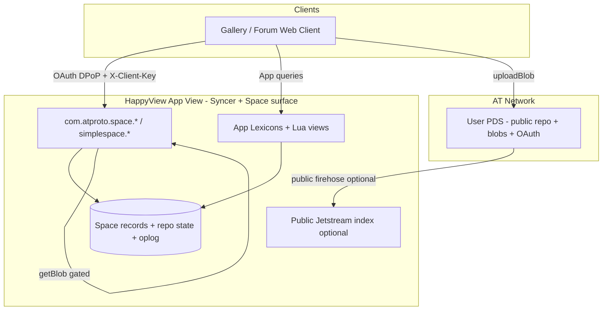

# Implementation Plan: AT Protocol App View Prototype for Proposal 0016 (Permissioned Spaces)

**Primary sources used (local KB):**

| Document | Role |
|----------|------|
| [`at-protocol-0016-permissioned-data-proposal.md`](./at-protocol-0016-permissioned-data-proposal.md) | Upstream proposal 0016 (Permissioned Data) |
| [`HappyView-0016-implementation.md`](./HappyView-0016-implementation.md) | HappyView dialect vs proposal comparison |
| [`happyview.md`](../../.agents/kb/happyview.md) | HappyView App View framework reference |
| [`at-protocol-v2.md`](../../.agents/kb/at-protocol-v2.md) | Combined AT Protocol + permissioned data concepts |

**Status:** Analysis + phased reference-implementation plan (not executable code). Proposal 0016 and HappyView Spaces are both experimental and will change.

---

## Context

This document supports building a **prototype AT Protocol App View** that can serve as a **reference implementation** for **Proposal 0016 — Permissioned Data** (“Permissioned Spaces”). Goals:

1. **Decide the build base:** HappyView vs from scratch vs other AT Protocol tools.
2. **Define a phased App View plan** that grows in complexity while each phase **implements and demonstrates** concrete 0016 requirements.
3. **Capture both** the decision analysis and the phased plan in one report.

This is **not** a full production product plan. It is a deliberate path to exercise the proposal’s model: spaces as access/sync boundaries, credentials, per-user permissioned repos (or App View–hosted equivalents), LtHash / deniable commits, sync without a firehose, and simplespace management—while keeping each milestone demonstrable.

---

## 1. What “App View” means under 0016

In public atproto, an App View indexes the **relay firehose** and serves app-shaped APIs. Under 0016, permissioned data has **no permissioned firehose**. The App View’s role shifts to that of a **syncer**:

```text
Public path:     PDS → Relay/Jetstream → App View → Client
Permissioned:    Space host (credentials, writers, notify)
                 + Repo hosts (per-user permissioned repos)
                 → Syncer App View pulls with space credential
                 → Client reads App View views (gated by membership / credential)
```

| Role | 0016 responsibility | Typical implementer |
|------|---------------------|---------------------|
| **Repo host** | Store/serve one permissioned repo per (user, space); LtHash commits; oplog; CRUD | PDS (required in pure model) |
| **Space host** | Issue credentials; `listRepos`; notification fan-out | PDS or dedicated service |
| **Syncer (App View)** | Obtain space credential; pull repos; build views; register for `notifyWrite` | Your prototype |
| **Client** | OAuth; (optionally) mint credentials; write via OAuth to repo host | Web/mobile app |

A useful reference App View must therefore demonstrate **syncer behavior**, not only UI over a private database.

---

## 2. Build-base analysis: HappyView vs from scratch vs other tools

### 2.1 Options

| Option | What it is | Fit for 0016 reference App View |
|--------|------------|----------------------------------|
| **A. HappyView-first** | Schema-driven App View framework with **experimental Permissioned Spaces** already implemented (`com.atproto.space.*` / `com.atproto.simplespace.*`, feature-flagged) | Fastest path to a working gated App View; dialect differs from pure proposal |
| **B. From scratch** | Custom XRPC service (TS/Go/Rust) implementing space host + repo host + syncer, proposal-shaped | Best wire-format fidelity; highest cost; rebuilds OAuth/index plumbing |
| **C. Other ecosystem tools** | Statusphere-style custom App View, BFF, skyware, indigo/rsky pieces, Bluesky `atproto` PR #5187 WIP, Contrail (interop peer), Tap (public sync only) | Useful **components**, but none currently replace a full 0016 App View stack alone |
| **D. Hybrid (recommended)** | HappyView for App View UX + public plumbing; **explicit phases** that exercise proposal concepts; optional pure-0016 modules later for crypto/sync/CAR where HappyView dialect is insufficient | Best balance of speed, pedagogy, and proposal coverage |

### 2.2 HappyView strengths

From local KB (`happyview.md`, `HappyView-0016-implementation.md`):

- **Already ships an experimental Spaces product surface** aligned in *intent* with 0016: spaces, membership, credentials, LtHash-backed per-user repo state, oplog helpers, write notifications, gated blob reads.
- **App View plumbing is free:** Lexicon → XRPC, Jetstream for public data, OAuth/DPoP, PDS write proxy, SQLite/Postgres, dashboard, SDKs (`@happyview/lex-agent`, OAuth clients).
- **Demo surface is real:** feature flag `FEATURE_SPACES_ENABLED`, admin UX, invites, `mintPolicy` / `appAccess`, `read` / `read_self` / `write`.
- **Explicit interop intent** with peers such as Contrail as the experimental ecosystem evolves.

Building a Statusphere-class public App View from scratch is largely **orthogonal** to demonstrating Permissioned Spaces. HappyView removes that tax.

### 2.3 HappyView limitations (for a *proposal* reference)

HappyView is **App View–centric dialect**, not pure 0016 topology:

| Topic | Proposal 0016 | HappyView experimental |
|-------|---------------|------------------------|
| URI | `at://…/space/…` | `ats://…` |
| Record store | Per-user permissioned repos on **repo hosts** (usually PDS) | Space record store + per-user crypto state on **HappyView** |
| Member interactive path | Credential after OAuth `space:read` | Often **DPoP + `X-Client-Key`** without credential |
| App identity | Client attestation JWT | API client key + metadata URL allow-list |
| Policy field | `policy` | `mintPolicy` |
| Full CAR `getRepo` | Primary full-state recovery | `getRepoState` convenience; CAR not primary |
| Invites / space-as-member | App-defined / not core | First-class HappyView extensions |

**Implication:** A HappyView-only prototype is an excellent **product-shaped reference for how App Views use spaces today**, but it is **not** a pure wire-level reimplementation of the proposal’s multi-host crawl model. Document dialect explicitly (as `HappyView-0016-implementation.md` already does).

### 2.4 From-scratch strengths and costs

**Strengths**

- Can match proposal addressing (`at://…/space/…`), credential-everywhere reads, client attestation, dual roles (repo host vs space host), CAR export, pure `listRepoOps` syncer loop.
- Clear narrative for protocol reviewers: “this is proposal-shaped, not vendor dialect.”
- Forces implementing the hard parts that matter for interop tests (LtHash, deniable commits, credential JWT classes).

**Costs**

- Reimplement OAuth, DID resolution, lexicon validation, client app, and deployment before any space demo.
- Must either **mock PDS permissioned repos** or depend on unfinished reference PDS work ([atproto PR #5187](https://github.com/bluesky-social/atproto/pull/5187) is WIP).
- Higher risk of thrashing as the proposal changes (roadmap: major focus through summer 2026; “significant implementation and experimentation” expected).

### 2.5 Other tools (when to use, not as the sole base)

| Tool | Use in this project |
|------|---------------------|
| **@atproto/* / lex-cli / goat** | Lexicon authoring, types, publishing—use regardless of HappyView |
| **Bluesky atproto PR #5187 branch** | Track lexicon drafts & future PDS-side methods; do not block prototype on it shipping |
| **Indigo / rsky / custom PDS** | Later multi-host experiments; overkill for phase 0–3 |
| **Statusphere example app** | Pattern for public App View clients; not spaces |
| **Tap / Jetstream** | Public data only; still useful if the prototype mixes public gallery + private albums |
| **BFF / skyware** | OAuth/bots; no 0016 Spaces stack |
| **Contrail** | Interop target in late phases, not bootstrap base |
| **Blacksky tutorial materials** | Conceptual walkthrough of proposal concepts (referenced in local KB) |

### 2.6 Recommendation

**Use Hybrid D: HappyView-first prototype, proposal-mapped phases, with a clear dialect boundary.**

| Decision | Choice |
|----------|--------|
| **Primary runtime** | HappyView App View with **Permissioned Spaces enabled** |
| **Domain demo** | Permissioned **gallery / album** (or small private forum)—simple records + blobs; matches existing HappyView gallery patterns and ATPix-style F-008 thinking |
| **Normative for early phases** | HappyView wire dialect (`ats://`, `mintPolicy`, DPoP member path, invites) |
| **Normative for “proposal fidelity” phases** | Map each demo to 0016 concepts; add dual-path demos (credential flow, LtHash verify, notify/sync) even when HappyView also offers shortcuts |
| **When to go pure from-scratch** | Only if a later goal is **interop test vectors / multi-host PDS crawl** that HappyView cannot express—then add a small **proposal-shaped syncer library** (language of choice) that talks pure 0016 methods, optionally dual-running against HappyView or a mock repo host |

**Rationale in one sentence:** HappyView already implements the App View–facing slice of Permissioned Spaces; building that plumbing from scratch delays teaching 0016, while a pure-PDS multi-host reference is still blocked on ecosystem maturity—so prototype the **syncer App View** on HappyView first, and isolate pure-protocol work into later, optional modules.

### 2.7 Explicit non-goals (prototype)

- E2EE / confidentiality (out of scope in 0016).
- Full Bluesky-scale App View or full-network public backfill.
- Replacing PDS implementations network-wide.
- “Fixing” HappyView to pure `at://` URIs without an ADR (per existing ATPix guidance).

---

## 3. Prototype architecture (target)



**Demo app sketch:** “Private Album” space type (e.g. `com.example.album` / project NSID) containing photo records with blobs; members `read` / `read_self` / `write`; optional invites.

---

## 4. Phased implementation plan

Each phase has: **goal**, **0016 concepts demonstrated**, **HappyView surface**, **deliverables**, **acceptance demos**, **complexity notes**. Phases are cumulative; each should leave a runnable demo.

### Phase 0 — Baseline App View (public, no spaces)

| | |
|--|--|
| **Goal** | Deploy HappyView; ship a minimal public gallery (Statusphere / photo pattern) so OAuth, lexicons, and client SDK work. |
| **0016 concepts** | None yet—establishes contrast with public broadcast. |
| **Work** | Deploy HappyView; service identity; API client; record + query + procedure lexicons; optional Jetstream backfill; simple web client with `@happyview/oauth-client-browser` + `@happyview/lex-agent`. |
| **Acceptance** | User logs in via atproto OAuth; creates a public photo; query lists it. |
| **Effort** | Small (days). |

### Phase 1 — Space as authorization boundary (simplespace lifecycle)

| | |
|--|--|
| **Goal** | Create and manage a **space** as the access/sync boundary. |
| **0016 concepts** | Space identity `(authority, type, skey)`; space type as modality; simplespace `createSpace` / `updateSpace` / `deleteSpace`; `getSpace`; config axes (`policy` / HappyView `mintPolicy`, `appAccess`). |
| **HappyView work** | Enable `FEATURE_SPACES_ENABLED`; create space of album type; surface space metadata in UI; document URI dialect (`ats://` vs proposal `at://…/space/…`). |
| **Acceptance** | Authority creates space; `getSpace` returns config; non-members cannot read gated content (once records exist in later phases). |
| **Effort** | Small. |

### Phase 2 — Membership & access levels

| | |
|--|--|
| **Goal** | Demonstrate **who** may enter the perimeter. |
| **0016 concepts** | Access control as perimeter (not E2EE); member-list policy; read vs write attribution; `read_self` vs whole-space `read`; app gate `open` vs `allowList`. |
| **HappyView work** | `addMember` / `removeMember` / `listMembers` with `read` / `read_self` / `write`; optional HappyView **invites** (extension—label as non-core 0016); configure `appAccess.allowList` with client metadata URL. |
| **Acceptance** | Member A `write` posts; member B `read` sees A’s records; member C `read_self` sees only own repo; non-member denied; unlisted client denied when allow-list on. |
| **Effort** | Small–medium. |

### Phase 3 — Credential flow (cross-service / proposal path)

| | |
|--|--|
| **Goal** | Implement and **demo the two-step credential flow**, even if HappyView also allows DPoP member shortcuts. |
| **0016 concepts** | Delegation token (`atproto-space-delegation+jwt`); space credential (`atproto-space-credential+jwt`); credential exchange; multi-use Bearer for reads; verification via authority space key; **access control not confidentiality**. |
| **HappyView work** | Call `getDelegationToken` → `getSpaceCredential`; use Bearer credential on space read routes; document dual path: **interactive member** (DPoP + client key) vs **credential** (proposal-shaped / cross-service). |
| **Acceptance** | Script or secondary service reads space **only** with space credential, without member DPoP session; expired credential fails; wrong space `sub` fails. |
| **Effort** | Medium (crypto/JWT debugging). |
| **Pedagogy note** | This phase is critical for a *proposal* reference: many product paths hide credentials; the reference must show them. |

### Phase 4 — Permissioned records CRUD (App View as space surface)

| | |
|--|--|
| **Goal** | Create app data **inside** the space, with author DID authority. |
| **0016 concepts** | Permissioned records; record authority remains author DID; no public firehose for these records; create/put/delete/applyWrites; list/get with access gate. |
| **HappyView work** | Space record CRUD via `com.atproto.space.*`; album photo lexicon in space collections; optimistic concurrency (`swapRecord` / `swapCommit`) if available; app views that hydrate multi-author feeds **from space store**. |
| **Acceptance** | Two members write photos; third reads combined album view; deleting member removes only their write access for new content; space data never appears on public Jetstream index. |
| **Effort** | Medium. |

### Phase 5 — Gated blobs

| | |
|--|--|
| **Goal** | Media with the same access perimeter. |
| **0016 concepts** | Blobs on authoring host; `com.atproto.space.getBlob` with OAuth or space credential. |
| **HappyView work** | Upload via normal `uploadBlob` to PDS; reference blob in space record; serve via gated `getBlob`; client never uses public CDN URL for private images. |
| **Acceptance** | Non-member cannot fetch blob CID; member/credential holder can; public blob endpoints do not leak private album bytes. |
| **Effort** | Small–medium. |

### Phase 6 — Sync primitives (writer set + oplog + LtHash)

| | |
|--|--|
| **Goal** | Demonstrate App View as a **syncer**, not a silent DB. |
| **0016 concepts** | Writer set (`listRepos`); incremental sync (`listRepoOps`); set-hash / LtHash; deniable signed commits; self-healing sync (hash mismatch → recovery). |
| **HappyView work** | Exercise `listRepos`, `listRepoOps`, `getRepoState` (HappyView); maintain local running hash for a member repo in a **demo sync worker**; log divergence and recovery. |
| **Acceptance** | After writes, oplog advances `rev`; sync worker catches up; hash matches commit; deliberate corruption or `since` gap triggers recovery path. |
| **Effort** | Medium–large (crypto correctness). |

### Phase 7 — Write notifications & eventual consistency

| | |
|--|--|
| **Goal** | Real-time-ish pull without a permissioned relay. |
| **0016 concepts** | `registerNotify`; `notifyWrite` (no payload data); best-effort delivery; sweep via `listRepos` as fallback. |
| **HappyView work** | Register App View endpoint; on notify, pull only advanced repos; implement periodic sweep; document dropped-notify healing. |
| **Acceptance** | Write on client A → App View updates within notify latency without full poll; kill notify path → sweep still converges. |
| **Effort** | Medium. |

### Phase 8 — Full-state recovery & space deletion

| | |
|--|--|
| **Goal** | Lifecycle completeness. |
| **0016 concepts** | Full-state recovery (`getRepo` CAR in proposal; HappyView may use state rebuild); space deletion; syncer **must delete** retained copies; repo host **flags** rather than hard-erases user data (proposal)—document HappyView cascade delete as dialect. |
| **HappyView work** | Delete space; verify credentials stop; App View purges derived views; export/debug dump for education. |
| **Acceptance** | After delete, reads fail; App View has no residual album feed; documented difference vs proposal repo-host flag behavior. |
| **Effort** | Small–medium. |

### Phase 9 — Managing-app policy & dynamic admission (advanced)

| | |
|--|--|
| **Goal** | Show protocol-level **dynamic** user gate beyond static member lists. |
| **0016 concepts** | `policy: managing-app`; `managingApp`; `com.atproto.simplespace.checkUserAccess` served by App View; appAccess still applies. |
| **HappyView work** | Implement `checkUserAccess` on the App View (e.g. “followers only” or “paid flag” mock); set space policy; prove mint succeeds/fails based on app decision. |
| **Acceptance** | User on allow-list of app logic gets credential; user failing check does not; open appAccess vs allowList still enforced. |
| **Effort** | Medium. |

### Phase 10 — Proposal-fidelity / interop track (optional fork)

| | |
|--|--|
| **Goal** | Stretch toward pure 0016 multi-host model and interop. |
| **0016 concepts** | Separate repo host vs space host; credential presentation to **repo hosts**; client attestation JWT; `space:` OAuth scopes; CAR `getRepo`; `at://` URIs; Contrail / other experimental peers. |
| **Work options** | (1) Thin **proposal-shaped client library** dual-mapping HappyView dialect ↔ 0016 names; (2) mock multi-PDS lab; (3) track atproto PR #5187 for real PDS permissioned repos. |
| **Acceptance** | Documented interop matrix; at least one automated test vector (LtHash add/remove, credential typ headers, URI parse). |
| **Effort** | Large; only if reference-for-spec becomes primary over product dialect. |

---

## 5. Phase → 0016 feature coverage matrix

| 0016 requirement / feature | Phase |
|----------------------------|-------|
| Access control ≠ E2EE | 2–3 (documented throughout) |
| Space as auth + sync boundary | 1 |
| Space URI / identity triple | 1 (dialect documented) |
| Space type declaration (Lexicon `type: space`) | 1, 4 |
| Simplespace lifecycle + member list | 1–2 |
| `policy` / mintPolicy: member-list, public, managing-app | 1–2, 9 |
| `appAccess` open / allowList | 2 |
| Delegation token + space credential | 3 |
| Client attestation (pure) vs client key (HV) | 2–3, 10 |
| Permissioned record CRUD + author DID | 4 |
| No permissioned firehose | 4 (negative test) |
| Gated blobs | 5 |
| Writer set `listRepos` | 6–7 |
| Oplog incremental sync | 6 |
| LtHash + deniable commits | 6 |
| Write notifications | 7 |
| Full-state recovery | 8 |
| Space deletion semantics | 8 |
| Managing-app `checkUserAccess` | 9 |
| Multi-host / pure topology | 10 |
| OAuth `space:` scopes (where available) | 3, 10 (verify at runtime) |

---

## 6. Suggested repository / project layout (when building)

```text
AT-PS/   (or new prototype repo)
  kb/                              # already present
    implementation-plan.md         # this report
    HappyView-0016-implementation.md
    at-protocol-0016-...
  prototype/                       # optional new tree
    README.md                      # how to run demos per phase
    lexicons/                      # album space type + photo records + app queries
    client/                        # web UI
    scripts/                       # credential flow demos, sync worker, acceptance checks
    docs/
      dialect-map.md               # short link to HappyView-0016-implementation.md
      phase-demos.md               # click-path demos per phase
```

---

## 7. Verification strategy (end-to-end)

| Layer | How |
|-------|-----|
| **Per-phase acceptance** | Manual script + UI path listed above; checkboxes in `phase-demos.md` |
| **Negative tests** | Non-member read; wrong client key; expired credential; public firehose absence |
| **Crypto** | Golden vectors for LtHash add/remove if implementing Phase 6 worker; compare to proposal description |
| **Regression** | After HappyView upgrades, re-run Phase 3 and 6 first (highest dialect drift risk) |
| **Interop (Phase 10)** | Cross-instance credential verify; Contrail if available |

---

## 8. Risks and mitigations

| Risk | Mitigation |
|------|------------|
| Proposal changes underfoot (roadmap: experimentation through 2026) | Pin versions; treat 0016 text + HappyView docs as dual sources; ADR before dialect flips |
| HappyView dialect mistaken for final spec | Keep `HappyView-0016-implementation.md` linked; label demos “dialect” vs “proposal-shaped” |
| Open items (space: OAuth parity, CAR getRepo, PDS-colocated stores) | Open list in existing comparison doc; verify on live HappyView before depending |
| Scope creep into full E2EE or full PDS rewrite | Non-goals above; Phase 10 optional |
| Building public App View plumbing from scratch | Avoid—use HappyView Phase 0 |

---

## 9. Recommended immediate next steps

1. **Decide NSID namespace** for the demo app (e.g. project domain).
2. **Stand up HappyView** locally/Docker with Spaces feature flag.
3. **Execute Phase 0 → 1** and record a short demo script.
4. Open a thin **ADR** only if you later choose pure from-scratch for Phase 10 (topology / URI scheme).

---

## 10. Summary decision

| Question | Answer |
|----------|--------|
| HappyView or from scratch? | **HappyView-first hybrid** |
| Why not pure from scratch now? | Proposal + PDS reference still experimental; rebuilds non-0016 plumbing; slows demos |
| Why not HappyView-only forever? | Dialect gaps (URI, hosting topology, auth shortcuts) limit pure-protocol reference value |
| How does complexity grow? | Public App View → space lifecycle → membership → credentials → records → blobs → sync/LtHash → notifications → deletion → managing-app → optional pure interop |
| What is the reference story? | “An App View acting as a **0016 syncer** on a working experimental Spaces stack, with explicit mapping to the proposal and optional pure-protocol modules.” |
