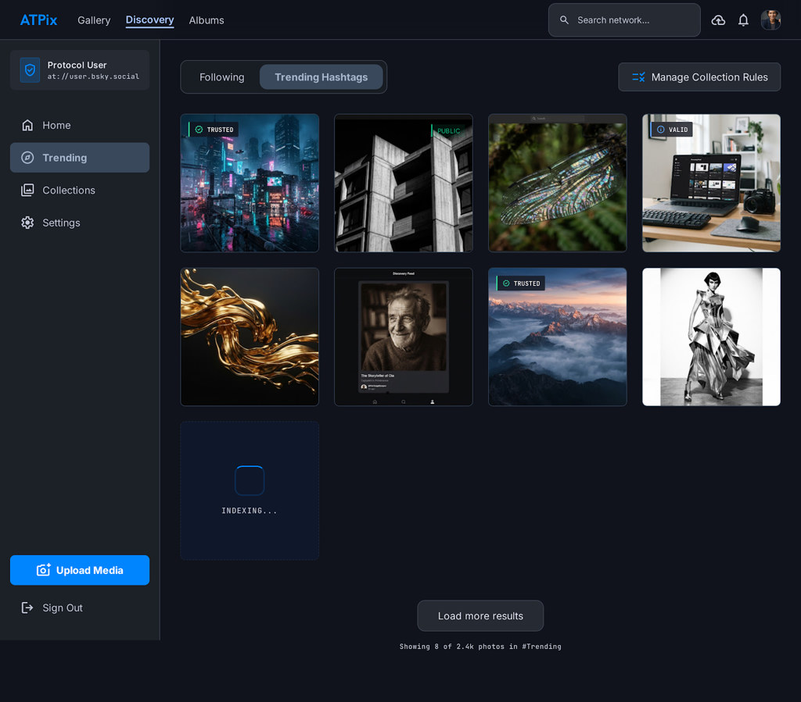
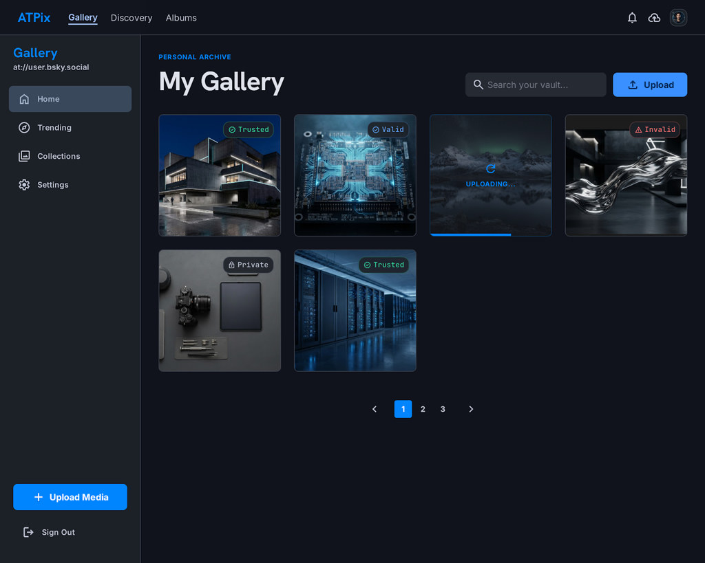
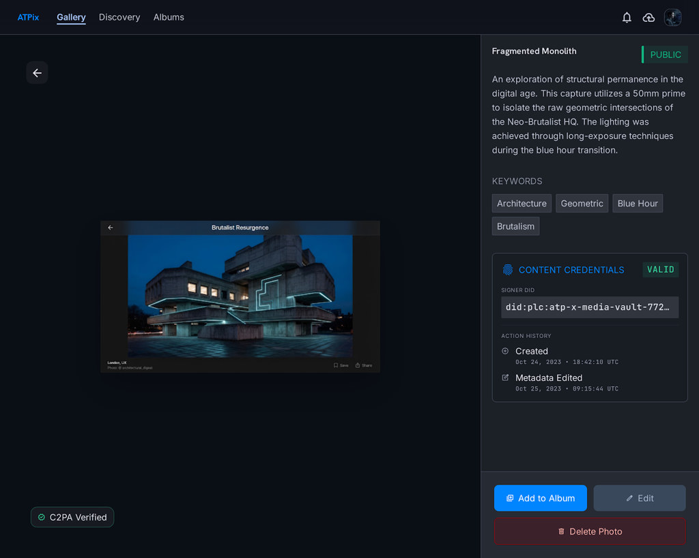
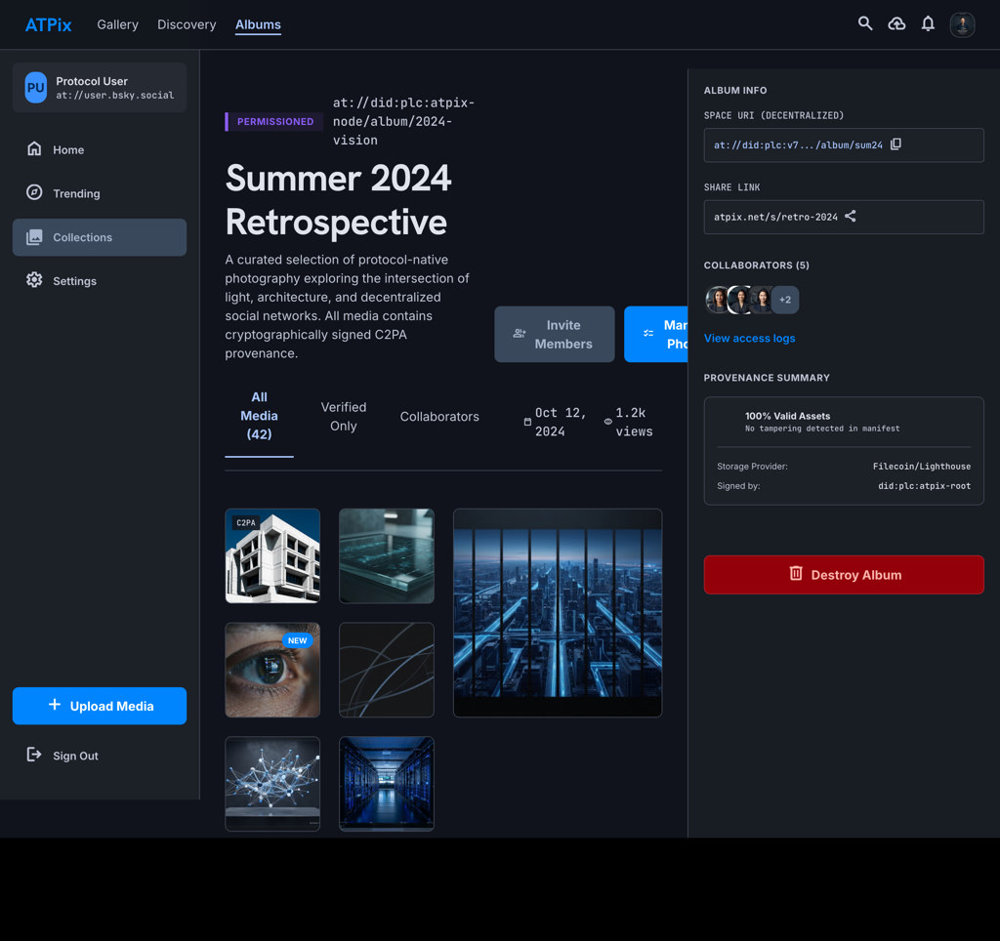
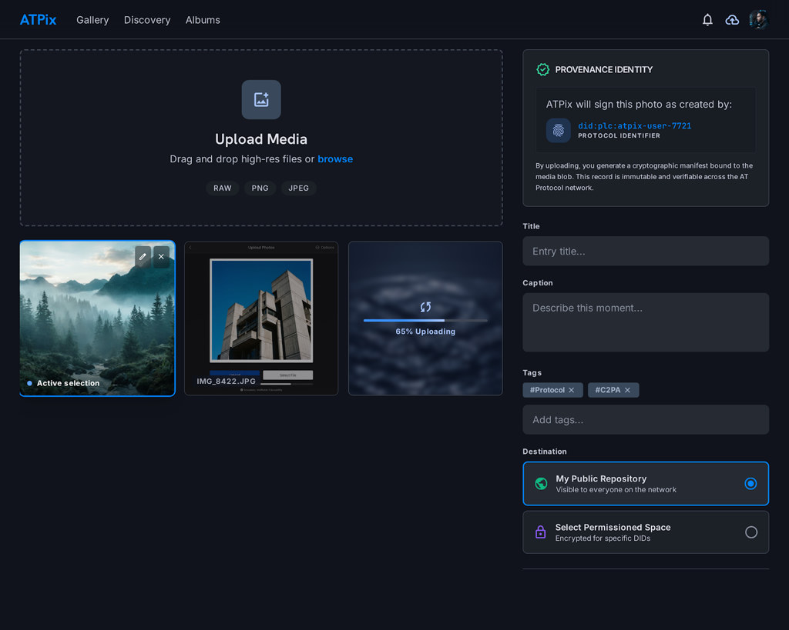
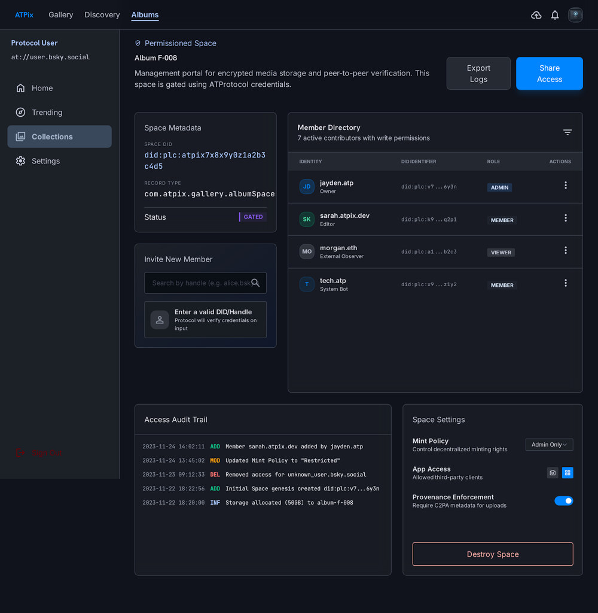

# ATPix UI mockups

Directional screen captures for [ui-requirements.md](../../overview/004-ui-requirements.md). Styling tokens: [000-UX-guide.md](../000-UX-guide.md).

## Current assets (dark mode)

| File | Screen |
|------|--------|
| [01-discovery-feed.jpg](./01-discovery-feed.jpg) | Discovery feed |
| [02-my-gallery.jpg](./02-my-gallery.jpg) | My Gallery |
| [03-photo-detail.jpg](./03-photo-detail.jpg) | Photo detail |
| [04-album-view.jpg](./04-album-view.jpg) | Album view |
| [05-upload-flow.jpg](./05-upload-flow.jpg) | Upload flow |
| [06-permissioned-space-admin.jpg](./06-permissioned-space-admin.jpg) | Permissioned space admin |

All six images are **dark-mode only** and do **not** show the color-scheme toggle (UI-SHELL-003).

## Previews

### Discovery feed

### My Gallery

### Photo detail

### Album view

### Upload flow

### Permissioned space admin

## Planned (not yet in repo)

| File | Purpose |
|------|---------|
| `00-app-shell-annotated.jpg` | Header with sun/moon toggle placement |
| `02-my-gallery-light.jpg` | Light-theme gallery chrome validation |
| `07-settings-appearance.jpg` | Settings → Appearance (Dark / Light / System) |

See [Mockup inventory](../../overview/004-ui-requirements.md#mockup-inventory) in the UI requirements spec.