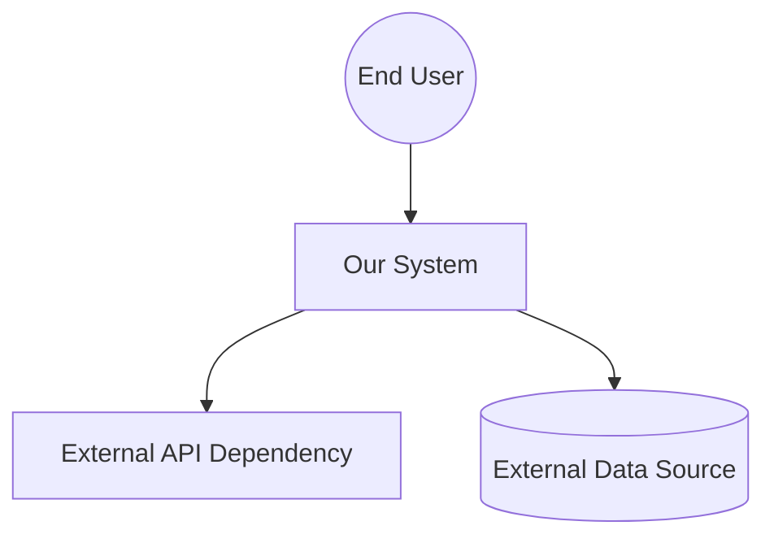
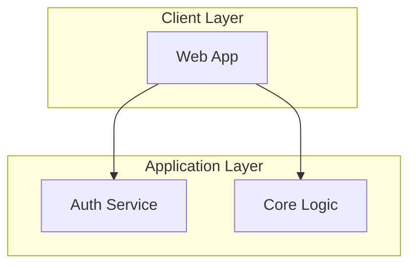
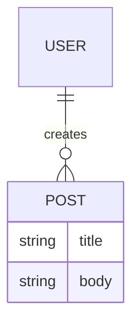
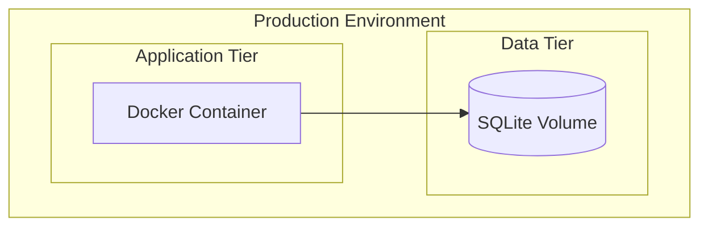
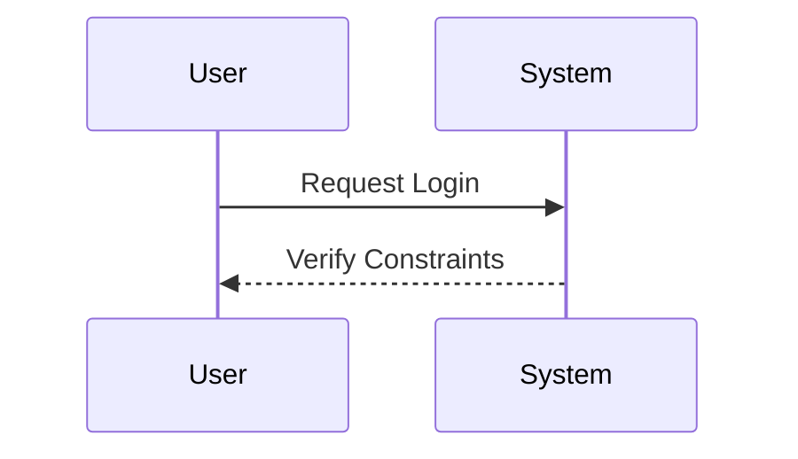

# System Architecture Document

## 1. Introduction
### 1.1 Purpose
[Describe the purpose of this architecture document]
### 1.2 Scope
[Define what aspects of the system this architecture covers]
### 1.3 References
- **PRD:** [PRD](../overview/002-prd.md)
- **SRS:** [SRS](../overview/003-srs.md)
- **Implementation Plan:** [Project Plan](../overview/005-plan.md)
- **ADRs:** [ADRs](../architecture/)

### 1.4 Architectural Principles
- **KISS:** Minimize dependencies, maximize simplicity
- **Scale-to-Zero:** Design for serverless/stateless where possible
- **API-First:** All functionality exposed via well-defined APIs
- **Security by Design:** Security considerations in every layer
- **Observability:** Built-in logging, metrics, and tracing
- **Modularization:** Break down the system into smaller, more manageable modules

## 2. Context & Stakeholder Viewpoint (ISO 42010)
*Addresses: Who interacts with the system, external dependencies, and what the key stakeholder concerns are.*

### 2.1 Stakeholders & Concerns
- [e.g., End Users -> Performance, Reliability]
- [e.g., Developers -> Maintainability, Deployment ease]
- [e.g., Security Team -> Data isolation, Auditability]

### 2.2 Context Diagram

## 3. Functional/Logical Viewpoint (ISO 42010)
*Addresses: How the system is subdivided into modules, their responsibilities, and how they interact logically.*

### 3.1 Logical Architecture

### 3.2 Frontend Architecture
- **Framework & Technologies:** [e.g., Streamlit, React, Vue]
- **Key Design Patterns:** [e.g., Component-driven, Server-side rendering]

### 3.3 Backend Architecture
- **Framework & Technologies:** [e.g., FastAPI, Express, raw Python]
- **API Style:** [e.g., REST, GraphQL, gRPC]
- **Directory Structure Overview:** [Summary of logical module breaks]

## 4. Information/Data Viewpoint (ISO 42010)
*Addresses: Data structures, database systems, permanence, caching, and data flow.*

### 4.1 Data Architecture

### 4.2 Database Decisions
- **Primary Database:** [e.g., SQLite, PostgreSQL]
- **Schema Management:** [e.g., Alembic, Prisma migrations]
- **Caching Strategy:** [e.g., LRU cache inside app, Redis]

## 5. Deployment/Physical Viewpoint (ISO 42010)
*Addresses: How the logical components are mapped onto physical hardware, cloud instances, or container networks.*

### 5.1 Infrastructure Architecture

### 5.2 CI/CD Pipeline
- **Orchestration / Tooling:** [e.g., GitHub Actions, Docker]
- **Current Pipeline Stages:** [Lint -> Test -> Build -> Deploy]

## 6. Security Viewpoint (ISO 42010)
*Addresses: Threat vectors, authentication boundaries, and data protection mechanisms.*

### 6.1 Authentication Flow

### 6.2 Security Measures
- **Secrets Management:** [e.g., Environment Variables, Vault]
- **Network Boundaries:** [e.g., Internal Docker network only]

## 7. Performance & Concurrency Viewpoint (ISO 42010)
*Addresses: Scalability, error handling, rate limiting, and system observation mechanisms.*

### 7.1 Scalability Constraints
- **Known Bottlenecks:** [e.g., SQLite concurrent write blocking]
- **Mitigation:** [e.g., Write serialization, Read replicas]

### 7.2 Observability & Monitoring
- **Logging Subsystems:** [e.g., Python `logging`, sentry]
- **Tracing / Alerting:** [None / Custom alerts]

## 8. Technology Decisions Summary
| Layer | Technology | Rationale (Driven by ADRs) |
|-------|------------|-----------|
| Architecture Style | [Monolith/Microservices] | [Why chosen?] |
| Frontend | [Framework] | [Why chosen?] |
| Backend | [Framework] | [Why chosen?] |
| Database | [Database] | [Why chosen?] |
